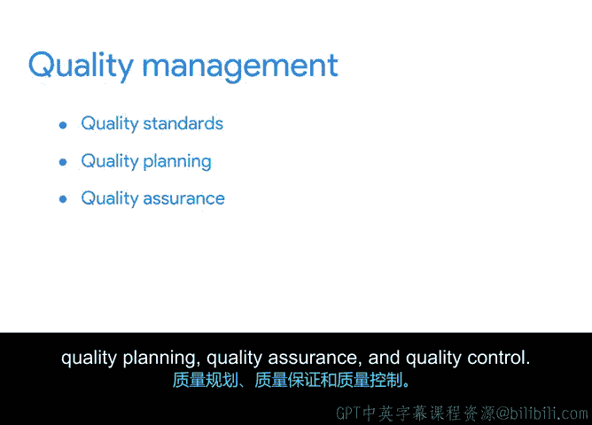

# 014：关键质量管理概念 📊

在本节课程中，我们将学习项目质量管理中的四个核心概念。理解这些概念对于确保项目成果满足客户期望至关重要。我们将逐一探讨质量标准的设定、质量规划、质量保证以及质量控制，并了解它们如何共同作用以交付高质量的项目成果。

## 质量与“完成”的区别

在项目管理中，仅仅“完成”项目是不够的。项目必须满足客户定义的质量标准。项目的整体质量会受到时间、范围和预算这“三重约束”的影响。其中任何一个要素出现问题，都会损害项目质量。与团队的有效沟通是产出高质量可交付成果的关键。

**质量**在项目管理中的定义是：**满足可交付成果的既定要求，并达到或超越客户的需求与期望**。

## 质量管理四大核心概念

为了成功交付满足客户需求的产品或服务，你需要了解并监督质量管理计划的实施。以下是质量管理的四个主要概念。

### 1. 质量标准

质量过程始于设定质量标准。**质量标准**提供了用于确保产品、过程或服务适合实现预期成果的要求、规范或指南。

在项目开始时，应与团队和客户共同设定质量标准。明确定义质量标准可以减少返工和进度延误。

**示例**：以Office Green公司的“植物伙伴”项目为例，该项目为顶级客户提供桌面友好型植物。
*   **可靠性标准**：每个盆栽需在约定时间完好送达，供应商仓库需有足够库存以满足准时交付需求。
*   **可用性标准**：盆栽不会引起客户过敏或不适，且对所有人及动物（如必要）安全。
*   **产品标准**：供应商产品需符合品牌形象，使用指定材料，且完好无损地交付。

质量标准应贯穿所有产品和流程。例如，在网站开发流程中，可用性标准可定义为：网站必须在手机、电脑或平板设备上都易于导航。

### 2. 质量规划

上一节我们介绍了质量标准，本节中我们来看看如何实现这些标准。**质量规划**是指项目经理或团队为识别和确定与项目相关的具体质量标准，并规划如何满足这些标准而采取的行动。

为引导规划讨论，你可以问自己：
*   客户期望的项目最终成果是什么？
*   对他们而言，质量是什么样子的？
*   我如何满足他们的期望？
*   我将如何判断质量措施能否带来项目成功？

在此阶段，你将规划实现质量标准的程序。

**示例**：针对“植物伙伴”项目的可靠性标准（盆栽准时完好送达），一项质量规划措施可能是：与植物供应商制定计划，在决定使用前测试盆栽的耐用性。

### 3. 质量保证

接下来，我们进入贯穿项目始终的持续过程。**质量保证**，常缩写为**QA**，其核心是评估项目是否正朝着交付高质量服务或产品的方向推进。

与质量标准和规划不同，QA贯穿整个项目生命周期，而非仅在特定阶段进行。你的质量计划应包含定期审计，以确认一切按计划进行且必要的程序得到遵循。定期的检查与向利益相关者汇报，有助于增强各方信心。

质量保证确保你和客户得到合同约定的确切产品。

**示例**：在“植物伙伴”项目中，QA可能包括团队检查盆栽选项，或参与耐用性测试。如果你计划由供应商自行进行耐用性测试，则需确保跟踪其进度并定期检查。

### 4. 质量控制

最后，我们来看当问题出现时如何应对。**质量控制**，常缩写为**QC**，涉及在发现问题或质量计划未按预期方式执行时，为确保质量标准而采取的技术和纠正措施。

QC包括监控项目结果和交付物，以确定其是否符合预期。如果不符合，则应采取替代行动。质量控制对于为下一个项目创造更成功的着陆也至关重要。

**示例**：在盆栽被放置到客户办公室后，质量控制可能表现为你或团队成员对已送达植物的办公室进行最终巡查。你会检查是否有破损的盆栽或在运输中受损的植物，并在必要时进行更换。在项目初期进行此类检查有助于发现可改进的问题。

## 总结与回顾

本节课中，我们一起学习了项目质量管理的四个核心概念：**质量标准**、**质量规划**、**质量保证**和**质量控制**。如果你能坚持质量计划，在整个项目生命周期中检查质量（QA），并在需要时进行纠正（QC），那么满足质量标准的可能性就会很高，最终将产出高质量的可交付成果，满足组织目标并超越客户期望。

在下一个视频中，我们将讨论如何运用谈判和同理心等软技能，在质量方面满足客户需求。