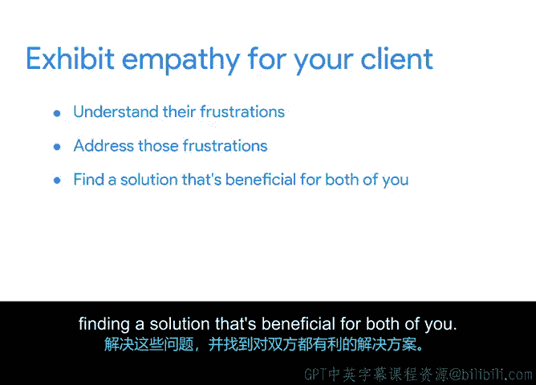

# 015：通过沟通技巧培养客户关系

## 📋 概述
在本节课中，我们将学习如何运用沟通技巧来培养和巩固客户关系。我们将探讨谈判、共情式倾听和建立信任等软技能，并了解如何通过获取客户反馈来迭代优化产品或服务。

---

## 🗣️ 沟通在项目中的核心地位
现在，你可能已经理解沟通对于项目成功至关重要。沟通是整个项目的命脉。沟通在项目开始之前就已启动，并在项目的剩余阶段持续稳定地进行。

在接下来的内容中，我将解释如何运用谈判、共情式传递信息以及通过提问澄清问题等软技能来促进和加强沟通。我们还将讨论反馈作为产品迭代基础的重要性。

根据项目管理协会的研究，大多数项目都会经历某种形式的沟通中断。尽管项目经理大约花费90%的时间专门处理沟通事务，但巧妙地沟通仍然符合项目经理的最大利益。这不仅涉及与组织内部成员的沟通，也包括与客户和供应商的沟通。

## 🤝 运用软技能与客户沟通
上一节我们强调了沟通的重要性，本节中我们来看看项目经理应如何与客户沟通。运用谈判、共情式倾听和建立信任等软技能，将有助于在你和客户之间建立良好的关系。一位优秀的项目经理知道如何以及何时运用这些技能。

以下是运用这些软技能的关键实践：
*   **提问**：提出开放式问题并积极倾听，以了解客户的现状、期望状态以及帮助他们实现目标的可能途径。
*   **谈判**：通过提问，你可以发现如何让客户感到更安心，并能够通过谈判确保双方的需求都得到满足。
*   **建立信任**：通过上述过程，你将建立起成功合作所必需的信任。

## 📅 设定清晰的沟通期望
高绩效的项目经理会就何时向客户沟通特定事项设定清晰的期望。例如，你可以设定每周提供进度更新的期望，以便让客户了解情况，而不是等待他们来询问。

在解决产品问题时，可能没有必要告知客户那些不会影响最终结果的问题。假设你团队中的一名设计师离职了，而你很快找到了替代者，项目进度并未受到影响。在这种情况下，你可以在不给客户增添额外担忧的情况下完成任务。

客户与项目之间的信息透明度可能因项目而异。你需要运用自己的判断力来决定哪些信息对客户是重要的。

## 🧩 处理问题时的沟通策略
有时，你需要告知客户存在的问题。如果你在项目中遇到一个没有他们的帮助和意见就无法推进的节点，你就必须以冷静和共情的方式与他们沟通这个问题。

让我们将其置于“植物盆栽项目”的背景下，假设我们正在处理花盆破损的问题。也许在制定质量标准时，我们为供应商的误差留出了一定空间，并预计了部分花盆会破损。我们假设每50个花盆中有2个破损是可接受的数量。

但想象一下，客户收到的一批货中，有5个花盆破损了。此时，我们需要与客户会面，并提出重要的谈判问题。我们需要决定每50个中有5个破损是否是可接受的结果，或者需要讨论客户是否愿意投资购买更不易破损的高档花盆。

提出使用更坚固花盆的解决方案会影响他们的预算，他们需要相应调整。客户是否接受这个变更？这会导致其他权衡吗？在整个谈判过程中，请牢记主要目标是客户满意度，你需要体谅他们的感受和限制。你可以通过展现共情、理解他们的挫败感、解决这些问题，并找到一个对双方都有利的解决方案来做到这一点。

## 👥 从客户服务经验中学习
你可能过去担任过面向客户的职位，无论是在呼叫中心、零售店、餐厅服务员还是其他任何职位。即使没有，你也可能在作为客户与服务代表交谈时为自己争取过权益。

因此，你可能对优质的客户服务有很好的理解。优质的客户服务会促使你选择再次光顾同一家美发沙龙、面包店或咖啡店，因为你喜欢他们对待你的方式和所接受的服务，即使曾遇到过问题。反之，如果你没有感受到那种关怀，你就不会选择再次光顾那些地方。

你过去的经验教会了你如何管理关系，并避免交付低质量的产品或服务。当你处于接收端时，那种感觉并不好。

## 🔄 获取并利用客户反馈
为了在未来项目中取得更好的成果，有必要从客户那里获取反馈。有时反馈会在项目过程中出现，有时则在项目完成后获得，这取决于你在启动阶段如何规划。何时接收反馈可能取决于你项目实际想要达成的目标。

如果你的企业正在推出一个电子商务网站，你会希望获得用户反馈，以便进行调整以优化客户的购物体验。如果你的企业是按需饼干配送服务，你可能希望在交付饼干后获取用户反馈，以了解客户对饼干和整体配送体验的感受。

用户反馈有助于弥合客户期望与项目需求之间的理解差距。

## 📝 总结
本节课中我们一起学习了如何通过沟通技巧培养客户关系。我们了解到，运用谈判、共情式倾听和建立信任等软技能有助于在你和客户之间建立良好的关系。同时，从这些客户那里获取反馈将帮助你迭代优化产品或服务。

我们将在下一个视频中更具体地探讨用户测试和反馈。