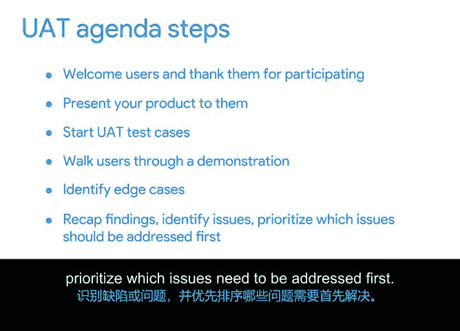

# 016：衡量客户满意度 📊

## 概述
在本节课程中，我们将学习如何衡量客户满意度。项目的最终目标是交付高质量的产品或服务，这需要我们了解客户的需求。我们已经学习了如何确保项目内部的质量，现在我们将探讨如何通过收集客户反馈来满足他们的期望和标准。

## 收集客户反馈的方法
了解客户和用户需求的最佳方式是直接询问他们。但这并不意味着需要逐一电话联系，因为那可能不是最高效的方法。幸运的是，我们可以通过一些系统化的方式来收集这些信息。

以下是两种常见的收集客户反馈的方法：

### 1. 反馈调查
反馈调查是一种让用户对产品功能表达喜好或不满的调查方式。这种调查可以在设计阶段、产品发布前或发布后进行，目的是了解用户是否喜欢并理解产品，或者确保用户体验更加令人满意。

用户通过参与调查，提供他们对产品功能的反馈，包括哪些功能直观易用，哪些操作起来较为困难。根据收集到的反馈，如果产品尚未发布，团队可以决定是否启动发布；如果产品已上市，则可以返回进行迭代改进。

### 2. 用户验收测试
用户验收测试（UAT）是一种帮助业务方确认产品或解决方案是否对用户有效的测试。UAT必须满足既定的要求并交付预期的结果。这种测试通常用于评估用户对新流程或产品的端到端体验。

用户验收测试在产品开发接近尾声时进行，因此是对整个产品、软件或服务的全面用户体验测试。UAT有时也被称为Beta测试。

## 用户验收测试的流程
在一个典型的UAT场景中，测试议程通常包含以下步骤：

1.  **欢迎与介绍**：欢迎用户并感谢他们的参与，然后向他们展示产品。这包括讨论测试指南和演示产品的工作原理。
2.  **执行测试用例**：开始UAT测试用例，引导用户完成关键用户旅程。**关键用户旅程**是指用户为完成产品中的任务而遵循的一系列步骤。
3.  **产品演示**：在展示产品时，必须为用户提供产品的视觉呈现或模型，或者让他们体验演示版本。例如，在一个建筑项目中，如果计划更换房屋内的所有电器和硬件，就需要向用户展示这可能涉及的内容，例如3D模型、数字蓝图、样品等。
4.  **聚焦行动号召**：UAT演示应聚焦于一个行动号召。例如，项目的行动号召可能是需要在客户未来的家中测试硬件。假设房主要求一个开合所需力度很小且噪音不大的洗碗机，那么就应该为客户提供真实的生活场景，让他们装载碗碟并启动洗涤循环，然后询问诸如“在1到10的范围内，开合洗碗机需要多大力度？”等问题，以确定产品是否满足他们的期望。
5.  **收集反馈**：在UAT演示和引导过程中，应收集用户关于整体体验的反馈。在这个测试环节，用户可以帮助识别**边界情况**。边界情况是指原始需求未考虑到的罕见异常情况，涉及参数的极端最大值和最小值。
6.  **总结与后续步骤**：识别边界情况后，UAT议程的最后一步是总结发现、识别缺陷或问题，并优先处理需要首先解决的问题。在解决问题并确定后续步骤后，即可结束用户验收测试。

## 总结
本节课我们一起学习了倾听客户反馈的重要性，并探讨了衡量客户满意度的一些常见方法，如反馈调查、用户验收测试以及识别边界情况。掌握这些方法对于确保项目成果符合客户期望至关重要。

在下一个视频中，我们将转向识别风险与变更发生的原因，并学习如何管理依赖关系。