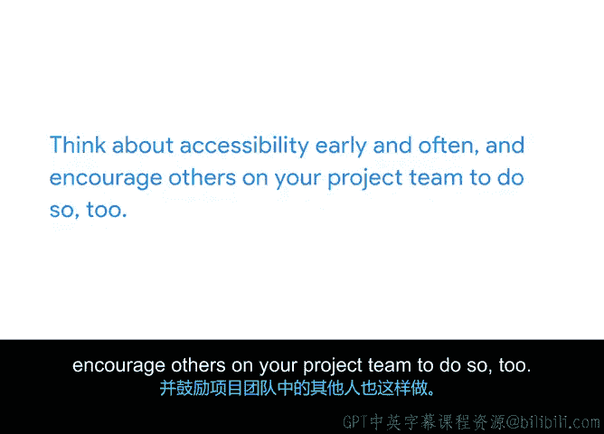

# 017：确保反馈收集过程中的可访问性 🧑‍🦯

在本节课中，我们将学习如何在项目执行阶段，确保收集反馈和衡量质量的过程是公平且具备可访问性的。这对于创建包容性项目至关重要。

---

上一节我们介绍了质量管理和沟通的重要性。本节中，我们来看看如何让质量评估过程本身也做到无障碍和包容。

作为项目经理，在通过实时访谈收集反馈时，必须在沟通中主动提供便利措施。以下是具体做法：

*   在安排访谈的邮件或消息中，明确表示可以提供便利。
*   参与者可能会请求实时字幕或手语翻译服务。
*   部分人士，例如有焦虑症或自闭症谱系人士，可能会要求提前查看问题，以便有充足时间思考和准备答案。

请记住，适用于一个人的方法未必适用于另一个人，即使两人有相同的残障情况。

如果访谈在实地进行，请以无障碍视角检查场地：

*   确保有通往大楼和房间的无障碍通道。
*   检查走廊是否整洁无杂物，避免阻碍使用轮椅、助行器的人士或有视力障碍的人安全通行。

如果通过技术手段发送调查或收集反馈，请确保所使用的系统完全具备可访问性：

*   如果不确定，请联系系统所有者，询问其是否符合最新的**《网页内容可访问性指南》**。
*   **《网页内容可访问性指南》** 的英文缩写是 **WCAG**。

同时，需要做好准备，在必要时以替代方式提供问题并收集回复。

---

除了收集反馈，项目经理从一开始就将可访问性纳入讨论也同样重要，尤其是在项目涉及流程或产品时。

很多时候，产品的无障碍功能会被忽视或留到项目最后阶段，这可能导致严重后果，例如发布延迟，或者更糟的是，产品无法被一部分人群使用。

为确保可访问性融入项目，请遵循以下步骤：

*   在项目开始时，确保开发人员熟悉无障碍要求。
*   如果他们不熟悉，帮助他们联系相关资源或专家。
*   在可用性测试中，尽可能纳入有不同残障情况的测试者。
*   至少，要确保产品经过测试，符合无障碍指南。

---

本节课中，我们一起学习了在项目执行阶段确保反馈收集过程具备可访问性的关键方法。核心在于**尽早且持续地考虑可访问性**，并鼓励项目团队中的其他成员也这样做。

接下来，你将练习衡量质量的方法，并学习更多关于管理变更、风险等内容。请继续保持出色的学习状态。