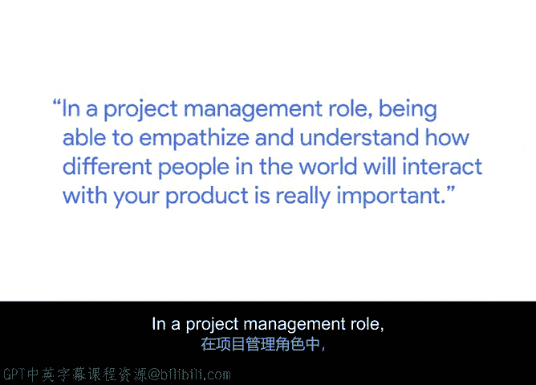
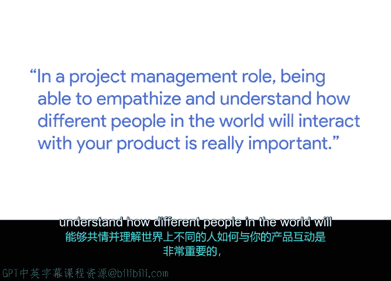

# 018：理解客户需求的重要性

## 概述
在本节课中，我们将跟随谷歌技术项目经理Sue，学习理解客户需求在项目管理中的核心作用。我们将探讨如何区分不同类型的利益相关者，并掌握与他们有效沟通的技巧，以确保项目成功交付。

---

## 技术项目经理的角色

大家好，我是Sue，是谷歌支持平台的技术项目经理。

技术项目经理的职责是确保团队完成其设定的目标。这意味着需要整合来自多个团队的不同能力和交付成果，最终形成一个交付给客户的产品。

**核心职责公式：**
`项目成功 = 整合跨团队能力 + 交付最终产品`

---

## 客户的核心地位

如果没有客户，我们构建任何东西都将失去意义。

在构建项目、与客户合作并设想他们需求的过程中，你会处于一个非常独特的位置：你需要设身处地，通过他们的视角来想象世界或产品。在项目管理角色中，能够共情并理解世界上不同的人将如何与你的产品互动，这一点至关重要。

这种能力能为你带来绝佳的视角。

---

## 理解客户需求：一项关键技能

理解客户需求是一项非常困难的工作，但它确实非常重要。我相信这是一项可以随着时间培养的技能。

实际上，我将客户视为一种特定类型的利益相关者。

我喜欢将我的利益相关者分组。以下是主要的两类：

*   **客户**：通常是产品的最终用户或购买产品的人。
*   **赞助方**：为实际构建产品的团队提供资金的人。

这两类人群非常不同。

---

## 与赞助方沟通的策略

我倾向于以非常特殊的方式对待赞助方。他们希望提高投资回报率。

因此，你需要始终寻找方法来量化你是如何产生投资回报的。他们总有一丝担忧，担心无法获得物有所值的回报。

作为项目经理，掌握一项重要技能：以适当的详细程度频繁地向他们提供信息。

有时，过多的细节会让他们不知所措，无法看清全局。有时，信息不足又会导致他们不信任你所说的话。因此，找到这种平衡至关重要。

**沟通平衡公式：**
`有效沟通 = 信息频率 × 信息详细度（需保持平衡）`

---

## 项目管理的成就感

我真的很享受看到一个项目从无到有，直至最终完成。当你真正向客户展示产品，获得他们的认可和赞赏，并看到他们对产品实际运行感到兴奋时，那种感觉无与伦比。

回想项目启动之初，可能一无所有，只有一些想法和几页纸。然而，几个月后，你竟然拥有了一个可以展示的产品。

我热爱项目管理的原因在于，它让你扮演了这个角色，使你能够真正见证事物从开始到结束的全过程。

---

## 总结
本节课中，我们一起学习了理解客户需求的重要性。我们明确了技术项目经理整合资源的职责，区分了“客户”与“赞助方”这两类关键利益相关者，并探讨了如何通过共情理解客户，以及如何通过平衡的沟通策略管理赞助方的期望。最终，见证项目从创意变为现实，并为客户创造价值，是项目管理工作中最大的回报。