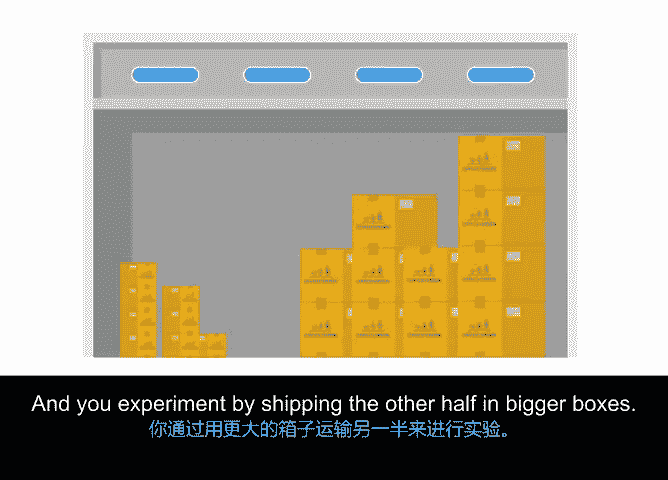

# 019：持续改进与流程改进 🚀

在本节课程中，我们将学习如何在项目中倡导并实现持续改进，核心是理解流程改进的概念与方法。我们将探讨如何识别改进机会、通过实验验证假设，并最终优化项目流程以实现最佳结果。

---

## 什么是持续改进？✨

持续改进是一项旨在持续提升产品或服务质量的长期努力。它帮助确保项目能够稳步朝着最理想的结果前进。

上一节我们介绍了项目执行的基础，本节中我们来看看如何通过系统化的方法让项目变得更好。持续改进的起点，是识别出哪些流程和任务需要被创建、消除或优化。

---

## 流程改进的核心 🔧

流程改进是指识别、分析并改进现有流程的实践，目的是提升团队绩效、制定最佳实践或优化客户体验。

认识到需要改进后，项目经理必须规划并实施变更，以保持项目正常进行。这就是流程改进的用武之地。为了有效地进行流程改进，在受控的实验环境中测试变更想法，可以帮助你确认这些改变是否能真正解决问题。

---

## 受控实验法：验证你的假设 🧪

**控制**是一种旨在最小化变量影响的实验或观察方法。**控制组**是具有代表性的样本，它能帮助你确定实验组与常态之间的差异是由你的改变引起的，而非其他因素。它们能排除对结果的替代性解释。

如果你不熟悉这个概念，没关系，下面我将用一个例子来分解说明。

以下是进行受控实验的基本步骤：

1.  **观察问题**：你首先观察到流程中存在的问题。
2.  **提出假设**：提出一个关于问题成因及解决方案的“有根据的猜测”。
3.  **改变单一变量**：在系统中只改变一个变量，同时保持控制组不变。
4.  **观察结果**：再次观察并比较实验组与控制组的结果。

---

## 实战案例：植物伙伴项目 🌱

让我们将上述概念置于“植物伙伴”项目的场景中。Office Green公司业务蓬勃发展，对新植物配送服务的需求快速增长。为满足需求，供应商简化了流程，将所有植物装入一种“通用尺寸”的箱子。

假设你只用一种尺寸的箱子运送所有植物。对于较小的植物，箱内会添加更多填充物以填补多余空间，植物通常能完好送达。但较大的植物必须被塞进箱子，有时送达时已经损坏。根据客户调查，这是一个需要解决的问题。

为了修复这个问题，你通过提出一个问题来假设一个潜在的解决方案：
> “如果使用我们为小植物准备的相同填充物，但将大植物放在更大的箱子里运送，是否会有更多大植物能完好送达？”

这时，你的控制组就派上用场了。你继续用原来的箱子运送一半的大植物，这构成了你的**控制组**。同时，你进行实验，用更大的箱子运送另一半大植物。除了尺寸，箱子的形状、厚度、供应商、送货地址等所有其他条件都保持**完全一致**。

在大植物送达后，你进行新的调查。如果更多的大植物完好无损地到达，那么你的假设就得到了证实。如果结果与实验前相同，你就需要尝试其他方法来解决植物损坏的问题。

---

## 总结与展望 📝

本节课中，我们一起学习了持续改进与流程改进的核心概念。我们了解到，持续改进是一个循环往复的过程，始于对问题的识别，并通过在受控环境中测试假设来推动有意义的改变。我们以“植物伙伴”项目为例，详细拆解了如何设计一个简单的受控实验来验证流程改进方案。

在受控环境中工作并非确保持续改进的唯一方式。还存在各种数据驱动的改进框架，例如 **DMAIC** 和 **PDCA**。我将在下一个视频中定义这些框架，并在“植物伙伴”的语境中展示它们。我们下节课再见。