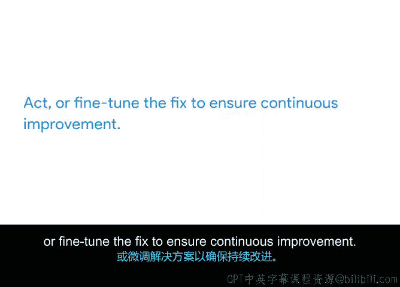

# 020：数据驱动改进框架

在本节中，我们将学习如何利用数据驱动的方法来推动项目的持续改进。我们将介绍两种实用的框架：DMAIC和PDCA，并通过具体示例说明如何应用它们来识别问题、实施解决方案并优化流程。

在上一节中，我们介绍了持续改进的概念，并深入探讨了在受控环境中工作如何优化项目成果。本节中，我们将继续沿着这条路径，揭示用于实现持续改进的具体方法。

我们将从数据驱动改进框架开始。数据驱动改进框架是基于实际数据做出决策的技术。

我们将介绍的第一个框架DMAIC，您可能已经熟悉，因为我们在之前的课程中讨论过它。DMAIC代表定义、测量、分析、改进和控制。它规划了实现持续改进可以采取的五个步骤。

因此，在考虑如何改善客户体验时，请从以下步骤开始。

以下是DMAIC框架的五个步骤：

*   **定义**：您需要明确业务问题、目标、资源、项目范围和项目时间线。
*   **测量**：在此阶段，您将进行绩效指标衡量和数据收集，以建立基线并衡量成功。
*   **分析**：致力于找出问题的根本原因并理解其影响。
*   **改进**：这意味着实施一个合理的解决方案来解决问题。
*   **控制**：在此阶段，您将实施变更，并持续监控您所建立的更新后的流程。

在处理持续改进时可以参考的另一个框架是PDCA。PDCA是一个四步流程，侧重于识别问题、修复问题、评估修复是否成功以及微调最终的解决方案。

以下是PDCA的四个步骤：

*   **计划**：在此阶段，您将识别问题及其根本原因，并集思广益寻找解决方案。
*   **执行**：在此阶段，您将实施解决方案以修复问题。
*   **检查**：将结果与目标进行比较，以确定问题是否已解决。
*   **处理**：微调解决方案以确保持续改进。

让我们通过一个例子来具体说明PDCA的应用。假设有一种植物销量不佳，这意味着仓库里堆满了某个特定品种。如果不迅速采取行动，这些植物可能很快就会死亡。那么有哪些可行的解决方案呢？

您提议将网站上销售页面底部的该植物移到顶部，使其处于醒目位置。您还可以开展以该植物为主题的电子邮件营销活动，向客户提供“买一送一”的优惠。

在“执行”阶段，您的项目发起人认为，如果仍能盈利，他们不愿意免费赠送植物。因此，您决定采用第一个方案：将该植物移到网站上更显眼的位置。您的假设是，转移旧库存的最佳方式是将其放在客户无法错过的地方。

接下来是“检查”阶段。您等待一周，观察该植物的销售数字是否上升。如果销量上升了，那么您的假设就是正确的。您既拯救了一些植物的生命，又帮助Office Green避免了财务损失。干得漂亮。

最后是“处理”阶段。在我们的例子中，您决定未来对网站进行重组。所有库存过剩的植物都将在网站上获得一个醒目的位置。

PDCA和DMAIC都是可以在日常生活和工作中应用的优秀问题解决框架。这些框架帮助您识别问题、减少错误并优化流程。我鼓励您下次遇到问题或发现工作流程中有改进空间时，思考这些技术。您会惊讶于一个简单的框架如何能帮助您取得成功。

太棒了，现在您对倡导和创建持续改进有了更多了解。我们还定义并通过示例演示了如何使用DMAIC和PDCA框架进行流程改进。

既然您已经了解了持续改进和流程改进的基础知识，我们接下来将讨论项目与项目集之间的区别以及它们如何交叉。我们下一个视频再见。