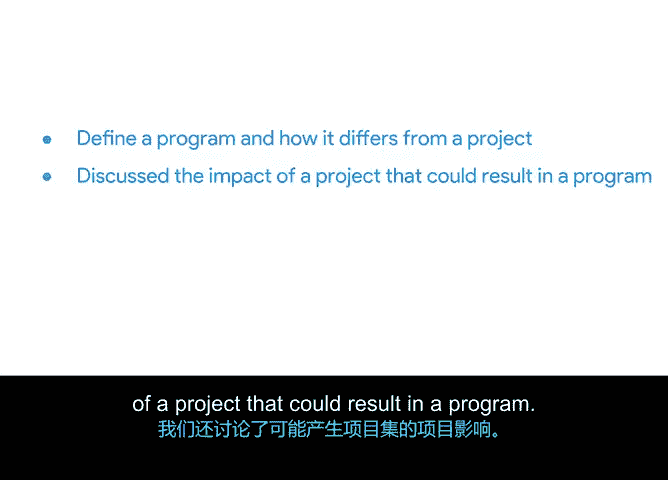

# 021：21_02_03_区分项目与项目集

在本节课中，我们将要学习项目管理中的三个核心概念：项目、项目集和项目组合。我们将探讨它们之间的区别与联系，并了解它们如何共同协作，通过持续改进为组织创造价值。

## 项目、项目集与项目组合概述

到目前为止，你已经知道项目经理需要与团队成员进行日常互动。你可能不知道的是，项目经理也是其所在企业或组织内更大生态系统的一部分。项目并非项目经理可能参与的唯一工作类型，还存在项目集和项目组合。

一个**项目**是单一的、聚焦性的工作。一个**项目集**是多个项目的集合，而一个**项目组合**则是整个组织中所有项目和项目集的集合。

可以这样理解：项目可以存在于项目集之内，而项目集又可以存在于项目组合之内。请注意，这里说的是“可以”，因为情况并非总是如此。项目也可以作为独立的、不相关的计划存在。但如果它们属于组织内某个更大的整体，项目就可以组成一个项目集。这三者的集体成功与各自成功都依赖于持续改进。

## 管理角色与职责

那么，谁来管理这些不同类型的工作并推动成功呢？让我们从组织架构的角度来思考，从项目经理开始。

以下是不同管理角色的职责：

*   **项目经理**：监督单个项目，负责短期、具体的交付成果。其任务是持续改进其负责的项目。
*   **项目集经理**：监督项目群组，甚至管理其他项目经理，专注于长期的业务目标。其任务是持续改进其负责的项目集合。
*   **项目组合经理**：监督项目与项目集的组合，并为它们提供集中管理。其任务是持续改进其负责的项目和项目集集合。

不同公司对这些角色的命名可能略有不同，但概念是相同的。

## 持续改进的实例

让我们来看一个实例，说明这些角色如何直接为组织创造持续改进。

一位项目经理决定每月为其团队成员提供跨部门培训。他们的团队规模较小，因此他们认为，让其他部门的员工了解他们的工作量和流程是有益的。这样，如果有人不在办公室，工作总能得到覆盖。

经过几个月的培训，项目经理意识到这不仅改善了沟通流程，还无意中起到了团队建设的作用。因为培训，员工有机会互动并更好地了解彼此。

项目经理将此信息汇报给其项目集经理，项目集经理非常喜欢这个意外的发现。现在，项目集经理可以在其管理的所有项目中推广这些培训，使这些持续改进在项目集范围内生效，而不仅仅是单个项目。

## Office Green公司的实例分析

那么，项目、项目集和项目组合在Office Green公司具体是什么样子呢？

*   **项目**：启动并运行“Plant Pals”服务是一个项目。它是短期且临时的。一旦服务成功启动，项目就结束了。
*   **项目集**：让该服务持续无限期地运行，需要将项目转变为项目集。运行“Plant Pals”服务的项目集成为Office Green的长期业务目标之一，公司将致力于持续改进该项目集。
*   **项目组合**：现在，“Plant Pals”以及Office Green的其他项目和项目集，都被包含在公司的项目组合中。

当“Plant Pals”项目执行持续改进时，Office Green的项目集和项目组合都会注意到其带来的好处。

## 从项目改进到组织收益

例如，让我们回顾上一个视频中关于植物库存过剩的例子。

在使用PDCA（计划-执行-检查-处理）循环时，你注意到其中一种植物品种的销量下降。因此，你决定重新组织网站，将滞销的品种展示在顶部，并给予小幅折扣。这一改变非常成功，最终你将其定为最佳实践。从现在起，表现不佳和库存过剩的植物品种都将被展示在网站顶部。

这实际上是一个新流程。反复运行它将推动持续改进。你对项目所做的持续改进，很好地反映在了你的项目集和项目组合上。因为现在该策略已经过测试，可以在全公司范围内对所有其他网站和产品实施相同的策略，从而全面减少浪费、增加收入。

如果Office Green的许多或所有项目都看到了同样的改进，这将直接使项目集（即项目的集合）受益。如果同样的策略应用于Office Green的项目集，项目组合将通过获得更强的盈利能力指标而直接受益。

## 总结

本节课中，我们一起学习了如何定义项目集以及它与项目的区别。我们还讨论了项目可能对项目集产生的影响，并学习了项目如何转变为项目集或项目组合的一部分。现在你对这三个概念如何协同工作有了更深入的了解。

