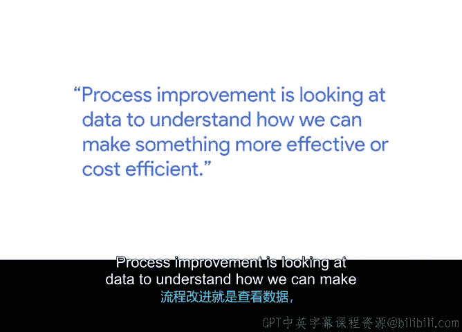
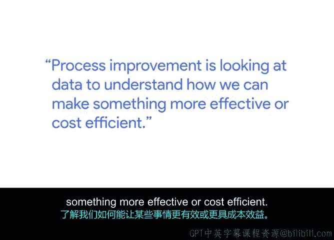
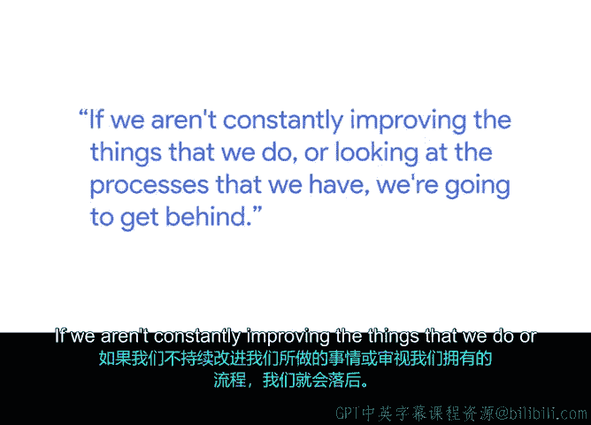
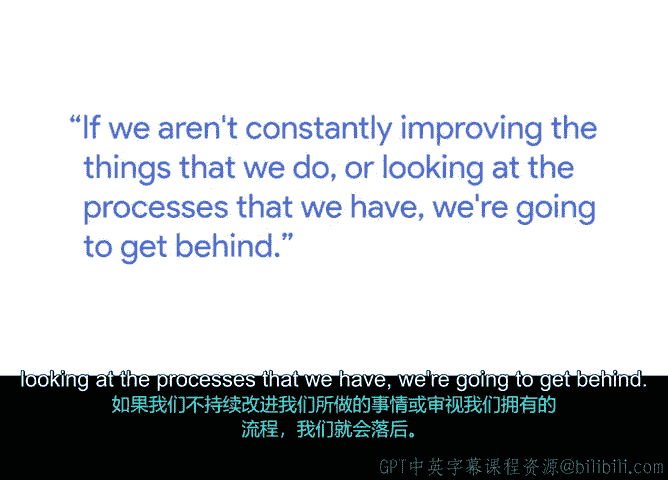

# 022：培养持续改进思维 🧠

## 概述
在本节课中，我们将跟随谷歌产品运营经理Jacob，学习如何在项目管理中培养和应用“持续改进”的思维模式。我们将了解这种思维的重要性、具体实践方法以及它如何帮助团队和技术产品不断进步。

---

我是Jacob，目前在谷歌担任产品运营经理。

产品运营与项目经理的角色并无太大差异。我曾担任过多种职务，例如解决方案顾问、项目经理，如今是产品运营经理。这些角色本质上需要同一套技能：**组织人员**，并将复杂的想法简化，以便团队能够理解并据此开展工作。

产品运营经理的职责非常多样化。我们不仅与工程师、产品团队合作，还需要与法务部门协作。更重要的是，我们是**客户的声音**。我们处于一个独特的位置，能够收集来自支持渠道等处的客户反馈，并与产品团队协作，共同构建解决方案。

---

## 什么是流程改进？ 🔄

上一节我们了解了产品运营的角色，本节中我们来看看什么是流程改进。

**流程改进**是指通过分析数据，来理解如何使某项工作更有效或更具成本效益。

😊

---

## 持续改进的实践与心态 🛠️

在项目中工作时，我们总会审视当前的管理方式，并思考是否能做得更好。

我可以举一个非常简单的例子：**记会议纪要**。这看似超级简单，但很多时候，纪要记好了，我们却忘记发送出去，忘记通过邮件同步更新给相关人员。因此，我们不断寻找新的方式来处理诸如记纪要这类事情，思考如何组织我们的技能和项目。

所以，流程改进的一部分，就是审视我们手头的工具，看看是否有新的、更好的选择。

**持续改进**更是一种我们团队秉持的心态，即不断鞭策自己，即使我们认为产品已经处于不错的状态，也要追求更好。在技术领域工作，事物瞬息万变，因此我们必须具备这种心态。

😊

---

## 为何持续改进至关重要？ ⚡

我们刚刚讨论了持续改进的实践，现在来深入探讨它为何如此关键。

你不可能将事情计划得完美无缺，或者说，你认为的完美计划，总会有新情况出现。一旦产品发布出去，用户会以你意想不到的方式使用它。这正是**持续改进**理念的用武之地。因为即使你认为产品已经很棒了，你也需要能够审视它，放下自我，在看到用户的实际使用方式后，去解决那些新出现的问题。

这对于技术领域至关重要，因为技术发展迅猛，变化极快。如果我们不持续改进所做的工作或审视现有的流程，我们就会落后。

---

## 拥抱变化与保持初心 ❤️

我们总是在添加新功能，而这些新功能总会带来需要我们解决的新问题。

如果你坚信你所做的一切是为了服务用户，并且你能忘记那些冰冷的数字、抛开所有杂念，记住你的产品可能会让某人感到非常开心，或者帮助某人的业务更加成功——正是这些事情让我对工作感到兴奋，并驱散了项目推进过程中可能产生的所有挫败感。

---

## 总结
本节课中，我们一起学习了持续改进思维的核心。我们了解到，它既是一种通过数据分析来优化流程的**方法**，更是一种在快速变化的技术领域中保持竞争力的关键**心态**。从记会议纪要这样的小事，到发布影响用户的产品，持续改进要求我们不断审视、放下自我、拥抱反馈并积极解决问题。记住工作的初心——为用户创造价值，是驱动我们持续改进的根本动力。