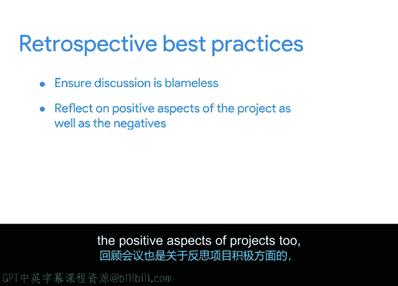

# 023：回顾会议的目的 🎯

在本节课中，我们将深入探讨回顾会议的目的、价值以及如何有效实施，以帮助项目团队从过往经验中学习并持续改进。

你是否曾回顾生活中的某个事件，并希望它能有不同的结果？虽然我们无法让时光倒流，但你可以采取一些措施，确保不再重蹈覆辙。在上一节视频中，我们讨论了持续改进。而确保持续改进的一种有效方式，就是召开回顾会议。接下来，让我们更深入地探讨这个话题。

回顾会议是一种研讨会或会议，它为项目团队提供了反思项目的机会。回顾会议，有时简称为“回顾”，应在项目的整个生命周期中定期举行，但通常是在主要里程碑达成后，或最常见的是在项目完成后进行。回顾会议让你有机会讨论项目或各阶段中发生的成功与挫折。你可以将其视为项目内部的一种流程改进形式。

回顾会议主要服务于三个目的：
1.  **促进团队建设**：因为它们让团队成员能够理解团队内部的不同视角。
2.  **促进未来项目的协作改进**。
3.  **推动未来流程和程序的积极变革**。

下面我们来详细阐述每一点。

回顾会议非常有助于团队建设，因为它们能让团队更好地相互理解，促进更佳协作，从而提高生产力。回顾会议的重点在于**持续改进和变革**，而非重复旧有的、可能不良的习惯、程序和流程。

回顾会议之所以有帮助，是因为即使我们为所有可能的风险做了计划，也总会有意外发生。当出现疏漏，需要与团队一起反思时，你可能就需要召开一次回顾会议。其他可能需要召开回顾会议的情况包括：错过截止日期或未达预期、利益相关者之间的沟通不畅等。你也可以在冲刺结束时召开回顾会议。提醒一下，**冲刺**是一系列以达成目标为终点的有序任务。此外，在产品发布和上线后也可以举行回顾会议。这些都是记录关键经验教训的绝佳机会，其他人在进行自己的项目时或许可以从中学习。

识别项目中的障碍和成功有助于改进未来的流程。但具体如何召开回顾会议，方式可以多种多样。一次富有成效的回顾会议并没有确切的公式或模板。你选择如何组织回顾会议，将取决于你的团队和工作环境。

如果你的团队偏好当面汇报，你可以决定进行一次正式的面对面回顾会议。你可以使用便利贴、文档或任何其他实体工具来帮助团队进行汇报。或者，如果你发现团队在面对面会议中经常偏离主题，那么虚拟或在线回顾会议可能是更好的选择。在这种情况下，使用**调查问卷**可能有助于整理思路。

虽然没有固定的方法召开回顾会议，但有一些最佳实践需要牢记。如前所述，你需要确保回顾会议是**无指责的**。确保每个人都能尽可能坦诚地提供反馈，这将带来最富有成效的回顾会议。为了应对尴尬局面或敏感话题，可能需要鼓励匿名或私下反馈。项目经理可以使用一些策略来确保过程无指责，例如**转换视角**和**将“你”语言改为“我们”语言**。

转换视角意味着设身处地为他人着想。例如，如果你的团队急于指责快递公司未能按时将植物送达客户办公室，请从快递公司的角度思考一下情况：快递公司的路线是否经过优化和测试以避开交通拥堵？如果没有，也许这本应是你项目中的一项任务。

使用“你”语言可能会带来麻烦，因为它会让房间里的人感觉像是在评判那个被指责的人。例如，告诉你的项目发起人“你没有明确说明我们没有预算用于植物死亡时的应急资金”，就不如说“应急资金的缺乏从一开始就没有完全明确，这是我们下次可以改进的地方”来得有建设性。前者可能让项目发起人感到被攻击，并质疑你作为项目经理为何没有在早期提出正确的问题。也许事实是，双方本都可以为纳入应急预算多做一点努力，而这没关系。

确保不要只关注负面。回顾会议同样关乎反思项目的积极方面。所以，也要讨论哪些方面进展顺利、哪些部分很有趣、有哪些新事物可以带入未来的项目。😊 也许销售和市场团队不常合作，但这次给了他们一个建立联系的机会。也许你非常喜欢与项目“Plan Poal”签约的网站设计师合作，以至于团队决定全职聘用他们。无论积极方面是什么，都值得庆祝。你甚至可以点一些晚餐或甜点来感谢大家。😊

最后，你需要确保实施所讨论的变革。你将落实讨论过的改变，并决定在下一阶段以略有不同的方式处理项目。如果人们觉得他们的反馈没有被充分考虑和实施，他们就不愿意参与回顾会议。

现在你已经对回顾会议有了一个总体了解。在下一节视频中，我们将在此基础上进一步深入，演示如何亲自组织一次回顾会议。我们下节再见。