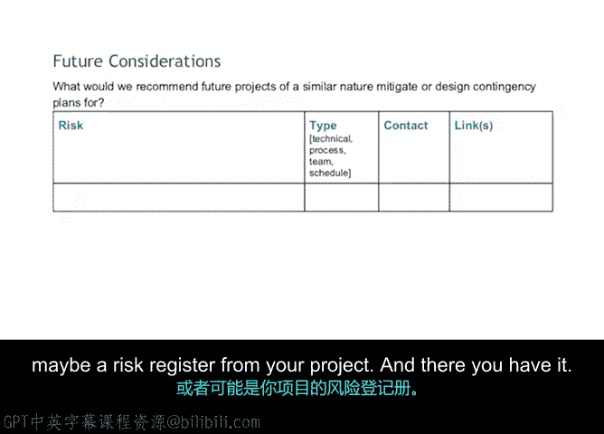

# 024：召开回顾会议 📊

## 概述
在本节课程中，我们将学习如何有效地召开项目回顾会议。回顾会议是项目执行过程中的关键环节，旨在总结经验教训，为未来的项目改进提供依据。我们将探讨会议的准备、执行步骤以及如何记录和运用会议成果。

## 回顾会议的核心原则
上一节我们介绍了回顾会议的重要性，本节中我们来看看召开会议时需要遵循的核心原则。首先，回顾会议没有固定的公式或模板，因为每个团队的学习、适应和成长方式都不同。不同的情况需要不同的策略，尤其是在接收可能敏感的反馈时，最好优先考虑团队的需求。

在开始回顾会议之前，有几点需要牢记。

### 会议前的注意事项
以下是召开回顾会议前需要考虑的两个关键点。

1.  **保持积极基调**：在整个过程中，需要保持积极的基调。请记住，即使存在一些艰难的对话，回顾会议的目标是鼓励改进，为未来的项目做好准备。通常，回顾会议应被视为一种积极的体验，团队成员应能自如地分享反馈。
2.  **考虑相关团队**：可能需要考虑项目之外的其他团队。如果有经常合作的其他团队，他们也需要参与回顾会议。例如，项目中涉及的某些关联团队可能希望对团队间沟通困难等问题发表意见。如果他们选择不参与回顾会议，至少需要与他们分享你的发现。毕竟，改善跨团队互动和交付物交接是回顾会议中经常讨论的话题。

## 回顾会议的进行方式
正如之前提到的，可以使用各种道具和工具来进行回顾会议。以下是一个回顾会议可能包含内容的示例。正如你将注意到的，它相当全面，并提供了很多记录细节的机会。你需要鼓励团队成员尽可能多地提供反馈。

这个回顾会议模板是一个标准文档，项目经理可以填写并与团队讨论，用它来引导对话。按照事件发生的真实顺序回顾整个事件链。

*   在规划阶段发生了什么？
*   哪些地方可以做得更好？
*   你的团队在哪些方面比较幸运？
*   在执行阶段又如何呢？

在进行上述回顾时，填写“经验教训”部分。这是一个空间，用于详细阐述下次可以采取哪些不同做法。

## 记录经验教训
这是一个记录在项目中具体化了哪些风险的空间。

*   原始计划与其执行之间是否存在巨大差距？
*   团队对此感受如何？

也许你的几位项目团队成员评论了网站上线未按原定截止日期完成的事实。因此，销售团队成员当月未能完成指标。市场部门不得不更改多份内容和广告的日期，而项目发起人不得不向急于查看网站的投资者做出解释。

团队成员现在感到沮丧，因为如果你优先完成了网站建设，并在次要任务上花费更少时间，这种情况本可以避免。这是尖锐的反馈，但对于未来的成功，考虑此风险为何具体化是切题的。下次，你将确保优先处理具有许多依赖关系的任务。

## 规划未来行动
既然已经回顾了所有情况，通过填写剩余的表格来为团队构建更美好的未来。

第一个表格是关于行动项的，它将解决这个问题：**根据我们学到的经验教训，我们应该采取哪些行动？**

你将从左侧想要处理的行动项开始，然后向右填写各个单元格，包括以下信息：

*   **类型**：例如，这是一个工具、一个流程、一个团队还是其他什么。
*   **负责人**：谁将负责此行动项。
*   **相关链接**：考虑我们在哪里跟踪此项。

下一个表格全是关于未来考虑的。

*   是否存在任何风险，如果不在下一季度解决，可能会演变成问题？
*   是否需要将此项目的所有权移交给其他人？

包含这些内容，并确保填写其他单元格，包括：

*   **类型**：这是一个流程、一个团队还是其他什么？
*   **联系人**：如果我们以后需要参考此程序，谁可以作为我们的资源？
*   **相关链接**：再次强调，任何可能与此主题相关的链接。如果移交项目，可能是相关文档，或者你项目中的风险登记册。

这样，回顾会议就完成了。

## 创新会议形式
刚才展示的是一个相当标准的回顾会议填写方式。但如果你觉得你的团队需要一些更具互动性的形式，请随意发挥创意。从团队收集信息的方式可以比单纯询问更具创新性。

你可以使用颜色编码、便利贴、带有表情符号的列，或任何你认为适合你的团队并能保持他们参与度的方式。无论做什么，请确保将学到的经验教训应用到你的下一个项目中。😊

## 总结
在本节课中，我们一起学习了如何召开有效的项目回顾会议。我们了解了会议前的准备原则，包括保持积极基调和考虑相关团队。我们探讨了使用标准模板引导对话、按时间顺序回顾事件、记录具体风险和经验教训的详细过程。最后，我们学习了如何将会议成果转化为具体的行动项和未来考虑，并鼓励采用创新形式提高团队参与度。回顾会议是持续改进的关键，确保将学到的经验应用于未来项目是成功的重要一步。

在下一个视频中，我们将总结本模块学到的所有经验教训。到时见。😊