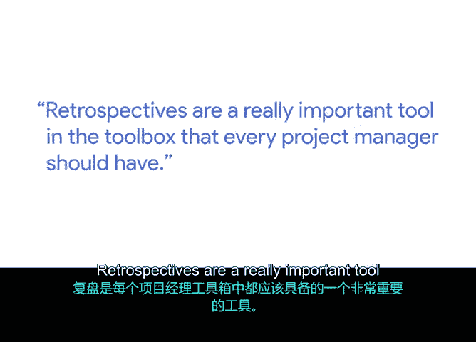
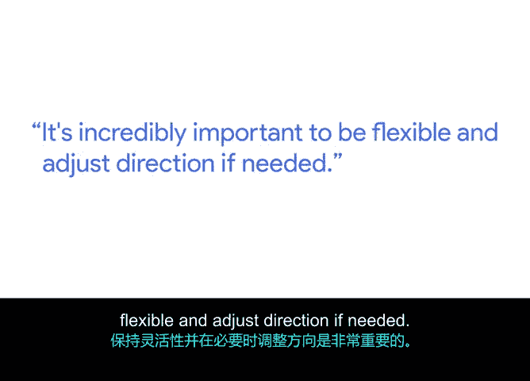

# 025：利用回顾会议重回正轨 🧭

在本节课中，我们将学习回顾会议这一关键工具，了解项目管理者如何利用它来识别问题、调整方向，确保项目在偏离轨道时能够及时回归正途。

我的名字是克诺特，是谷歌纽约的高级项目经理。我所在的部门名为“Geo”，负责谷歌地图及谷歌搜索中的地图产品。高级项目经理通常负责一系列项目和计划，从构思阶段一直到最终发布落地。对于任何项目经理而言，几乎每天都会遇到一些不可预见的情况，导致项目偏离轨道。回顾会议是工具箱中一个非常重要的工具，每位项目经理都应掌握。

## 回顾会议：持续性的检查工具 🔄

上一节我们介绍了回顾会议的基本概念，本节中我们来看看它如何作为一种持续性实践发挥作用。人们常常在项目结束时才说“现在该做回顾了”，然后仔细审视哪些做得好、哪些做得不好，以及可以应用于未来项目的经验教训。但我认为这更应该是一个贯穿项目始终的持续性练习，你应该持续检查项目的进展状况。

以下是一个回顾会议帮助我们重回正轨的实例：

我们当时正在推进一个项目，旨在谷歌搜索上发布一项新功能。项目进行到一半时，我们意识到实际上存在一种更好的方法，能为用户带来更大的利益。因此，我们召集了整个项目团队，深入讨论了以下内容：
*   我们目前完成了哪些工作？
*   项目的当前状态是什么？
*   我们有哪些前进选项，可以解决现已识别出的不足？

随后，我们共同重新规划了项目的剩余部分，以确保我们有一条清晰的前进路径，并对如何达成调整后的新成功标准有了明确的理解。

## 灵活性与方向调整的必要性 🧘

在明确了回顾会议的作用后，我们来看看其核心目的：灵活调整。在必要时保持灵活并调整方向至关重要。

如果你知道需要改变，并且清楚项目正朝着错误的方向发展，那么继续沿着错误方向前进显然是对项目和公司最不利的做法。因此，尽快启动分析流程至关重要。我们需要分析有哪些选项可以纠正航向，确保项目朝着正确的方向前进，并尽快踏上新的方向。当然，在此过程中需要投入足够的时间，以确保这是一个**数据驱动**的决策，并且所有利益相关者和发起人都能达成共识。

## 项目经理的核心跟踪要素 📊

了解了调整方向的重要性后，我们来看看项目经理在日常工作中应重点关注哪些方面。作为项目经理，需要跟踪的最重要事项实际上在一定程度上取决于你所参与的项目类型。但我认为，核心在于以下几点：

以下是项目经理需要紧密管理的几个关键维度：
*   **严格管理范围**：控制项目边界，防止范围蔓延。
*   **严格管理资源**：确保人力、物力等资源得到有效分配和利用。
*   **严格管理时间线**：对照最初设定的时间计划进行评估。
*   **持续评估进展**：仔细评估实际情况，并与原始计划进行比较。
*   **必要时进行航向修正**：根据观察到的情况，在需要时做出路线调整。

本节课中我们一起学习了回顾会议如何作为一项持续性工具，帮助项目团队及时发现问题、共同分析选项并调整计划。关键在于保持灵活性，基于数据和共识做出决策，并紧密管理范围、资源和时间线，以确保项目最终成功。