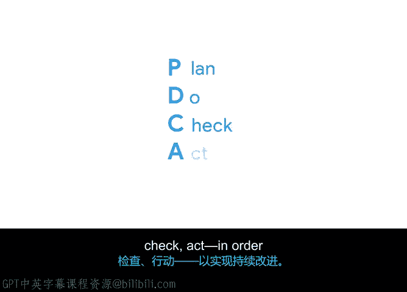

谷歌项目管理专业证书：第4课：项目执行推动项目总结

在本节课中，我们回顾了熟悉的概念并引入了许多新知识。我们重点探讨了质量管理、持续改进以及如何利用回顾会议促进团队学习与未来项目的成功。

我们讨论了质量管理。

以下是确保质量的四个步骤：
*   **设定质量标准**：明确项目成果需满足的要求。
*   **质量规划**：确定如何达到这些标准。
*   **质量保证**：通过审计等过程确保项目活动符合计划。
*   **质量控制**：监控具体成果，检查其是否符合标准。

我们涵盖了持续改进。

以下是两种用于实现持续改进的数据驱动策略：
*   **DMAIC**：代表定义、测量、分析、改进、控制。
*   **PDCA**：代表计划、执行、检查、处理。

我们学习了如何开展和利用回顾会议作为未来改进的工具，以及如何引导积极对话并鼓励团队成员提供反馈，以避免在未来的项目中重蹈覆辙。

你的进步令人赞叹。请花一点时间欣赏自己的成长并为自己鼓掌。😊

在下一个模块中，你将学习收集数据的重要性以及如何做出数据驱动的决策。当你准备好时，我们那里见。