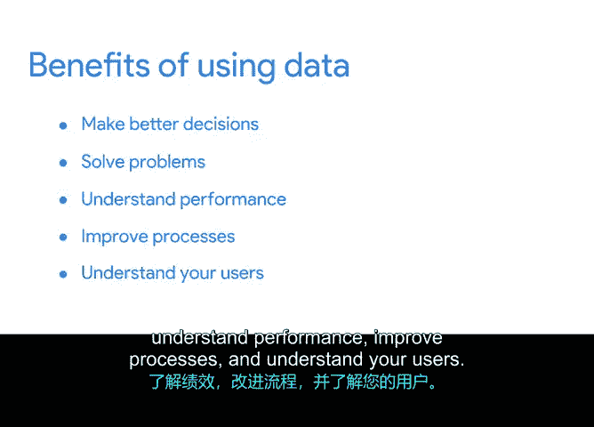

# 028：数据的价值 📊

在本节中，我们将解释数据的价值及其对项目的影响。我们还将介绍如何利用数据与利益相关者进行沟通。数据在现代商业中扮演着至关重要的角色，每天产生海量信息，理解并运用这些信息是项目成功的关键。

## 什么是数据？

数据是事实或信息的集合。通过数据分析，你可以学会如何利用数据得出结论、做出预测和决策。我们在日常生活中经常使用数据来辅助决策和提升表现。

例如，我的一位朋友是跑步爱好者，每年参加5公里和10公里比赛。在训练时，她使用GPS手表上的数据来测量时间和距离。她甚至可以通过计算**每分钟每公里**的配速来追踪自己的表现，从而专注于未来的提升。

## 数据如何为组织创造价值？

同样，企业也通过各种方式使用数据和分析来改进业务并为组织创造价值。例如，公司通过收集客户行为和需求的数据来提供更好的服务并开发新产品。

Netflix是一个很好的例子，它利用数据智能预测客户喜好。通过观察**类型、评分和重复观看次数**等数据点，Netflix会推荐他们认为客户可能喜欢的电视节目，从而提升客户的观看体验。

## 数据在项目管理中的日常应用

作为项目经理，你可以每天使用数据来做出更明智的决策、解决问题、理解绩效、改进流程并了解你的用户。让我们通过一个具体项目来看看这些好处如何体现。

## 案例：Office Green的植物项目

在Office Green的植物项目中，如果你掌握了客户购买模式的数据，并发现最畅销的产品都是热带植物，你就能在与供应商下新订单时做出更好的决策。你还能更好地了解用户及其偏好，从而改进产品供应和业务表现。

数据在项目团队中的另一个日常好处是提供了改进流程的机会。如果你从项目跟踪器中获得了**已完成任务数量、升级次数或内部流程相关问题数量**的数据，你就能推断出大部分问题的根源。这些数据将帮助你决定应将注意力集中在何处以改进流程。

## 总结与展望

虽然这些都是简单的例子，但通过批判性分析、应用和执行，数据将成为引导任何项目走向正确方向的强大工具。接下来，我们将讨论你可以使用的项目数据类型，以便更好地应用这一工具。

在本节课中，我们一起学习了数据的定义、其在组织中的价值，以及如何在项目管理中实际应用数据来改善决策、流程和用户理解。掌握数据的运用是推动项目成功的重要技能。