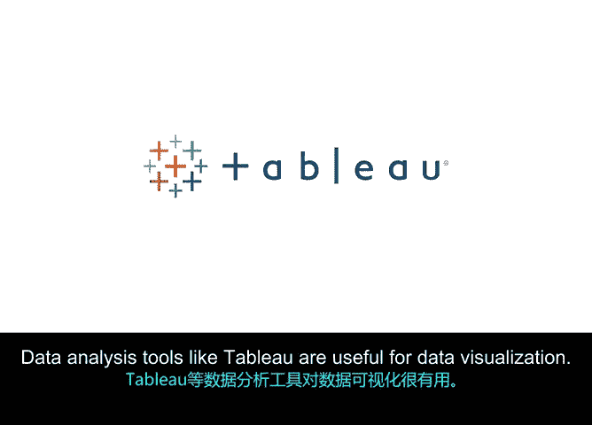

# 029：常见项目数据类型 📊

在本节课中，我们将学习项目经理日常收集和分析的常见数据类型，并了解用于组织这些数据的工具。

上一节我们探讨了数据的价值，本节中我们来看看项目经理具体会处理哪些类型的数据。

## 数据与指标

正如之前所讨论的，数据是事实的集合，有助于为决策提供信息。你可能会开始注意到项目数据如何影响团队的日常活动以及项目的整体进展和成功。这通常通过使用各种类型的指标来实现。

一个**指标**是一个可量化的测量值，用于跟踪和评估业务目标。指标基于选定的目标，因项目而异，是项目数据的一种关键类型。

## 项目数据的类型

你可以使用多种类型的项目数据来确定进度和效率。项目指标可以分为**生产力指标**和**质量指标**。

### 生产力指标

生产力通常衡量一段时间内的进展和产出。生产力指标允许你跟踪项目的有效性和效率，包括里程碑、任务、预测和持续时间等指标。

以下是几种常见的生产力指标：

*   **里程碑**：项目时间表中的一个重要节点，标志着进展，通常表示一个可交付成果或项目阶段的完成。
*   **任务**：需要在规定时间内完成的活动。
*   **预测**：基于现有信息对结果的预测。例如，你可以预测，根据项目开始时拥有的资源，项目将在六个月内完成。
*   **持续时间**：项目从开始到完成所需的总时间。持续时间也可用于里程碑，以判断是否能满足项目截止日期。这些数据可以分解为小时、天、周、月，有时甚至是年。

### 质量指标

质量指标关系到实现可接受的结果，可以包括变更数量、问题和成本差异等指标，这些都会影响质量。

以下是几种常见的质量指标：

*   **变更数量**：项目或项目范围期间的变更数量有助于监控风险。变更显示了与项目初始要求的不一致之处。一系列累积的小变更可能预示着更大的问题，并提供这些问题的早期迹象。使用**变更日志**来记录这些变化是与利益相关者沟通某事为何耗时更长或成本超出预期的有用工具。变更日志是项目中所有显著变更的记录。
*   **问题**：一个已知且真实的问题，可能会影响完成任务的能力。例如，问题可能是你希望推出的广告延迟获得法律批准，或者是为商务会议预定场地时确认席位的数量不足。
*   **成本差异**：它说明了实际成本与预算成本之间的差异。简单来说，成本差异比较了你计划花费的金额与实际花费的金额。例如，如果你预算只为即将到来的商务会议接待250名与会者，但实际来了275人，并且场地向你收取了这些额外客人的费用，那么实际成本将高于你的初始预算或估算。

## 项目管理工具

虽然这些数据点是项目经理通常跟踪的，但你还可以利用数十种其他指标来为项目决策提供信息。好消息是，有许多专门用于项目管理和数据分析的复杂软件和工具。因此，你将获得帮助，在一个集中的位置跟踪所有这些不同类型的数据。

像 **Workfront** 和 **Jira** 这样的项目管理工具可以跟踪活动并提供可读的结果，以便你衡量项目的整体健康状况。像 **Tableau** 这样的数据分析工具则对数据可视化非常有用。

## 总结

本节课中，我们一起学习了如何识别常见的数据类型，包括生产力指标（如里程碑、任务、预测、持续时间）和质量指标（如变更数量、问题、成本差异）。我们还了解了一些可以帮助你管理和分析数据的常见项目管理软件和工具。

在下一课中，我们将介绍数据如何帮助你做出明智的决策。