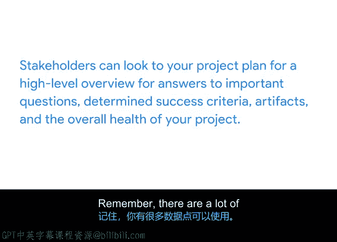

# 030：推动项目｜识别重要数据 📊


## 概述
在本节课程中，我们将学习如何识别项目中最重要的数据。我们将探讨如何从海量信息中筛选出关键信号，如何根据项目目标和利益相关者的需求来优先处理数据，以及如何利用这些数据来确保项目的整体健康与成功。

## 识别关键数据信号
上一节我们介绍了数据的类型及其对项目经理的价值。本节中，我们来看看如何识别那些对项目成功至关重要的数据。

数据中的“信号”是指可观察到的变化，它能帮助你判断项目的整体健康状况，并及早发现潜在问题。就像人体体温达到100.4华氏度（约38摄氏度）以上是生病的信号一样，项目数据中的异常变化也预示着风险。

**公式：** 信号 = 可观察到的变化

作为项目经理，你需要关注那些威胁项目整体成功的信号。以下是开始识别重要数据的两种方法：

### 1. 观察团队生产力与产出
关注对项目总体目标贡献最大的任务。这能帮助你确定哪些数据点（在本例中是任务和活动）最为重要。

### 2. 优先处理对利益相关者最有价值的数据或指标
确保你收集和分析的数据与利益相关者最关心的问题保持一致。

## 实践案例：确定数据优先级
让我们通过一个案例来理解如何应用上述方法。

假设你在一家制造公司负责一个项目，目标是在第三季度发布一款便携式家用电器。你的利益相关者最关心的是能否按时交付。

首先，梳理你掌握的项目数据：
*   目前处于第一季度。
*   项目已超预算2000美元。
*   根据**燃尽图**（一种追踪剩余工作量与时间关系的图表），项目进度比计划提前了30天。

**代码示例（燃尽图概念）：**
```
// 燃尽图通常展示剩余工作量随时间减少的趋势
剩余工作量 = 总工作量 - 已完成工作量
```
仅看这些，你可能会觉得项目进展顺利。但还有其他因素需要考虑：
*   过去三周，任务数量增加了10%，因为利益相关者希望为产品添加更多功能。
*   为了完成这些新增功能，团队需要加班，导致开始出现倦怠，生产力正在下降。

现在，你对按时交付的信心还那么足吗？显然，情况不容乐观。

此时，你可能会专注于“超预算2000美元”这个信号。但如果利益相关者明确表示，他们更关心截止日期而非预算小幅超支，那么你就应该将注意力集中在与**时间**和**范围**相关的关键信号上，而不是预算。

通过分析相关数据，你可以得出结论：只要利益相关者停止请求导致任务量增加的新功能，项目就能按时交付。你可以利用生产力指标来预测，在当前团队效率下，范围增加将如何影响进度，并将此分析结果传达给利益相关者。

## 保持信息同步与透明
为了避免反复与利益相关者重新设定期望，你需要及时更新项目计划，确保优先级信息对所有人透明。利益相关者可以通过项目计划，快速获取重要问题的答案、成功标准、项目成果以及项目整体健康状况的高级概述。



**记住**，你可以获取的数据点非常多。通过关注信号、聚焦对项目目标影响最大的任务，并与利益相关者的优先级保持一致，你可以有效地为正确的任务确定优先级。

## 总结
本节课中，我们一起学习了如何识别项目中的重要数据。我们了解了数据“信号”的概念，掌握了通过观察团队产出和 aligning with stakeholder priorities 来确定数据优先级的两种方法。通过一个具体案例，我们看到了如何在实际项目中应用这些原则，做出以数据为依据的决策，并强调了通过更新项目计划来保持沟通透明的重要性。下一节，我们将探讨如何利用这些数据来做出更优的决策。