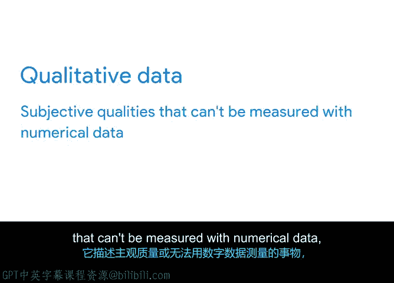

# 031：运用数据分析支持决策 📊

在本节课程中，我们将深入探讨数据分析，并了解项目经理如何在整个项目周期中运用数据来做出明智的决策。

我们每天都在使用数据来帮助自己做出生活中或简单或重要的决定。例如，假设你正在为一项大额消费攒钱。你或许会认为，更快达成目标的最佳方式是制定一个预算。在花时间审查预算后，你可能会发现每周的开销超出了每周的预算额度，并且许多开销来自于点外卖和外出就餐。你意识到，为了达成目标，你需要减少在外就餐的花费，并找到更具成本效益的购买食物的方式。凭借这个新发现的信息，你找到了为那笔大额消费攒钱的方法。

这类似于你如何通过制定和调整预算来达成期望的结果。作为项目经理，你的职责就是选择合适的数据来为你的决策提供信息。你可以通过一个叫做“数据分析”的过程来实现这一点。

数据分析是收集和组织信息以帮助得出结论的过程。它被用于解决问题、做出明智决策以及支持目标达成。企业使用数据分析来揭示其数据中的重要洞察和模式，从而为行动提供信息并推动结果。

收集数据只是过程的一部分，另一部分是分析数据。你从分析中学到的东西将成为知识，为你的项目提供智能解决方案的动力。项目经理通常会运用数据分析来寻找重复的行为模式，并基于数据预测来寻找解决方案。

例如，假设一家网约车公司有一组数据分析师，他们正在利用乘客的行为模式来改善客户支持。他们注意到，在某个特定城市，工作日的交通高峰时段对司机的需求量很大。结果，乘客在高峰时段很难叫到车。作为项目经理，你被要求想出一个解决方案来帮助满足对司机日益增长的需求。

你与团队合作，确定哪些数据点最适合进行审查。你可能会决定追踪高峰交通时段、平均每日乘客请求数量以及可用司机数量。这些数据点可以帮助你了解如何解决高峰时段的高需求问题。

在分析数据之后，你的团队意识到，一个可能的解决方案是在高峰时段为在该城市接载乘客的司机提供奖励。新的奖励措施让司机感到被重视，而司机数量的增加也提升了客户满意度。你之所以能找到这个解决方案，正是得益于从数据分析中获得的洞察。

在这个例子中，你收集了两种类型的数据：定性数据和定量数据。

**定量数据** 包括关于收到的乘客请求数量的统计和数字事实。例如，该城市的请求数量在一段时间内的特定时间点有所增加。

**定性数据** 则描述了主观特质或无法用数值数据衡量的事物，例如用户对服务或产品的反馈。

在项目管理中，你将同时使用定性数据点和定量数据点来为决策提供信息、进行改进并分享洞察。接下来，你将学习如何用数据讲故事，以及有效呈现数据的方法。我们稍后见。