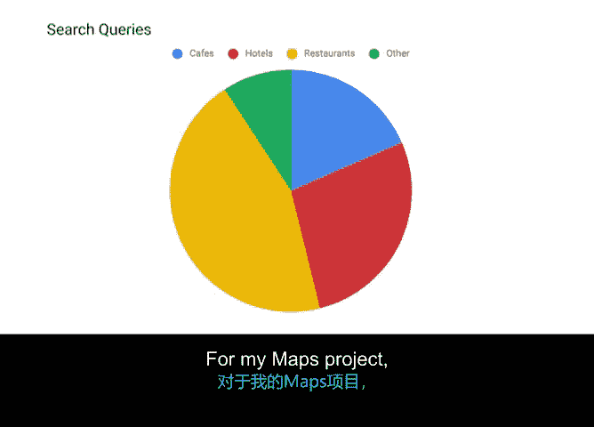

# 032：通过数据呈现讲述项目故事 📊

在本节课程中，我们将学习如何利用数据来讲述一个有力的项目故事。你将掌握如何收集、组织项目数据，并向组织内的其他人进行有效呈现。

---

## 概述

项目执行过程中，清晰地向利益相关者传达信息至关重要。数据呈现是将项目事实转化为引人入胜的叙事，从而支持决策、推动项目前进的有力工具。本节将引导你完成数据故事讲述的六个核心步骤。

---

## 故事讲述的六个步骤

上一节我们介绍了数据呈现的重要性，本节中我们来看看构建数据故事的具体流程。以下是构建一个完整、准确且引人入胜的数据故事的六个主要步骤。

### 第一步：明确受众

首先，了解你的汇报对象至关重要。你需要明确听众是项目发起人、高管还是团队成员。定义你的受众，并找出他们最关心的问题。

开始前，你可以问自己几个关键问题：
*   我的听众想了解项目的哪些方面？
*   他们最紧迫的关切是什么？
*   哪些关键数据点会影响故事叙述和项目结果？

明确这些问题将帮助你确定要讲述的故事类型以及需要使用的数据。例如，在为谷歌地图项目工作时，我们的汇报对象是来自谷歌地图和谷歌搜索的副总裁，因此故事需要兼顾这两个产品的目标。

### 第二步：收集相关数据

接下来，你需要寻找可靠的数据来源来支撑你的观点。利用相关的项目资源和文档，例如项目计划或工作管理软件，来下载和分析关键数据点。

对于谷歌地图项目，我们试图回答的问题是：“我们应该首先将注意力集中在何处？”为此，我们从内部数据库和用户搜索行为信息中寻找相关数据。

### 第三步：筛选与分析数据

收集数据后，你需要核实其可信度并进行筛选分析。对于地图项目，我们通过分析搜索查询来确定用户最常搜索的业务类型，例如餐厅、咖啡馆和酒店。其他类别（如加油站、博物馆等）在特定地理位置搜索流量中占比较小。

### 第四步：选择视觉呈现方式

可视化是帮助听众记住信息的重要手段，是故事讲述的关键一环。你可以通过多种方式利用数据讲故事，例如使用**仪表盘**、**图表**、**信息图**和**地图**。

对于地图项目，我们选择使用**饼图**来帮助讲述故事。在接下来的视频中，我们将更详细地探讨这些可视化示例。

### 第五步：构建故事脉络

在分析数据并确定可视化方式后，是时候将所有内容整合成一个连贯的叙事了。花时间思考你希望达成的目标、想要阐述的要点以及需要解答的问题。

对于地图项目，我们使用饼图来展示：大部分地理位置特定的搜索查询，仅由相对少数几类业务覆盖。我们据此构建了故事：希望获得副总裁的同意，优先在几个主要市场完善这几类业务的数据，并阐明此举将成功改善超过50%的地理搜索的结果。

### 第六步：收集反馈

类似于面试前请朋友帮你模拟练习，在正式汇报前，进行一次试讲并获取反馈非常重要。尝试从与项目无关的人员那里获取反馈，了解故事是否有趣、是否清晰、他们产生了哪些疑问。

他们的反馈可以帮助你发现故事中不清晰或难以记忆的部分，并给你最后调整的机会。

---

## 总结

本节课中，我们一起学习了通过数据讲述项目故事的完整流程。关键步骤包括：**明确受众**、**收集数据**、**筛选分析数据**、**选择视觉呈现**、**构建故事**以及**收集反馈**。有效故事讲述的关键在于**有条理**、**有目的性**且**准备充分**。

接下来，我们将更深入地探讨第四步：有效的可视化。敬请期待。