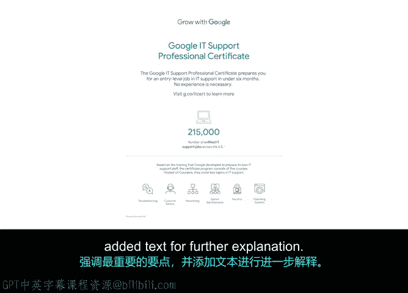

# 033：数据可视化工具 📊

在本节中，我们将探讨数据可视化及其如何帮助为项目决策提供信息。数据可视化是信息的图形化表示，旨在促进理解。我们将介绍几种项目经理常用的可视化工具，并解释它们如何有效地总结信息、传达关键见解并帮助团队和利益相关者理解项目进展。

## 什么是数据可视化？

数据可视化是通过图形、图表等形式呈现信息，以帮助人们更直观地理解复杂数据。常见的可视化形式包括图表、地图和表格。

项目经理使用数据可视化主要有以下几个原因：
*   **有效沟通**：可视化能帮助过滤信息，引导观众关注最重要的数据点和见解。
*   **高效总结**：它们能将冗长的想法和事实浓缩为单一的图像或表示形式。
*   **增强记忆**：可视化有助于观众理解和记住所呈现的信息，在讲述项目故事的过程中扮演着积极角色。

## 项目经理常用的数据可视化工具

接下来，我们看看项目经理在整个项目生命周期中常用的一些熟悉的数据可视化类型。

### 仪表盘

首先，我们来讨论一个在项目运行中常用的数据可视化工具：**仪表盘**。

仪表盘是一种用户界面，通常以图表或摘要图的形式，提供项目进度或绩效的快照视图。它充当了项目利益相关者获取快速见解的集中位置。

仪表盘可以显示指标、统计数据和关键绩效指标的紧凑摘要。**关键绩效指标**是一个可衡量的值或指标，用于证明组织在实现关键目标方面的有效性。它们能帮助团队和利益相关者判断项目是否在正确的轨道上。

**仪表盘示例**：
*   可以汇总顶级KPI或指标以及迄今为止的进度。
*   例如，如果项目目标是在三个月内达到95%的客户满意度，可以通过仪表盘汇总成千上万份调查的结果，展示平均满意度分数，而不是显示每份回复的电子表格。
*   同样，也可以包含其他表示进度的关键KPI，例如距离项目启动的天数倒计时，或已解决问题的百分比。

许多项目仪表盘还会将项目计划、文档和报告汇总在一处，并提供各自状态的视觉呈现。例如，如果项目计划包含数百个完成度不同的任务，仪表盘可以汇总当前已完成的任务或里程碑数量，以及进行中、已完成或未开始任务的百分比。

正如您可能开始注意到的，仪表盘是进行高效状态更新的绝佳可视化工具，因为它们使您能够对顶级项目数据点进行分组、总结和突出显示。

### 燃尽图

另一种实现类似功能的可视化工具是我们之前提到过的**燃尽图**。

燃尽图是一种折线图，用于衡量时间与已完成工作量及剩余工作量之间的关系。剩余工作量通常显示在纵轴上，时间则显示在横轴上。这是一个强大的可视化工具，能帮助团队直观了解剩余待完成的任务量。

### 柱状图与饼图

与折线图类似，**柱状图**是另一种用于表示项目绩效和进度的流行图表。

柱状图适用于比较不同的活动或比较一段时间内的进度。例如，您可以展示不同年份的客户数量或交付工厂数量等产出，以演示增长和变化。

**饼图**则在展示某事物的构成或部分与整体的关系时非常有用。

所有这些简单的图表都提供了可视化形式，使您能够快速获取见解并帮助讲述故事。在接下来的阅读材料中，还有更多类型推荐您查看和练习。

## 信息图：高效的沟通工具

在介绍阅读材料之前，还有一个重要的视觉工具需要您了解，那就是**信息图**。

信息图是信息（如数据或事实）的视觉表示，通常采用我们所说的“一页纸”或“单页摘要”的形式。其特点在于，它通常是对数据的简明摘要，主要通过图形或绘图来完成，强调最重要的观点，并辅以文字进行进一步解释。

使用信息图可以快速、专业且清晰地呈现复杂信息，尤其是在您可能无法亲自到场分享所有细节的情况下。信息图应该能够在无需额外支持和解释的情况下传达强有力的信息。

## 总结与最佳实践

以上只是数据可视化在项目管理中的几个例子。请记住，您需要使用可视化来展示和说明诸如随时间变化、频率、关系相关性等情况，并用于分析价值和风险。

另一个重要的提示是确保这些可视化是**易于访问的**。正如我们之前提到的，您需要确保您的数据故事能被所有人理解。请查看资源选项卡，了解关于无障碍可视化和沟通的一些最佳实践。

做得好！现在您已经了解了如何使用数据来有效地讲述您的故事。我们将继续学习本课程的最后一个部分：学习展示数据的演示技巧。下个视频见。