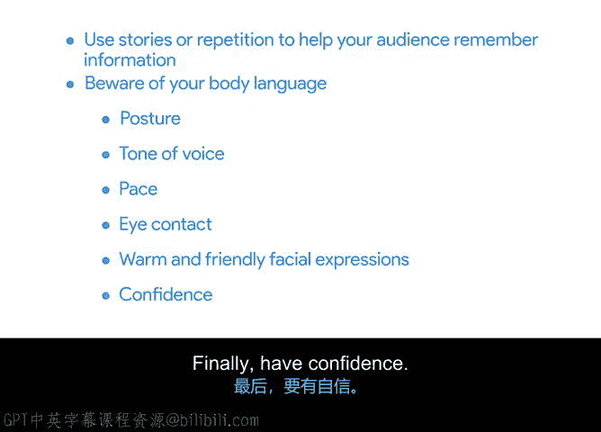

# 034：高效演示技巧 🎤

在本节课中，我们将学习如何将项目叙事与数据可视化相结合，并通过有效的演示技巧，清晰、自信地向听众传达你的项目成果。

你已经学习了如何构建项目叙事，也掌握了可视化关键数据点以辅助讲述故事的方法。现在，是时候将这一切整合起来了。本节视频将重点介绍一些实用的演示技巧。

回想一下你最喜欢的一位公众演讲者，思考你为什么如此欣赏他们的演讲。是因为他们的声音、学识，还是他们在演讲时散发的自信？

以布琳·布朗为例，她是我最喜欢的演讲者之一。她因其2010年题为“脆弱的力量”的TED演讲而广为人知，该演讲在全球获得了6000万次观看。布朗并非以公众演讲开始其职业生涯，而是休斯顿大学的一名研究教授。如今，她通过公众演讲向高管和领导者传授关于勇气和同理心的知识。

公众演讲者花费大量时间磨练技艺。面对听众进行演讲，无论是为了告知、娱乐还是分享，都并非易事。仅凭数据本身，并不足以说服人们相信你做出了正确的决策，或者你的项目产生了巨大影响。

一次有效的演示有助于传达你和团队在项目中所完成的重要工作。在整个项目周期中，你将有许多演示机会，从最初的项目启动会议，到每周的状态更新，再到最终的项目汇报。

## 构建演示的核心思路

在开始构建你的叙事时，请思考你的听众。问自己：**我希望听众在听完这次演示后，知道什么、思考什么或采取什么行动？**

围绕大局来创建你的演示，并保持简洁。

## 高效演示的三个关键要素

以下是帮助你进行有效演示的三种方法：**精确、灵活、令人难忘**。

### 1. 保持精确

首先，要进行有效的演示，你需要对关键点保持精确。明确你为听众解决的问题，并删除任何会削弱你叙事的内容。

确保幻灯片演示尽可能精确的一个方法是使用“**5秒设计法则**”。其理念是，你的听众应该在5秒内理解一张幻灯片的内容。因此，我会保持幻灯片简洁，只包含最相关的数据点，避免用过多文字使听众超负荷。他们没有时间阅读。

### 2. 保持灵活

要进行有效的演示，你还需要保持灵活。灵活性是项目经理工作的一个重要组成部分。例如，利益相关者可能意外地需要离开你的演示，或者其他与会者可能迟到。

考虑一下，如果你的演示时间从一小时缩短到30分钟甚至只有5分钟，你会采取什么方法。了解你想要表达的最重要的观点，并准备好在意外发生时只分享这些要点。

提前准备也有助于你在演示时更加灵活。充分的准备可以帮助你避免那些可能分散叙事注意力的小错误，比如说话结巴或难以调出幻灯片。

为了提前准备，你可以练习向团队成员进行演示，并邀请他们提供反馈、提出问题或分享疑虑。提前准备还让你有机会预测听众可能对演示提出的问题类型，并准备好答案。同时，它让你有时间设想并准备好应对听众对你想要做出的决策可能提出的反对意见。

### 3. 令人难忘

最后，要令人难忘。制定一个策略，帮助你的叙事令人过目不忘。

回想一下有效的讲故事技巧。此时，你需要将数据分析、有效的可视化结合起来，并为你的叙事做最后的润色，将所有内容融为一体。使用故事或包含重复元素，以帮助听众记住信息。

另一个有用的技巧是在演示时注意你的肢体语言：保持挺直的姿势，双手自然垂放在身体两侧。在强调观点时，尝试提高音调以示强调。通过有意的停顿来控制节奏。语速大约比你平时说话慢一半，并保持句子简短。与听众进行眼神交流，保持面部表情温暖友好。

最后，保持自信。你已经做了研究并准备充分，因此可以放下担忧。

## 总结

如果你能做到**精确、灵活、令人难忘**，你就能做一次出色的演示。现在，你已经分析了数据并构建了故事，你的任务就是有效地展示你的发现。

运用这些技巧，做一场值得起立鼓掌的演示吧。在下一个视频中，我们将进行总结并回顾最近所学的内容。