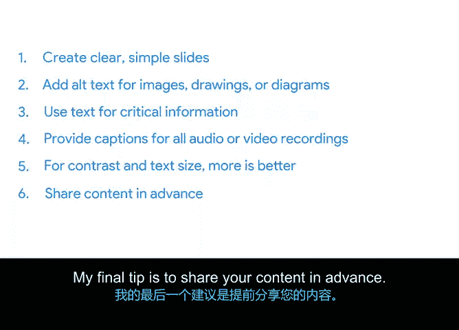

# 035：确保演示的可访问性 🎯

在本节课中，我们将学习如何确保你的项目演示对所有观众都是可访问和易于理解的。我们将探讨从幻灯片设计到内容分享的一系列最佳实践，帮助你有效地向所有人传达信息。

---

上一节我们介绍了演示的最佳实践，本节中我们来看看如何确保这些演示能被所有人无障碍地获取和理解。

## 幻灯片设计原则

首先，从演示文稿的设计开始。清晰、简洁的幻灯片是关键。

以下是设计可访问幻灯片的具体建议：

*   **避免视觉复杂**：不要使用过多图形、文字或动画。视觉上的复杂性会让观众，尤其是存在视觉或认知障碍的观众，难以在演示过程中吸收信息。
*   **慎用动画**：如果使用动画，确保重要内容不会消失，以免部分观众跟不上。避免使用闪烁或跳动的重复动画，因为它们可能分散注意力或引发不适。
*   **保持简洁与美观**：简洁不等于乏味。一张简单的幻灯片同样可以美观且信息丰富，只需避免在一张幻灯片上塞入过多信息或活动。
*   **考虑使用幻灯片**：即使你通常演讲时不使用幻灯片，也建议尝试制作。哪怕只有一张列出要点的幻灯片，也能为仅靠听觉理解有困难（如因语言障碍、听力或认知障碍）的观众提供视觉辅助。

## 图像与图表处理

接下来，我们关注演示中非文本元素的可访问性。

以下是处理图像和图表的建议：

*   **添加替代文本**：为所有图片、绘图或图表添加“替代文本”。这能向依赖屏幕阅读器的观众描述图形中的信息。在 Google Slides 或 PowerPoint 中添加替代文本的方法是：选择对象 -> 右键单击 -> 选择“替代文本”。
*   **明确图表要点**：图表可能难以解读，尤其是当字体过小以容纳更多数据时。如果幻灯片包含数据密集的图表，务必在幻灯片本身或演讲者备注中明确指出其核心结论。
*   **不依赖纯视觉格式**：切勿仅依靠颜色或其他视觉格式来传达图表或幻灯片上的关键信息。过度依赖视觉格式会排除色盲或无法看到屏幕的观众。例如，要突出流程图的新部分，不要只改变颜色，还应同时添加“新”等文字提示。

## 内容呈现与辅助

除了静态设计，内容的动态呈现方式也至关重要。

以下是提升内容可访问性的方法：

*   **提供文字摘要**：如果演示严重依赖图像，考虑在演示结束时提供一份书面摘要，方便观众在一个地方轻松阅读你的主要观点。
*   **添加视频字幕**：为演示中分享的所有音频或视频内容提供字幕。如果使用 YouTube 视频，请检查其自动生成的字幕是否准确；若不准确，应通过字幕服务请求添加隐藏式字幕。
*   **使用实时字幕**：如果条件允许，为你的演示使用实时字幕。这不仅有助于失聪或听力困难的观众，在演讲者口音多样、语速过快、麦克风出现问题或现场有干扰时也很有用。

## 视觉可读性优化

文字的可读性直接影响信息传递效果。

以下是优化视觉可读性的技巧：

*   **确保高对比度**：文本与其背景颜色之间的差异称为对比度。高对比度使文本更易阅读，图像更易辨认，尤其对于坐在远处、视力低下或色盲的观众。理想的对比度比例为 **7:1**。可以使用在线的对比度检查工具进行验证。
*   **使用足够大的字号**：关于字号大小的建议可能不同，但通常越大越好。在演示开始前，走到房间后排，确保你能看清自己的幻灯片。
*   **避免全大写文本**：全部使用大写字母会使部分人群（如阅读障碍者）阅读更困难。尽可能避免使用全大写，这是一个简单但效果显著的改变。

## 会前材料分享

最后，提前分享演示材料可以极大地提升可访问性。

以下是会前分享的建议：

*   **提前发送幻灯片**：如果可能，在演示前几天将幻灯片发送给观众。这给了观众预览内容的机会，并能根据需要自行安排以适应其需求和偏好。例如，视障观众可能希望在自己的设备上使用屏幕阅读软件跟随你的幻灯片。
*   **提供大纲或术语表**：如果无法提前分享幻灯片，考虑发送一份包含演示要点的项目符号大纲文档。如果你使用了缩写、技术术语或生僻词汇，请附上带有定义的术语表。这些信息对提供手语翻译和字幕服务的人员尤其有帮助。

---

本节课中我们一起学习了确保演示可访问性的多项核心策略。从设计简洁的幻灯片、为图像添加替代文本，到优化对比度、提供实时字幕以及提前分享材料，这些最佳实践将帮助你的信息有效地传达给每一位观众。请记住，如果观众无法轻松获取信息，你就无法有效地进行沟通。

关于如何使文档和演示更具可访问性的更多最佳实践，请查看课程资源选项卡。接下来，你将学习团队沟通及其最佳实践。到目前为止做得很好，你正在取得真正的进步！