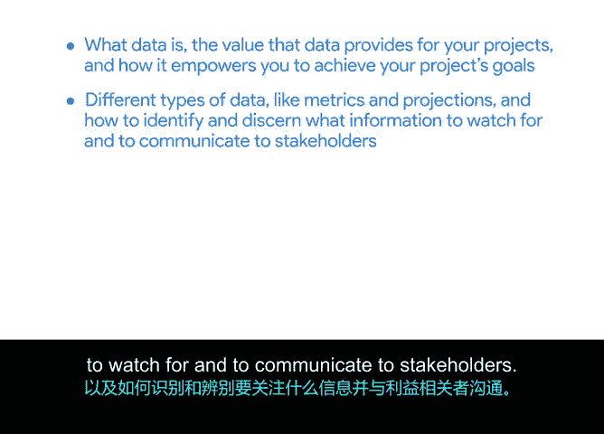

# 036：推动项目｜项目执行总结

在本模块中，我们探讨了数据在项目管理中的核心作用。本节课程将总结我们所学到的关键知识，并回顾数据如何帮助项目经理推动项目成功。

恭喜你完成本模块的学习。我们学到了什么？

我们了解到，数据对任何组织的成功都起着关键作用，并且它直接影响你作为项目经理的角色。

我们学习了什么是数据，数据为你的项目提供了哪些价值，以及它如何帮助你实现项目目标。

你学习了不同类型的数据，例如**指标**和**预测**，以及如何识别和辨别需要关注并向利益相关者传达哪些信息。

上一节我们介绍了数据的类型，本节中我们来看看数据的具体应用。

我们还讨论了数据对于帮助你做出明智决策、展示你和团队最有效的工作领域、以及标记潜在风险和机遇有多么重要。

我们回顾了数据可视化和数据工具，并了解到当有视觉元素辅助时，事实通常更容易被记住。

我们还讨论了如何向利益相关者、同事和客户展示你的所有见解。

以下是本模块的核心要点总结：
*   **数据的价值**：数据是决策的基础，能帮助识别风险与机遇。
*   **数据类型**：重点关注**指标**（如 `完成率 = 已完成任务数 / 总任务数`）和**预测**。
*   **数据应用**：利用数据支持决策、展示成效并进行有效沟通。
*   **数据可视化**：图表等视觉工具能显著提升信息的理解和记忆。

现在，请稍作停顿，为你坚持到这里给自己一个鼓励。

接下来，我们将讨论领导力与团队合作的基础。请继续保持出色的学习状态，我们准备好后在那里再见。

本节课中我们一起学习了数据在项目管理中的关键角色，包括其定义、类型、价值以及如何通过可视化工具进行有效沟通，为后续学习领导力与团队协作奠定了基础。