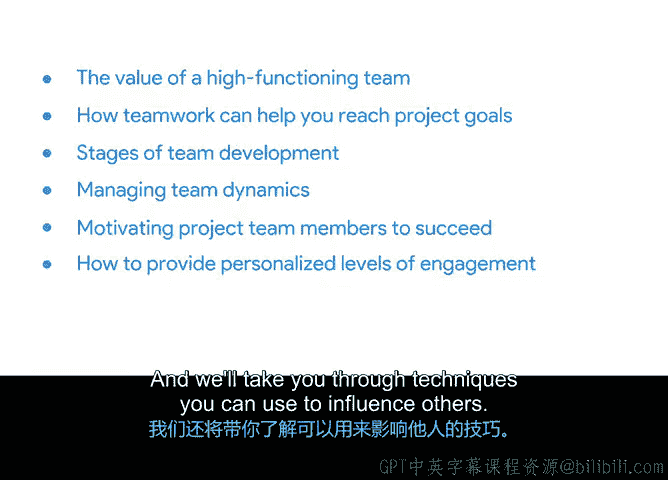

# 037：领导力与影响力技巧介绍 🧭

在本模块中，我们将学习高效能团队的价值，以及团队协作如何帮助你达成项目目标。我们将探讨团队发展的不同阶段，学习如何管理团队动态。我们还将讨论如何激励项目团队成员取得成功，并为每个人提供个性化的参与度。最后，我们将介绍一些可以用来影响他人的技巧。

## 高效能团队的价值与目标达成

上一节我们概述了本模块的学习内容，本节中我们来看看高效能团队的具体价值。一个运作良好的团队是项目成功的基石。团队协作能够整合多样化的技能和视角，更有效地解决问题，并推动项目朝着目标前进。

## 团队发展阶段与管理

理解了团队的价值后，我们接下来需要认识团队是如何形成和发展的。团队发展通常会经历几个可预测的阶段。了解这些阶段有助于你更好地管理团队动态，引导团队走向成熟和高产。

以下是团队发展的四个典型阶段：
1.  **形成期**：团队成员初次聚集，相互了解，明确目标和角色。
2.  **震荡期**：团队成员开始表达不同观点，可能出现冲突，这是建立工作方式的必经过程。
3.  **规范期**：团队建立共识、规范和流程，合作变得更加顺畅。
4.  **执行期**：团队高效运作，专注于实现项目目标。

## 激励与个性化参与

在团队能够高效执行任务之前，如何激发每个成员的潜力是关键。管理团队动态的核心在于激励成员。每个团队成员都有不同的驱动力和需求，因此提供个性化的参与和支持至关重要。

有效的激励方法包括：
*   认可与赞赏成员的贡献。
*   提供有挑战性且有意义的工作任务。
*   确保工作环境公平、透明。
*   关心成员的个人发展与职业成长。

## 影响力技巧

最后，作为项目管理者，你并非总能依靠职权来推动工作。因此，掌握非职权影响力技巧非常重要。这些技巧可以帮助你在没有直接汇报关系的情况下，获得利益相关者的支持与合作。

你可以运用以下技巧来施加积极影响：
*   **互惠**：乐于助人，人们通常愿意回报善意。
*   **共识**：指出许多人已经支持某个想法，利用从众心理。
*   **权威**：引用专家意见或可靠数据来支持你的观点。
*   **喜好**：建立良好的个人关系，人们更愿意帮助自己喜欢的人。
*   **稀缺**：强调机会或资源的独特性与有限性。
*   **承诺与一致**：争取他人对小型初始行动的承诺，这往往会导致其对后续更大行动的支持。

---

本节课中，我们一起学习了高效能团队对项目成功的重要性，回顾了团队从形成到执行的发展阶段，探讨了通过个性化方式激励团队成员的方法，并介绍了一系列可以在项目管理中运用的关键影响力技巧。掌握这些领导力技能，将帮助你更有效地推动项目执行。