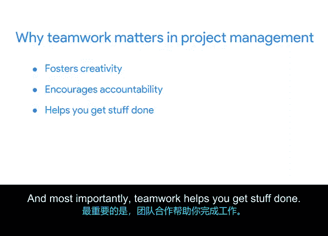

# 038：项目团队协作的必要性

## 📋 概述
在本节课程中，我们将探讨团队协作在项目管理中的核心作用。我们将明确“团队”的定义，并将其与“工作组”进行区分，同时阐述为什么培养团队协作文化对于项目成功至关重要。

---

## 🤔 什么是团队？
上一节我们提到了领导力，本节中我们来看看团队协作的基础——团队本身。虽然“团队”一词有许多不同的定义，但谷歌内部是这样描述的：

**团队**是一群为了特定的项目或目标，共同进行规划、解决问题、做出决策和审查进展的人。团队成员相互依赖以完成任务。

例如，一个软件工程团队的任务可能是创建一个满足用户需求的无缝软件体验。除了与项目经理协调外，软件工程团队的成员在朝着共同目标努力时，也会彼此协调。

---

## ⚖️ 团队与工作组的区别
理解了团队的定义后，我们需要将其与“工作组”区分开来。我们定义**工作组**是基于组织或管理层级形成的。虽然工作组内的人可能朝着一个共同目标努力，但他们的工作更可能由单个人或实体进行协调、控制或分配。

例如，一个专注于质量保证测试的工作组可能被分配运行一套测试计划。小组经理可能会拆分工作，并分配给每个质量保证测试员一个计划进行审查。但与团队不同，测试员将彼此独立地完成任务，并主要与他们正在测试的功能的经理和开发团队进行协调。

团队和工作组在更大的组织内部各有独特的优势。但为了本课程的目的，我们将重点讨论团队。更具体地说，我们将讨论项目经理如何通过培养团队协作文化来发展和领导高效的团队。

---

## 🤝 团队协作的定义与重要性
既然我们区分了团队和工作组，现在让我们深入探讨团队协作的核心。**团队协作**是一种有效、协作的工作方式，其中每个人都致力于并朝着一个共同的目标前进。团队协作能最大化每个团队成员的个人优势，激发出每个人的最佳状态。

正如你所想象的，团队协作是成功项目管理的关键部分。以下是几个原因：

以下是团队协作至关重要的几个方面：

1.  **团队协作能激发创造力。**
    团队可以利用成员多样化的视角、技能和经验，设计出更好的解决方案，并构建出能够满足更广泛用户需求的产品，这比他们各自独立工作所能达到的效果更好。

2.  **团队协作能鼓励责任感。**
    认识到你任务的执行会直接影响团队其他成员的任务，这可以成为一种强大的动力。

3.  **团队协作能帮助你完成任务。**
    庞大、复杂的项目需要聪明、有能力的人来完成各项任务，达成里程碑，以实现项目目标。

---

## 🧭 项目经理的角色
作为项目经理，你的职责是鼓励他人积极以团队形式协作，以激发创造力、鼓励责任感并完成任务。团队协作是一种有效、协作的工作方式，当执行得当时，它能对可衡量的团队成果和团队文化产生积极影响。

---

## 📝 总结
本节课中，我们一起学习了团队与工作组的区别，明确了团队协作的定义，并深入探讨了团队协作对于激发创造力、增强责任感和推动项目完成的三大核心价值。作为项目经理，培养和引领高效的团队协作文化是确保项目成功的关键。接下来，我们将带你了解高效团队的具体构成要素。