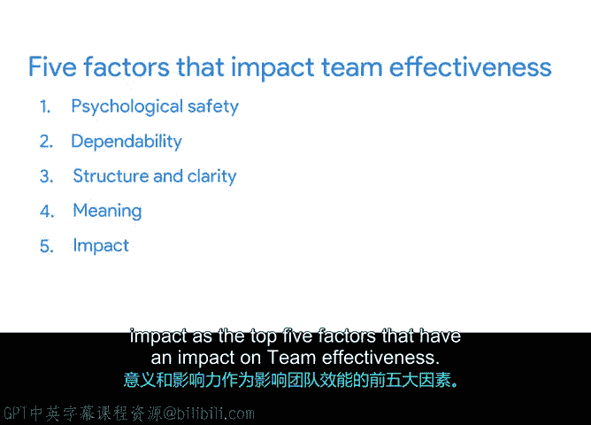

# 039：影响团队效能的因素 🔍

在本节课中，我们将探讨影响团队效能的关键因素。了解这些因素有助于项目经理更好地激励团队成员，推动项目成功执行。

团队由个体组成，而个体受到不同动机的驱动。这些动机可能包括服务组织、支持家庭，或者仅仅是从事他们认为很酷的项目。为了同时激励所有人，你需要了解团队中的成员。

几年前，谷歌的研究人员着手识别高效团队的动态特征。通过这项研究，他们确定了五个影响团队效能的关键因素。按重要性排序，这五个因素是：心理安全感、可靠性、结构与清晰度、意义感以及影响力。接下来，我们将逐一详细解析。

## 心理安全感：首要因素 🛡️

上一节我们介绍了影响团队效能的五个因素，本节中我们首先来看看最重要的因素——心理安全感。

研究人员将其定义为：个体对承担人际风险后果的感知。换句话说，团队成员相信在团队内冒险是安全的，他们不会因为冒险而被贴上无知、无能、消极或破坏性的标签。

在心理安全感高的团队中，成员们乐于在队友面前承担风险，寻求不同意见，并在出现人际冲突时积极解决。例如，在我的谷歌团队中，我们奉行“直接且友善”的原则。我们努力构建一种团队文化，在保持一个安全、可靠、平和的共享空间的同时，彼此负责。

我发现，当需要承担风险的机会出现时，例如向我的主管提出一个打破常规的想法，这种相互尊重的文化已经为获得直接反馈奠定了基础，而不会感到沮丧或担心自己可能出丑。这对于维持团队高水平的心理安全感至关重要。

## 可靠性：信任的基石 🤝

接下来，我们讨论第二个因素——可靠性。

谷歌研究人员对此的解释是：在可靠的团队中，成员是可靠的，并能按时完成工作。创建一个可靠的团队需要结合设定、协商和满足期望。

你的团队需要满足为他们设定的期望。同时，作为项目经理，你需要与团队建立双向关系。你必须能够清晰地沟通期望，并确保团队在需要时能自如地与你协商。例如，你的团队成员很可能同时参与两个或多个截止日期冲突的项目。如果他们害怕与你分享自己的限制条件，那么他们在两个项目上的工作都可能受到影响。反之，如果他们带着顾虑来找你，开放的理解和关于优先级的协商可以帮助减轻他们的负担。

## 结构与清晰度：明确的方向 🗺️

上一节我们了解了可靠性，本节我们来看看第三个因素——结构与清晰度。

研究人员将其定义为：个体对工作期望的理解、如何满足这些期望的知识，以及其绩效的后果。每个团队成员都对自己的个人角色、计划和目标有清晰的认识，并且了解自己的工作如何影响团队。

作为项目经理，你可以帮助培养团队的结构与清晰度。例如，如果项目结构和跟踪是草率、无组织且不连贯的，那么团队的产出很可能也是草率、无组织且不连贯的。这可能导致团队内部紧张。反之，如果你勤勉地进行项目跟踪，你的团队将拥有清晰度，感觉更团结，并能有效协作。

## 意义感：工作的驱动力 💡

结构与清晰度为团队提供了框架，而意义感则为工作注入了灵魂。这是影响团队效能的第四个因素。

谷歌研究人员在此背景下将意义感定义为：在工作本身或工作结果中找到目标感。例如，你的队友可能会在财务上支持自己、帮助团队实现目标，或者希望他们的产品能触达新的用户群体中找到意义。

## 影响力：看见改变的力量 🌟

最后，我们来看第五个因素——影响力。

研究人员将影响力定义为：相信自己的工作成果是重要的并能带来改变。人们可能很难注意到他们的工作如何推动整个生态系统向前发展。作为项目经理，你的部分职责是帮助团队成员识别他们如何在团队内部及外部推动影响力。

项目跟踪可以成为一个有用的工具，用于可视化进展和影响力。例如，达成里程碑可以向团队展示他们的个人任务如何为更大的项目目标做出贡献。以我的团队为例，我们专注于谷歌地图内的路线规划。核心理念是专注于帮助人们准时到达目的地。因此，我们所做的一切都应该使这种体验逐步变得更好。这就是我们增加影响力的方式。

## 总结 📋

本节课中我们一起学习了影响团队效能的五大关键因素。谷歌研究人员确定心理安全感、可靠性、结构与清晰度、意义感和影响力是对团队效能影响最大的五个因素。理解并积极培育这些因素，是项目经理领导团队达成项目目标的重要基础。

接下来，我们将讨论项目经理如何领导团队实现项目目标。