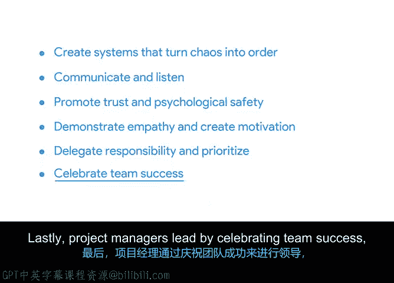

# 040：领导高绩效团队 🚀

在本节课中，我们将学习项目经理如何通过一系列关键行动，来构建并领导一支高绩效的团队，从而共同达成项目目标。

项目经理的核心职责是引导团队从混乱走向有序，并确保每个成员都能朝着共同的目标高效协作。接下来，我们将逐一探讨实现这一目标的六个关键方法。

## 建立系统，化混乱为有序

上一节我们概述了项目经理的角色，本节中我们来看看如何通过建立系统来引领团队。优秀的项目经理通过创建、实施并优化标准化、可衡量、可重复且可扩展的工作流程和流程来领导团队。

例如，如果你发现自己经常需要追着团队成员询问工作进度，你可以建立一个流程，规定团队成员应在何时以及如何告知你任务已完成。

可以将创建系统想象成一个“连点成图”的谜题。项目经理的工作与此类似，只是没有数字编号。我们需要识别出这些“点”（即任务和环节），理解它们的重要性，并将它们串联起来，从而帮助所有人看清项目的全貌。**公式化描述即：`有序 = 系统化(混乱)`**。

你的任务是在混沌中找到系统，并帮助他人也看到它。

## 有效沟通与积极倾听

除了建立秩序，项目经理的另一项核心领导力体现在沟通与倾听上。作为项目经理，你有责任确保团队中的每个人对项目状态都有一致的理解。

以下是几种常见的沟通方式：
*   **团队会议**：定期举行团队会议，同步信息并收集反馈。
*   **状态更新邮件**：通过每日或每周的邮件同步项目进展。
*   **一对一沟通**：定期与团队成员进行单独交流，了解他们的沟通偏好和需求。

重要的是，每个人沟通风格不同。例如，对于喜欢闲聊的同事，可以先寒暄几句；而对于喜欢直奔主题的同事，则应直接切入正题。关键在于理解并适应不同的风格。

## 促进信任与心理安全

在建立了沟通渠道之后，营造一个安全的团队环境至关重要。心理安全指的是个人对承担人际风险（如提出不同意见）可能带来的后果的感知。

你的职责是创造一个欢迎不同意见、且在艰难对话中所有成员都能保持相互尊重的团队氛围。例如，在每周状态会议上，可以专门安排时间进行开放、深思熟虑且包容的讨论。

你可以通过主动寻求帮助来解决一个影响团队的问题，来为这种行为建模。你应该鼓励所有团队成员贡献想法，无论其角色或职级。这样做能明确传达：团队成员可以放心地质疑流程，对项目和计划的批评是受欢迎且有价值的。

## 展现同理心与激发动力

在团队层面建立安全环境的同时，在个体层面，项目经理需要通过同理心和激励来领导。团队由拥有不同动机和生活的个体组成。

你可以通过专注在场、积极倾听和提问来展现对团队成员的同理心。在一对一谈话中，避免对对方的想法和感受做出假设。保持安静和好奇，总能学到更多。

除了展现同理心，我还会通过公开场合（如在会议或群组邮件中）认可出色的工作来创造动力。认可告诉人们他们做对了，并激励他们继续保持。请确保认可的是良好的工作，而不仅仅是“救火”式的英雄行为。

## 分配责任与确定优先级

项目经理还需要通过有效分配任务和明确工作重点来引领方向。大多数项目会同时进行多项任务，你的职责是通过将特定任务的责任分配给团队成员，来保持团队专注并朝着项目目标和交付物前进。

通过分配责任，你让队友有机会运用其特定技能创造价值，同时也为自己留出关注项目全局的空间。通过确定任务优先级，你可以减少模糊性，为团队提供清晰度。如果你认为某项任务重要而团队不以为然，他们可能会随意工作。通过确定优先级并让团队知晓，你能保持团队的专注。

与团队合作，就优先级达成共识。解释你的理由有助于获得他们的认同，并增强他们对工作的投入。

## 庆祝团队成功

最后，项目经理通过在项目结束时以及项目过程中庆祝团队的成功来发挥领导作用。这包括庆祝大大小小的胜利，例如达成一个里程碑或收到利益相关者的积极反馈。

庆祝成功是激励团队的重要工具，因为它能提高士气并提升团队的参与度。你可以通过团队午餐、小礼物或仅仅是一封祝贺邮件来庆祝。这样简单的举动表达了对团队辛勤工作的赞赏。当人们感到被赞赏时，他们往往会更努力地工作，团队表现也会更好。

## 总结

本节课中我们一起学习了项目经理构建高绩效团队的六个关键方法：**建立系统化秩序、有效沟通与倾听、促进信任与心理安全、展现同理心与激发动力、分配责任与确定优先级，以及庆祝团队成功**。随着你职业生涯的发展，你将增强领导更大、更复杂团队的能力，但团队合作的基本原则将保持不变。

接下来，你将学习团队发展的阶段以及如何管理团队动态。我们稍后见。