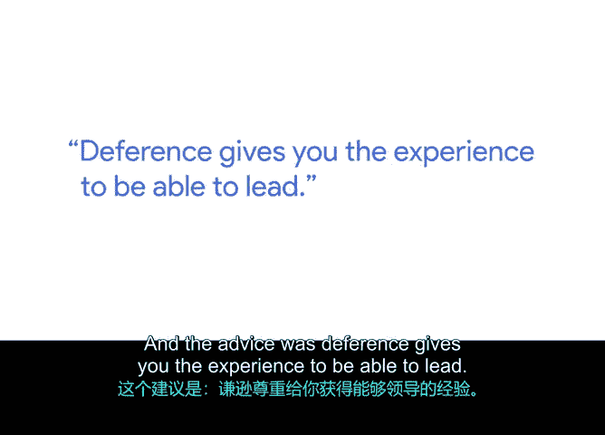

# 041：41_04_03_Emilio-学习领导

在本节课中，我们将跟随谷歌责任创新项目经理埃米利奥·加西亚，学习他从母亲——一位学校校长——身上领悟到的核心领导力原则。这种领导风格强调赋能与连接，对于项目经理协调团队、推动项目至关重要。

## 背景与影响

我来自加利福尼亚州的奥兰治县。我的母亲一生中大部分时间都是一名学校教师。

她后来还担任过助理校长，并最终在我成长期间成为了一名校长。

在那段日子里，我从未拥有过自己的暑假。实际上，我所有的时间都花在了陪伴母亲在她的学校里。

帮助那些想要补充货架物资、归档文件或粉碎文件的老师们。

## 核心领导力建议

在我成长过程中，母亲给过我一些重要的建议。

尤其当我花时间在她的学校里，观察她的领导风格时。她拥有并至今仍保持着一种非凡的能力，能以某种方式与人建立联系，这种方式不仅让他们感到被看见，更感到被赋能。我认为这是一种非常强大的领导风格。

这也是我喜欢带入我的项目管理角色中的东西。

因为它能让我确保团队成员感到他们能够完成任务。

但这不仅仅是为了我个人。这是为了一个共同的愿景。她的建议是：

**尊重他人能让你获得领导所需的经验。**

这一点很重要，因为正如我们在这些课程中所说，作为一名项目经理，

你不可能知道或拥有为了创造你试图推动的那些庞大、核心成果所需的所有技术或特定领域专业知识。但作为一名项目或项目经理，

你某种程度上是确保事情得以完成的领导者。

你需要与“馅饼”的每一小块合作。就像我的母亲，作为校长，

她与后勤人员合作，她与家长教师协会合作。

她与教师和教师工会合作，她与家长们合作。

她建立了一个出色的人际网络，帮助她完成各项任务。

因此，我会说这是我收到过的最好建议。我是埃米利奥·加西亚，

我是谷歌的一名责任创新项目经理。

## 总结

本节课中，我们一起学习了埃米利奥分享的宝贵领导力经验。其核心在于：**通过尊重和赋能团队成员来建立连接，从而构建一个支持你完成共同目标的人际网络**。作为项目经理，虽然你可能不具备所有专业知识，但通过这种领导风格，你可以有效地协调各方，推动项目向前发展。记住，领导力是关于让每个人感到被重视并有能力为集体愿景做出贡献。