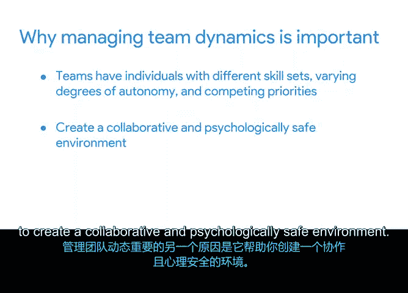

# 042：团队发展与团队动态管理 🧩

在本节课中，我们将学习团队如何随时间发展，以及如何有效管理团队动态。我们将重点介绍心理学家布鲁斯·塔克曼提出的团队发展五阶段模型，并探讨理解和管理团队动态的重要性。

---

想象一下，你正与一个全新的团队开始一个新项目。团队成员之前从未合作过，这对每个人来说都是一次全新的体验。

为了更好地理解你的团队可能如何随时间发展，我们来讨论心理学家布鲁斯·塔克曼提出的团队发展五阶段模型：**形成期、震荡期、规范期、执行期和休整期**。这些发展阶段展示了团队如何从一群互不相识的人成长为一个高效运作的单元。

你甚至可能从以往团队工作的经验中，识别出每个阶段的特征。

## 团队发展的五个阶段

上一段我们介绍了团队发展的概念，本节中我们来看看塔克曼模型的具体五个阶段。

**形成期**
这是团队发展的第一个阶段。此时，一切事物都显得新鲜。团队成员刚刚开始互相了解，并且渴望留下好印象。通常，他们对开始工作感到兴奋。在这个阶段，作为项目经理，你应该明确项目目标、角色和项目背景。人们正在寻求指导，而你的职责就是提供这种指导。

**震荡期**
这是团队发展的第二个阶段。随着人们适应自己的角色并开始项目工作，情况会变得有些棘手。团队成员互动增多，可能会出现一些分歧。这时可能会产生挫败感。个人可能会对某些他们认为低效的流程或持有不同意见的队友提出异议，尤其是在团队处理的任务比最初看起来复杂得多的时候。这是可以理解的。当你第一次与一个新团队紧密合作时，必然会存在一些人际冲突。队友们可能在时间和工作量估算上存在分歧，独立程度不同，或者倾向于优先处理某些任务而非其他同等重要的任务。作为项目经理，你的工作重点是解决冲突。倾听团队如何解决问题，并就团队如何更好地作为一个整体运作分享见解。

**规范期**
在震荡期之后，是塔克曼的第三阶段：规范期。此时，团队通过建立新的规范（如流程和工作流，使每个人都能更轻松地完成任务）解决了一些内部冲突。团队感觉更有能力高效、有效地协同工作。作为项目经理，你应该将这些团队规范正式化。确保团队了解这些规范，并在需要时予以强化。例如，如果你们已同意在每周团队会议上讨论问题的解决方案，请确保你的每周议程为此主题预留时间。

**执行期**
塔克曼的第四阶段是执行期。在此期间，团队相对无缝地协作完成任务、达成里程碑，并向项目目标推进。在执行阶段，作为项目经理，你应该专注于委派任务、激励团队和提供反馈，以保持团队的势头。

**休整期**
团队发展的第五个也是最后一个阶段是休整期。在这个阶段，项目即将结束，是团队解散的时候了。这对团队来说可能是一个苦乐参半的时刻，你可能希望通过庆祝活动来纪念项目的结束。作为项目经理，你应该安排时间与团队一起庆祝项目的最终里程碑和成功，并确保团队的每个成员都知道他们接下来的安排。

## 理解团队动态

我们已经了解了团队发展的阶段，现在让我们探讨团队动态的概念及其重要性。

团队动态指的是影响团队行为和绩效的有意识和无意识的力量。管理团队动态是决定如何激励团队的重要组成部分。人们可能会想当然地认为团队可以全速投入项目，但实际上，花时间理解团队的整体动态以及各个团队成员如何融入其中非常重要。这在较为不稳定的形成期和震荡期尤为重要。

以下是管理团队动态之所以重要的几个原因。

**促进团队协作与效率**
首先，团队由拥有不同技能、不同程度自主权和相互冲突优先事项的个人组成。你的工作是建立共识，并设定明确的目标、目的、依赖关系和责任。当团队能够凝聚一致地运作时，他们就能专注于手头的任务和目标。

**创造安全协作的环境**
管理团队动态很重要的另一个原因是，它有助于你创造一个协作且心理安全的环境。当团队成员感到安全时，他们愿意互相帮助，并在需要时接受帮助。这有助于保持日程按计划进行，从而使整个项目受益。虽然达到执行阶段可能需要时间，但利用规范期来培养协作环境可以帮助你更快地达到目标。

**有效激励团队**
理解和管理团队动态也有助于你了解如何激励团队。受到激励的团队成员更有可能为讨论做出更多贡献、完成任务并积极参与其他项目活动。积极的团队氛围可以帮助员工感到被赋能、更愿意承担经过计算的风险，并更有可能为复杂问题寻求创新解决方案。

请记住，团队动态在很大程度上是表面之下的。识别和理解团队发展的阶段可以帮助你理解动态在你的团队中是如何展开的。这可以帮助你成为更好的领导者。

---

本节课中我们一起学习了布鲁斯·塔克曼的团队发展五阶段模型（形成期、震荡期、规范期、执行期、休整期），并探讨了管理团队动态对于促进协作、创造安全环境和有效激励团队的重要性。理解这些概念将帮助你更好地引导团队走向成功。