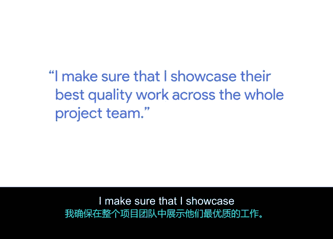

# 043：项目执行中的细节委派与团队影响

## 概述
在本节课中，我们将学习项目经理如何在不具备直接管理权限的情况下，通过影响力和有效的委派来推动项目执行。我们将重点探讨“无职权影响”这一软技能，以及如何通过委派细节工作来提升团队效率和心理安全感。

## 无职权影响：项目经理的核心软技能
作为项目经理，你通常并非团队成员的直接管理者。因此，一项关键的软技能是**无职权影响**。这指的是通过沟通，确保他人理解你的目标与目的，并带领他们朝着共同的愿景和旅程前进的能力。

## 从亲力亲为到有效委派
当我初次担任项目经理时，常犯的一个错误是试图独自完成所有事情，而不寻求帮助。在过去的几年里，我真正学会了如何委派工作，并作为团队一员与他人协作。这确保了我能有效地管理项目，无论我是否对项目团队拥有管理权，同时让各领域专家发挥他们的专长。

在我的日常工作中，委派通常是这样进行的：

## 如何有效委派：寻找合适的人选
以下是有效委派的具体方法：

*   **寻找领域专家或爱好者**：我努力寻找那些真正擅长或享受做某件特定事情的领域专家，即使那可能并非他们的正式职责。
*   **借鉴导师建议**：我从一位导师那里得到的最佳建议之一，就是在组织内寻找那些**享受做某事**的人，并将你的工作委派给他们。这样，你可以专注于整体的项目或项目管理，而不会陷入某些你可能不喜欢、但他人却乐在其中的细节中。

## 营造心理安全感与包容性会议
**心理安全感**在团队中至关重要，因为它能带来思想的多样性。我目前非常注重确保我们举行包容性的会议。

一个例子是，在会议中，如果你注意到有一两位参与者通常保持沉默或不发言，试着鼓励他们参与讨论。更好的做法是，在会前与他们喝杯咖啡，询问他们对即将讨论的话题有何看法。引导他们将想法带到会议上。让会议室充满思想的多样性非常重要，否则最终可能只有一个人不断地提出自己的想法，这并不多元。

## 委派中的指导与支持
这种合作关系也体现在指导与支持上。

*   **提供支持**：为了有效委派，我确保自己**支持**他人。这意味着我在整个项目团队中展示他们最优质的工作成果。这对团队士气非常重要。
*   **进行指导**：另一方面，关于**指导**，如果团队中有经验不足或缺乏信心发言的初级成员，我通常会委派较小的任务给他们，以建立他们的信心。或者，委派一些他们可能认为有趣、但不在其日常工作范围内的任务。

因此，找到这种独特的平衡点是委派和确定工作优先级的最佳方式。

## 总结
本节课中，我们一起学习了项目经理如何运用“无职权影响”来领导团队，以及通过寻找合适的委派对象、营造团队心理安全感和平衡指导与支持来有效委派工作。关键在于让合适的人做他们擅长或喜欢的事，从而让项目经理能聚焦于整体协调与目标达成。