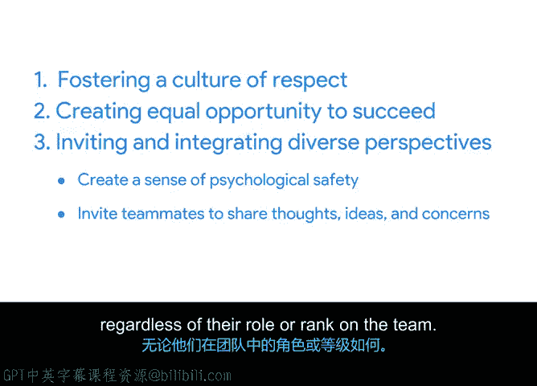

# 044：道德与包容性领导 👥

在本节课中，我们将学习道德领导与包容性领导的核心定义及其在项目管理中的重要性。我们将探讨如何通过培养尊重文化、创造平等成功机会以及邀请并整合多元观点，来打造一个心理安全、高效协作的团队环境。

---

领导项目团队意味着有责任为你周围的人创造一个心理安全的环境。通过道德与包容性的领导，你可以建立一种适合每个人、并能激励团队成员发挥最佳水平的团队文化。

## 道德领导与包容性领导的内涵

那么，在团队和组织中，道德领导与包容性领导具体包含哪些内容呢？

让我们从道德领导开始。**道德领导**是一种倡导并重视诚实、公正、尊重、集体和正直的领导方式。你可以通过定义并协调团队内的价值观，并展示遵守这些价值观如何有益于组织使命，来践行道德领导。

例如，考虑近年来工作文化的演变。世界各地的员工都在呼吁雇主采纳符合道德的政策变革，并就当前事件表明立场。公司可以通过创建论坛来展示道德领导力，让员工能够提出观点、被倾听，并由公司领导就员工关切的问题进行跟进。

道德领导与包容性领导紧密相连。如果说道德领导的目标是创建倾听员工关切的论坛，那么**包容性领导**的目标就是将我们所听到的付诸行动，以创造一个鼓励并赋能团队中每一位成员的环境。这反过来会带来更多的创新和更好的解决方案。

以下是谷歌对包容性的理解：

> **包容性领导**是指每个人的独特身份、背景和经验都受到尊重、重视，并被整合到团队的运作方式中。这些差异会改善团队文化、协作、创新和产出。

包容性领导与多样性相关。**多样性**是我们每个人所拥有的一系列差异（无论是可见的还是不可见的），这些差异赋予了我们每个人对世界和工作的独特视角。而**包容性**则是团队如何处理这种思想和视角的多样性。

## 践行包容性领导的三种方式

在谷歌，我们确定了管理者可以践行包容性领导的三种方式，包括：培养尊重文化、创造平等成功机会，以及邀请并整合多元观点。

以下是具体做法：

**培养尊重文化**
作为项目经理，你的职责是充当榜样、为团队定下基调并在需要时采取行动。这意味着：践行组织的价值观；在发生不当行为时采取适当行动；创造一个让团队成员能安心提出顾虑的环境；以及定期认可团队的贡献。

**创造平等成功机会**
你应该确保团队中的每个人都能获得他们做好工作所需的信息和资源。你可以通过以下方式实现：定期沟通；提供易于获取的文档；定期与团队进行沟通，以倾听、分享信息、提问和回答问题，并提供支持。作为项目经理，你处于绝佳的位置，可以发现那些非常适合某个非常渴望但羞于开口争取的成员的工作。了解个人的抱负将帮助你突出这些机会。

**邀请并整合多元观点**
你的职责是培养一种文化，让每个团队成员的观点都能被公开分享、倾听并整合到与工作相关的决策中。你可以通过以下方式实现：在团队中建立心理安全感；邀请队友分享他们的想法、观点和顾虑，无论他们在团队中的角色或级别如何。

---

## 总结与展望

在本节课中，我们一起学习了道德领导与包容性领导的核心概念。我们了解到，发展道德和包容性领导技能需要持续练习。无论你领导的是2人、20人还是200人的项目团队，都应努力通过创造一个让团队感到安全、被倾听和被重视的环境来构建你的包容性领导技能。具体可以通过培养尊重文化、创造平等成功机会，以及邀请并整合多元观点来实现。

在下一课中，我们将讨论影响力的基本原理，以及人们在尝试影响他人时常犯的一些错误。下个视频再见。