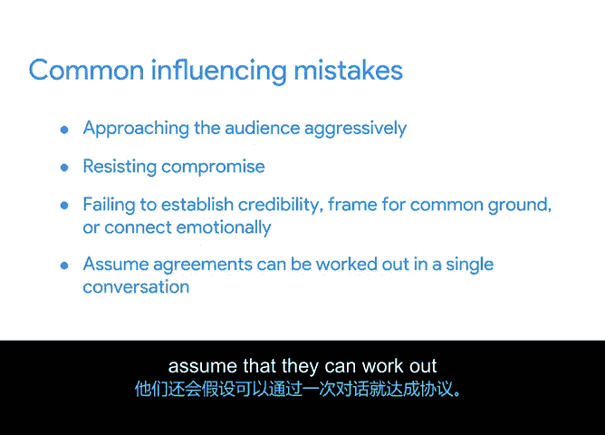

# 045：有效影响步骤 🎯


在本节课程中，我们将学习如何有效地影响你周围的人。影响他人是项目经理推动项目前进的关键技能。我们将探讨有效影响的四个步骤，并了解在尝试影响他人时常见的错误。

## 什么是影响？

影响是指改变他人想法或行为的能力。为了更具体地理解，我们以Office Green公司的Plantt Ps项目为例。假设你的团队希望与一家知名巧克力制造商合作，推出一个捆绑销售方案。客户可以选择在购买每株植物时，额外添加一块高品质巧克力棒。你需要向巧克力制造商的合作经理发送一封初始邮件，以评估他们的兴趣，并最终影响他们与你合作。

那么，如何撰写这封邮件，才能有效地影响对方考虑你的想法呢？

## 有效影响的四个步骤 🧩

领导力专家J. A. Conor博士提出了有效影响的四个步骤：**建立可信度、寻找共同点、提供证据、情感联结**。接下来，我们将逐一详细讨论。

### 第一步：建立可信度

在这一步，你需要向对方说明他们为何应该听取你的意见。根据Conor博士的观点，可信度来源于两个方面：**专业知识和人际关系**。

你需要向对方证明你是某个领域的专家，无论是通过专业经验、深入研究还是其他方式。同时，你需要通过展示自己诚实、可靠且值得合作的特质，来建立关系可信度。

**示例代码（邮件开头）：**
```
收件人姓名，您好！

我是Eliita，Office Green公司的首席项目经理。您的同事Alex向我推荐了您。在Alex加入贵公司之前，我们曾一起合作，成功推出了Office Green的多项新服务。
```

在这段开场白中，你通过介绍自己在公司的角色，并巧妙地提及过去成功推出新服务的经历，建立了**专业知识可信度**。同时，通过提及双方共同的联系人Alex，并暗示Alex可以为你的人品和情商作证，你建立了**关系可信度**。

### 第二步：寻找共同点

在这一步，你需要说明你的想法如何能使对方受益。要做到这一点，你必须深入了解你的受众及其价值观。本质上，你需要思考你的想法中哪些方面会吸引他们，以及他们同意你的想法后将获得什么好处。

在Office Green的邮件中，你可以表明你已经深入研究过对方的组织，并认为这项新服务可能符合他们当前的业务方向。

**示例代码（邮件正文）：**
```
我们正在推出一项为顶级客户提供桌面植物的服务，并希望探索一个捆绑方案，将高品质巧克力与每份植物订单搭配。我注意到贵组织近年来积极与生活方式和健康品牌合作，我认为我们之间可能存在绝佳的合作机会。
```

在这部分邮件中，你表明了自己已对对方组织做过调研，并且他们过去的合作历史显示双方合作可能非常契合。

### 第三步：提供证据

在这一步，你需要通过**硬数据和有说服力的故事**来支持你的观点。数字本身的说服力有限，需要故事来赋予其活力。

在Office Green的邮件中，你可以用这样一行文字来吸引收件人：

**示例代码（邮件正文）：**
```
我们最近对客户进行了调查，以评估对此类捆绑方案的兴趣，而贵品牌被反复提及。
```

在这个例子中，你通过客户调查结果提供了证据，这些结果显示目标受众对你的品牌有压倒性的积极认可。

### 第四步：情感联结

在这一步，你需要向对方展示你对这个想法的情感投入，并尽力匹配他们的情感状态。

在Office Green的邮件中，你可以通过呼应对方的品牌理念来展示情感联结。

**示例代码（邮件正文）：**
```
我们一直关注贵公司在Instagram上的动态，非常喜欢你们关于巧克力与追求健康平衡生活方式之间联系的帖子。或许我们可以探讨如何联手，将这一信息传递给更广泛的受众。
```

然后，你可以用一个友好的结尾来结束你的邮件，例如：“如果您有兴趣，我很乐意与您联系，详细介绍我们的合作伙伴计划。”

## 常见的影响错误 ⚠️

上一节我们介绍了有效影响的步骤，本节中我们来看看Conor博士指出的、人们在尝试影响他人时常犯的四个错误。了解这些错误可以帮助你避免它们，从而更成功地建立关系。

以下是四个常见错误：

1.  **过于激进**：过于强势地接近对方，往往会让人完全拒绝你的想法。
2.  **拒绝妥协**：妥协对于达成任何形式的相互协议都至关重要，拒绝妥协会阻碍合作。
3.  **过分关注论证**：将过多时间花在为自己的想法辩护上，而没有投入足够精力去建立可信度、寻找共同点、提供证据和进行情感联结。
4.  **期望一蹴而就**：假设仅通过一次对话就能达成协议。



这些错误可能会危及你影响他人的尝试，并限制你建立关系的能力。因此，在准备向他人推销你的伟大想法时，请务必注意这些常见陷阱。

## 总结 📝

本节课中，我们一起学习了有效影响他人的四个步骤：**建立可信度、寻找共同点、提供证据、情感联结**。我们还探讨了在尝试影响他人时常见的四个错误：过于激进、拒绝妥协、过分关注论证以及期望一蹴而就。掌握这些步骤并避免这些错误，将帮助你更有效地推动项目合作与进展。