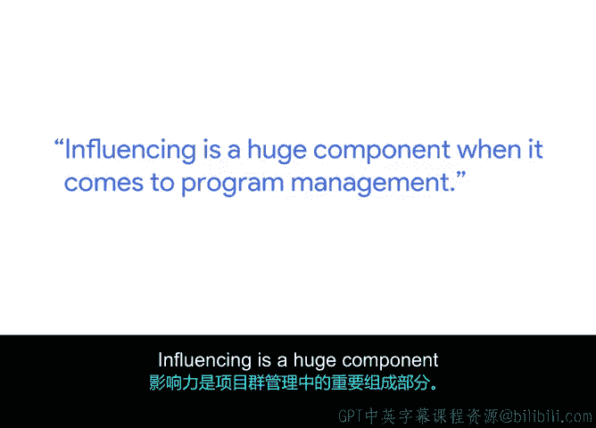

# 047：通过展示项目影响力影响他人 💡

在本节课中，我们将学习如何通过清晰地展示项目的影响力，从而有效地影响项目干系人，推动项目获得支持与批准。核心在于理解他人的需求，并将项目价值与之关联。

## 课程概述

大家好，我是Chris，谷歌的多元化项目经理。影响他人是项目管理中的一个重要组成部分。你可能有一个关于项目或计划走向的绝妙想法。当你构思出所有这些创意并想说服他人批准时，必须思考这对他们有何益处。这个项目或计划将对业务、客户等产生何种影响。一旦你能提炼出这种影响，就能真正思考如何向那位高管干系人提出你的请求。

## 影响力的本质与基础

上一节我们介绍了影响力的重要性，本节中我们来看看影响力的基础。每个人都有影响他人的能力，你从小就在这么做，无论是想出去和朋友玩，还是想从最喜欢的餐厅得到一顿美餐。你总是在试图影响他人以满足你的愿望。但你必须思考这对他们有何价值。当你还是个孩子时，价值只关乎你自己。

## 实践案例：整合冗余项目

当我首次担任多元化项目经理时，有一系列已运行多年的项目。我以全新的视角介入，发现我们现有的项目存在大量冗余。我所做的是，我必须去影响那些一直在运行这些项目的人，让他们认识到这些项目都非常相似，如果我们通力合作，就能构建一个满足所有需求的单一项目。

这需要一些时间。我必须展示示例，说明为何我认为这个单一项目能以同样的方式影响目标群体。我还必须展示每个人在这个新项目中将扮演何种角色。我不能简单地说“你们的所有项目都需要停止”，而更像是“你们的所有项目都需要成熟并融入这个新的身份”。因此，这需要时间，也需要大量的关系管理和耐心，因为我是新来的，必须证明自己。

由于事先经过了深思熟虑，项目的影响力很快便显现出来。

## 有效影响他人的关键策略

基于实践，以下是有效影响他人的关键策略：

我的建议是：保持简单。你掌握了所有关于此事为何重要的背景信息，以及达成目标所需的所有步骤。但你试图影响的那个人只需要知道：你何时能达到目标，以及你将如何达成目标的基本信息。

因此，不要试图把他们拉进细节的泥潭。根据你面对的受众，将他们保持在合适的理解层面。

*   **针对研究人员**：他们可能想知道数据点。
*   **针对营销团队**：他们可能更想知道那些更引人注目、更高层次的元素以及目标人群。

所以，要记住你的受众，但务必保持简洁。

## 保持热情与总结

影响力不应该是件苦差事。一旦你完成了工作，你应该很兴奋地与他人谈论它。如果你对自己正在做的工作不感到兴奋，我会退一步思考你正在构建什么、正在整合什么。如果它不能让你兴奋，它也无法让别人兴奋。

在本节课中，我们一起学习了如何通过展示项目影响力来有效影响他人。核心在于**理解干系人价值**、**提炼项目影响**、**根据受众调整沟通方式**并**保持简洁与热情**。记住，成功的说服始于清晰的利益呈现和真诚的沟通。