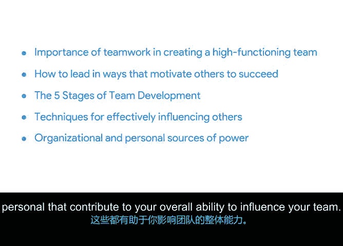

# 048：项目执行推动项目总结

## 📚 概述

在本节课中，我们学习了团队管理与影响力的多个方面。现在，我们来回顾一下本模块的核心内容。

## 🧩 团队管理与影响力回顾

上一节我们介绍了团队发展的五个阶段，本节中我们来总结本模块的全部要点。

以下是本模块涵盖的核心内容：

*   **团队合作的重要性**：你学会了如何解释团队合作对于创建高效团队、按时完成项目工作的重要性。
*   **领导与激励**：你学会了如何通过领导力激励他人取得成功，这包括在团队层面和个人层面。
*   **团队发展的五个阶段**：你学习了`形成期、震荡期、规范期、执行期、解散期`这一框架，它有助于理解和管理有时具有挑战性的团队动态。
*   **有效的影响力技巧**：我解释了如何运用技巧有效影响你周围的人。
*   **影响力的禁忌**：你学习了在尝试影响他人时不应采取的做法。
*   **权力来源**：最后，你了解了组织和个人层面的权力来源，这些共同构成了你影响团队的整体能力。

## 🎯 总结

本节课中，我们一起学习了如何通过理解团队动态、运用领导力以及掌握影响力技巧来有效管理团队并推动项目执行。这些技能对于确保项目成功至关重要。

## 🔮 下一步预告

接下来，我将带你学习如何进行有效的项目沟通。我们很快再见。