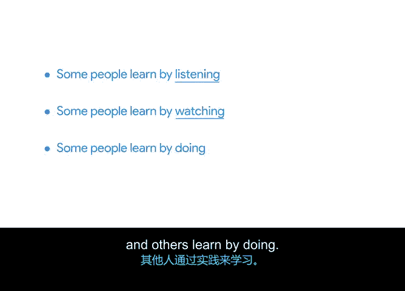

# 050：推动项目｜多样化沟通方式

## 概述
在本节课程中，我们将学习如何与项目团队进行多样化沟通，以确保信息有效传递，推动项目顺利进行。我们将探讨项目经理在沟通中的核心角色，以及如何利用不同工具和方式来适应团队成员的不同学习风格。

## 项目经理：信息的核心枢纽
上一节我们强调了有效团队沟通的重要性。本节中我们来看看项目经理在沟通中的具体职责。

作为项目经理，你是连接团队成员与项目所需信息的核心。在沟通和澄清目标、行动项、进展和更新方面，你是团队的主要资源。确保你持续、连贯地传递信息至关重要，这样每个人都能理解项目的当前状态以及下一步计划。

## 多样化的沟通方式
团队沟通方式多种多样。项目经理通常通过检查点、会议以及项目文档（如包含时间表、跟踪器或会议记录的项目计划）进行持续沟通。

以下是团队沟通的主要载体：
*   **项目文档**：如项目计划、时间表、跟踪器、会议记录。
*   **沟通枢纽**：集中的团队沟通平台。

你有责任明确这些文档的使用方式、访问权限以及更新频率。

当然，除了这些职责，你还需要处理电子邮件、即时消息并参加会议。所有这些对于推动项目前进都至关重要。

## 协调与适应：确保信息到位
作为项目经理，你需要协调信息的流入和流出，将个人与必要的细节和背景联系起来，并跟踪谁需要在何时接收何种信息。

某些信息你需要以多种方式向团队传达多次。因为人们的学习方式各不相同：有些人通过听来学习，有些人通过看来学习，还有些人通过实践来学习。

**公式：有效沟通 ≈ 信息 × （听觉 + 视觉 + 实践）渠道**

以多种方式沟通，能确保你以易于团队消化和吸收的格式分享知识。你的团队需要专注于大量任务，因此请积极主动，以多种方式多次强化重要信息，确保没有人被排除在信息圈之外。

## 常用沟通工具简介
有许多工具可以帮助你与团队沟通，便于在整个项目期间保持联系并同步进展。

以下是几种常见的沟通工具：
*   **电子邮件和即时消息**：用于日常、异步的书面沟通。
*   **面对面会议**：用于需要深度讨论或建立关系的场合。
*   **视频会议**：用于远程团队的同步沟通。
*   **工作管理与协作工具**：用于集中管理任务、文档和沟通。

你的组织可能已经部署了其中一些工具，或者你可能有机会为项目选择一些。无论是哪种情况，熟悉现有的工具都是有益的。

## 总结与预告
本节课我们一起学习了项目经理作为信息枢纽的角色，以及采用多样化沟通方式以适应不同团队成员学习风格的重要性。我们还简要介绍了常用的团队沟通工具。

在下一个视频中，我们将更详细地探讨那些能提供高效项目团队沟通的具体工具。

我们下个视频见。