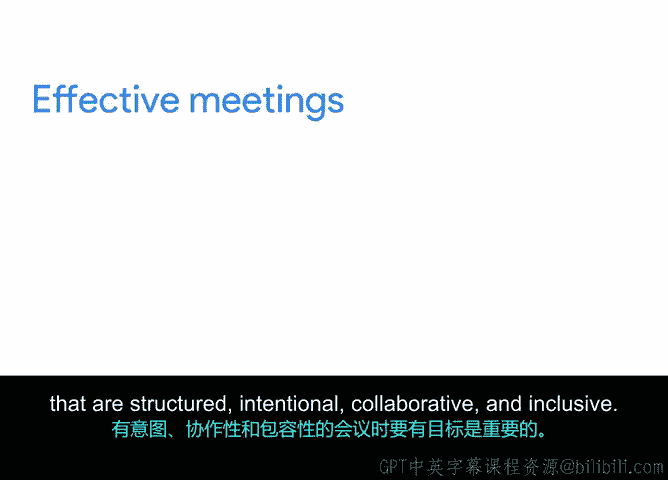

# 052：如何组织高效会议 🎯

在本节课中，我们将学习如何组织和引导高效的团队会议，这是确保项目成功推进的关键沟通工具。高效的会议能够有效地分发信息、促进团队及利益相关者之间的沟通，并帮助项目保持在正轨上。

上一节我们介绍了会议的重要性，本节中我们将详细拆解高效会议所共有的核心元素。

## 高效会议的核心元素

无论会议的规模、目的或形式如何不同，高效的会议通常都具备以下四个共同特点：**结构化**、**目的明确**、**协作性**和**包容性**。让我们逐一深入了解。

### 1. 结构化会议

结构化意味着会议有清晰的框架和流程。这能确保会议高效运行，并尊重所有参与者的时间。

以下是实现会议结构化的关键步骤：

*   **准时开始与结束**：这向参与者表明他们的时间受到重视。
*   **精心选择与会者**：只邀请能为讨论做出贡献或会直接受到议题影响的人。如果某人没有必要出席，可以通过分享会议笔记来告知他们。
*   **制定并优先排序议程**：将最重要的议题放在前面，确保它们得到充分关注。可以使用 **时间盒** 技术来管理每个议题的讨论时长。
    *   **时间盒公式**：`为每个议题分配时间 = 预计讨论时间 + 缓冲时间（几分钟）`
*   **指定记录员**：明确由谁负责记录会议内容，并确定笔记将如何、何时以及向谁分享。这确保了会议成果得以留存和传达。

在最初的几次团队会议后，你需要评估节奏，调整每个议题的时间分配。如果提前完成所有议题，可以果断提前结束会议。

### 2. 目的明确的会议

会议必须有清晰的目标和期望，这应在会议邀请和议程中明确说明，让每个人都知道为何要参会。

一个设计精良的议程能帮助与会者做好准备，保持讨论聚焦，并明确会议的目标。会议的目的可能是做出决策、分配任务、评估想法等。

无论会议目的是什么，都应确保：
*   如果需要与会者提前准备，务必提前发送阅读材料。
*   根据目的，会议可以是正式或非正式的，规模可大可小。
*   始终陈述一个清晰、深思熟虑的目的，并努力在预定时间内达成。

### 3. 鼓励协作的会议

协作是指人们为了产出或创造某物而共同工作。即使会议目的是由一人向团队传达信息，也有办法使其更具协作性。

以下是营造协作环境的方法：

*   **议程避免单向宣讲**：确保议程不仅仅是个人演示，要包含互动环节。
*   **明确会议目标**：在议程中说明本次会议是为了做出决策，还是仅供信息分享和讨论。
*   **使用共享文档**：创建一个数字共享会议文档，鼓励参与者直接将评论或想法写入文档。提醒大家笔记会被分享，这能促进实时倾听和参与。
*   **尊重沟通风格**：允许参与者通过口头、聊天框、会议笔记或其他任何你喜欢的方式参与讨论。

### 4. 包容性的会议

包容性是指有意地接纳那些可能被排除或边缘化的人群。良好的包容性会带来卓越的协作，确保每位参与者的贡献都受到重视。

作为项目经理，你在确保与会者感到被支持与被包容方面扮演着关键角色。

以下是提升会议包容性的实践：

*   **任命会议主持人**：让主持人引导会议，在他人演示时实时帮助参与者提问。这样演示者可以专注于内容，而主持人则关注参与者并引导发言时机。
*   **为安静者留出空间**：在某个议题结束前或会议结束前，可以轮流邀请每位与会者对特定问题发表看法。
*   **确保会议可访问**：提供无障碍资源（更多信息请参考课程资料）。在举行虚拟会议时，考虑网络接入水平。
    *   **为网络不佳者提供电话拨入选项**：大多数在线会议工具（如 Google Meet 和 Zoom）都支持此功能。
    *   **允许关闭摄像头**：告知参与者，如果需要改善连接或调整视频质量，可以关闭摄像头。

专注于包容性有助于建立归属感，并提醒我们世界是多元的。创造一个能让不同观点、背景和经验的人都能发挥最佳水平并相互支持的会议空间至关重要。

## 总结

本节课中，我们一起学习了组织高效会议的核心要素。我们了解到，高效的会议需要具备**结构化**、**目的明确**、**协作性**和**包容性**。通过精心设计议程、选择合适的与会者、鼓励积极参与并确保环境包容，你可以赢得举办高效、成功会议的美誉，这对你的项目和职业生涯都大有裨益。

现在，我们对如何通过会议有效分发信息、与团队和利益相关者沟通以及保持项目正轨有了更深的理解。我们也学习了创建高效会议的一些元素，例如包含清晰的议程、与会者名单、做详细笔记等。

在下一个视频中，我们将学习关于最常见的项目会议类型。