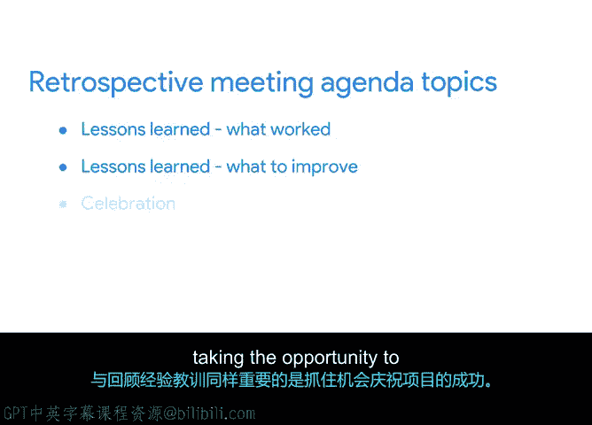

**谷歌项目管理专业证书：第4课：常见项目会议类型** 🗓️

在本节课程中，我们将学习项目管理中最常见的几种会议类型。了解这些会议的目标、结构和适用场景，将帮助你更有效地组织和参与项目会议，确保团队沟通顺畅，项目顺利推进。

---

上一节我们介绍了如何组织和主持有效的团队会议。本节中，我们来看看在项目周期内，你通常需要召开的几种具体会议类型。

每个项目都包含许多会议。虽然每次会议都独一无二，但熟悉最常见的项目管理会议类型，将帮助你更好地为每次会议确定目标、结构和最合适的活动。

项目管理会议主要有四种通用类型：项目启动会、状态更新会、干系人评审会和项目回顾会。

以下是这四种会议类型的详细介绍。

**项目启动会**
这通常被视为项目的正式开始，旨在使团队对项目目标的理解与实际计划和流程保持一致。
*   **主要与会者**：你的团队成员是启动会的主要参与者。
*   **关键参与者**：为确保获得支持并与项目目标保持一致，高级管理层和关键干系人的参与也必不可少。

**状态更新会**
状态更新会是最常见的会议类型之一。这类会议包括定期的团队会议，其主要目标是让团队在项目更新、进展、挑战和后续步骤上保持一致。
在会议中，项目经理可能会分发或展示项目绩效报告，以及对项目关键要素的正式状态更新。这使团队和干系人能够了解当前绩效水平和任务进展。
项目经理的关键职责之一是随时了解项目状态，并确保其他人掌握最新信息或知道在哪里能找到这些信息。为此，状态更新会成为贯穿项目生命周期、用于检查项目状态的关键工具。

通常，你会在这种会议上评估以下几个主题的状态：
*   **任务更新**：与会者需要了解最紧急任务的状态、已完成的任务数量以及剩余待办事项的数量。
*   **进度状态**：我们是落后于计划、超前于计划，还是与我们的预测保持一致。
*   **预算状态**：同样，讨论预算状态以及任何影响最终结果的新事项也很常见。
*   **当前或预期问题**：例如，变更、风险、资源问题、供应商问题等。特别是质量和范围的变更。定期提出这些事项是个好主意，这样就不会有人措手不及，并且可以共同讨论解决方案。
*   **行动项**：行动项是你列表中需要完成的任务。分配行动项是结束会议并确保项目持续向前推进的好方法。请记住，每个行动项都有负责人和截止日期。

状态会议是保持项目正常进行的基本工具。大多数项目经理建议为此类会议使用相对固定的议程和时间。为保持团队参与度，请遵循议程并严格控制会议时间。
由于项目经理应能随时向项目发起人或客户报告最新信息，因此定期召开状态会议非常重要。状态会议是有益的，因为它们提供了认可里程碑、共享信息并向团队提出关切的机会。
你决定安排这些会议的频率取决于几个因素，例如项目的复杂性、团队成员数量以及项目发起人、客户或其他方所需的信息级别。随着项目进展，不要害怕调整会议的节奏。

**干系人会议**
干系人参与对于成功的项目管理至关重要。干系人会议的目标是获得认同和支持。每位干系人都拥有自己的一套工具、专业知识和技能，干系人会议正是概述和利用这些贡献的场合。
你需要从理解干系人的挑战或问题开始，然后做出相应回应并进行必要调整以解决这些挑战。赢得并维持干系人的支持对你的项目成功至关重要。

在某些情况下，你可能希望与干系人进行一对一的会议。这允许你与每位干系人就相关细节进行更深入的探讨，然后你可以讨论该特定人员最感兴趣和最关心的话题。
其他时候，你需要以小组形式与干系人互动。如果你需要管理大量干系人，请将会议重点放在对你项目最有影响力的干系人身上，识别出适合进行高频率、深入沟通的干系人。例如，你可以将会议重点放在你需要接触的每个小组的高级经理身上。其他干系人可以通过其他方式（如电子邮件或会议纪要）进行通知。

虽然与干系人开会时可能涉及许多潜在议题，但大多数会议仅限于沟通关键信息。你应该始终能够呈现项目更新。会议开始时，先用两到五分钟做一个简短的整体项目状态更新。
与干系人会面的另一个关键原因是寻求并听取反馈。或者，你可能会与干系人会面以做出决策或解决围绕你项目的主要问题。在这种情况下，你通常会与高级领导和项目发起人会面。决策可能包括“继续/不继续”的决策、方案选择或批准投资。
干系人会议通常更为正式。提前准备阅读材料和文件供审阅是正常的，这有助于让与会者进入会议的正确心态。干系人会议可以是定期和循环的，也可以只是一次性的项目会议。频率将取决于干系人参与项目的原因：他们是扮演顾问角色（如咨询师），还是仅仅需要被告知并保持知情？他们的参与是围绕项目中的某一项活动，还是需要长期参与？你需要根据具体情况来决定。

**项目回顾会**
项目结束或项目阶段结束时，是回顾项目如何展开的绝佳机会。这被称为回顾会，你将在本课程的其他部分了解更多相关内容。
典型的回顾会议程包括回顾经验教训：哪些方面进展顺利、应该继续保持，以及哪些方面可以改进。与回顾经验教训同等重要的是，抓住机会庆祝项目成功。

---

了解这些项目会议类型之间的区别，可以让你最大限度地提高效率，并确保不浪费时间。你能从每种会议类型中获得正确的结果，这将有助于推动决策并促成积极主动的积极行动。

在本节课中，我们一起学习了常见的项目会议类型，以及如何使这些会议对每位与会者都有效。在下一个视频中，我们将回顾你在过去几个视频中学到的内容。我们下个视频见。