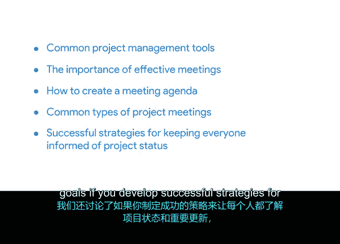

# 054：项目执行工具与会议管理总结

在本节课程中，我们将回顾项目执行阶段中用于团队沟通的关键工具，以及如何通过有效的会议管理来推动项目成功。掌握这些技能对于确保信息透明和团队协作至关重要。

## 团队沟通工具

上一节我们介绍了项目执行的核心任务，本节中我们来看看支持这些任务的实用工具。有效的沟通工具能帮助团队保持信息同步。

以下是几种常见的项目管理沟通工具：

*   **项目管理软件**：例如 Asana、Trello 或 JIRA，用于跟踪任务、截止日期和责任人。
*   **即时通讯平台**：例如 Slack 或 Microsoft Teams，便于团队进行快速、非正式的日常交流。
*   **文档协作工具**：例如 Google Docs 或 Confluence，支持多人实时编辑和共享项目文档。
*   **仪表盘与报告工具**：用于可视化项目进度和关键绩效指标（KPI），向利益相关者展示状态。

## 有效会议的重要性

仅仅拥有工具还不够，定期的、结构化的互动是确保团队对齐的关键。这就是会议发挥作用的地方。

有效的会议能集中团队智慧、解决问题并做出决策，从而直接推动项目向前发展。低效的会议则会浪费时间和资源。

## 如何创建会议议程

为了确保会议高效，会前准备至关重要。一份清晰的议程是会议成功的蓝图。

创建会议议程可以遵循以下步骤：

1.  **明确会议目标**：用一句话定义会议需要达成的具体成果。
2.  **列出讨论主题**：根据目标，列出需要讨论的所有项目点。
3.  **分配时间**：为每个议程项目预估并分配时间，确保会议节奏。
4.  **指定负责人**：确定每个议题的主讲人或主持人。
5.  **提前分发**：在会议前将议程发送给所有参会者，以便他们做好准备。

## 项目经理组织的常见会议类型

根据项目不同阶段和需求，项目经理需要组织和主持多种类型的会议。

以下是项目经理通常会涉及的几种会议：

*   **启动会议**：在项目或新阶段开始时召开，旨在对齐目标、范围和角色。
*   **状态更新会议**：定期举行（如每周），同步项目进度、讨论障碍和计划下周工作。
*   **评审会议**：用于演示特定成果（如设计稿、代码模块），并收集反馈。
*   **复盘会议**：在项目里程碑或结束后召开，总结经验教训，识别改进点。

## 实现项目目标的策略

我们讨论了工具和会议，现在将这些元素整合起来，看看它们如何共同作用于项目成功。

若能为团队制定成功的策略，确保每个人都能及时了解项目状态和重大更新，你实现项目目标的机会将大大增加。这包括建立清晰的沟通计划、有效利用工具以及主持富有成效的会议。

---

本节课中我们一起学习了项目执行阶段的关键支持技能。我们回顾了促进团队沟通的实用工具，深入探讨了有效会议的重要性、议程创建方法以及常见的会议类型。最后，我们总结了如何通过这些实践来制定策略，从而最大限度地提高项目成功的可能性。接下来，你将进入项目管理的最后一个阶段：项目收尾。