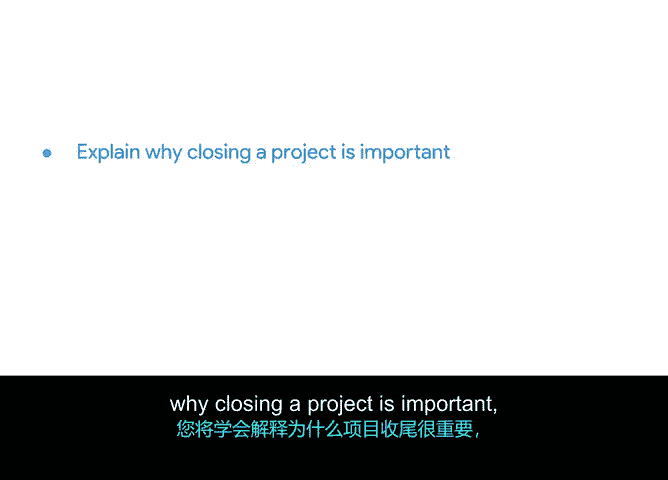

# 055：项目收尾介绍 🎬


在本节课中，我们将学习如何结束一个项目。你将了解到项目收尾的重要性，如何判断项目何时完成，以及项目收尾过程的具体步骤。

## 项目收尾的重要性与概述

上一节我们探讨了项目执行，本节中我们来看看如何为项目画上圆满的句号。项目收尾是整个项目不可或缺的一部分，它能帮助避免不利的情况发生。

需要明确的是，**完成一个项目**和**关闭一个项目**是两件截然不同的事情。完成意味着所有工作已做完，而关闭则涉及一系列正式的结束流程。



## 收尾过程中的关键角色

接下来，我们将讨论收尾过程中涉及的关键人员。你的项目相关方和客户在这个过程中扮演着重要角色。

以下是相关方在收尾阶段的主要参与点：
*   获取客户或发起人对项目可交付成果的最终验收。
*   确保所有合同义务和协议均已履行。
*   收集相关方的最终反馈。

## 团队的作用与回顾会议

你的团队也能帮助你完成项目收尾。一个重要的工具是**回顾会议**，你可以利用它来改进未来的工作流程和程序。

我们在之前的模块中简单提到过回顾会议，但在这里，你将在项目收尾这个新背景下更深入地学习它。回顾会议的核心目标是总结经验教训，其基本流程可以用以下伪代码表示：

```python
def conduct_retrospective(team_members):
    gather_feedback(what_went_well, what_to_improve)
    analyze_root_causes()
    create_action_plan()
    return lessons_learned
```

## 庆祝成功与项目经理的职责

一个项目只有在为团队的出色工作进行了庆祝之后，才算完全结束。庆祝成功是认可努力、提升士气的重要环节。

然后，我们将从你作为项目经理的角度，具体探讨收尾流程是如何运作的。

我们将学习项目经理需要准备哪些类型的演示文稿和文档，才能正确地关闭项目。这通常包括**项目总结报告**、**最终预算报告**和**经验教训文档**等。

## 总结

本节课中，我们一起学习了项目收尾的全过程。我们了解了收尾的重要性，区分了“完成”与“关闭”的不同，并明确了相关方、团队和项目经理在收尾阶段各自的任务。记住，一个正式的收尾流程和成功的庆祝，对于项目的完整性和团队的未来发展都至关重要。

内容很多，让我们从下一节视频开始，详细概述收尾流程。