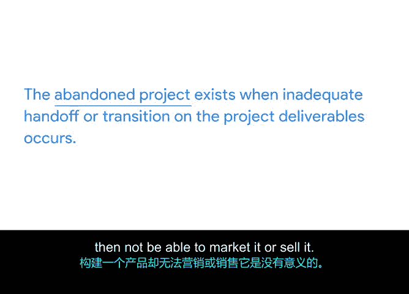

**谷歌项目管理专业证书：第4课：项目执行：推动项目 - P56：项目收尾的重要性**

欢迎回来。在本视频中，我们将讨论项目收尾。我们将回答以下问题：项目收尾意味着什么？为什么它很重要？以及它何时发生？

项目收尾是指为正式完成项目、当前阶段及合同义务而执行的过程。首先需要明确的是，**完成项目**与**关闭项目**不是一回事。项目做完了，并不代表它被关闭了。

在餐厅里，你点餐并吃完，并不意味着用餐体验结束。你必须在离开前结账。项目的道理与此相同。

那么，一个项目真正被关闭需要满足哪些条件呢？以下是构成项目收尾的三个标准。你需要确保所有工作都已完成，确保所有商定的项目管理流程都已执行，并获得利益相关者对项目完成的正式确认。

首先，你必须确保所有工作都已完成。有可能某项任务被忽略了。例如，在项目执行过程中，可能因变更而重新调整了工作优先级。

以“植物伙伴”项目为例，当你的团队完成用户验收测试后，一切似乎都已结束。但几个月后，客户在办公室屏幕上查找植物的过敏信息时，却找不到任何资料。如果在项目结束前进行审查，你可能会发现“创建过敏信息文档”这项任务被遗漏了，因此没有完成。通过对项目进行审查，你可以反复确认所有工作是否完成，以避免日后不得不重新处理该项目。

其次，你必须确保所有商定的项目管理流程都已执行。有时，管理性任务会被忽视。即使任务本身已完成，后续需要进行的程序性或行政性工作也可能被遗忘。

一个例子是合同的签署和处理。项目可能已完成数月，但当你重新查看与植物供应商的合同时，发现双方都未最终签署。这是一个关键失误，使双方都处于风险之中，并且此事发生在服务正式上线很久之后。

最后，你需要获得关键利益相关者对项目完成的正式确认和同意。如果你没有获得所有利益相关者关于项目结束的正式批准，某些利益相关者可能仍会要求对项目进行调整，因为他们认为项目仍在进行中。这可能会影响你的团队成员。

例如，如果办公室屏幕公司签约的网页开发人员认为项目仍在进行，他们可能仍在为此项目投入时间甚至计费工作，这意味着办公室屏幕公司浪费了资金。

与项目流程中所有其他阶段（如启动、规划、执行、监控）一样，收尾阶段同样有其重要目的。**关闭项目很重要，因为它能确保没有任何疏漏。** 😊

如果项目没有关闭，你团队的努力、时间和信誉都可能受到负面影响。

为了避免对你的团队造成负面影响，你需要了解并避免以下几种类型的项目：**“永无止境的项目”** 和 **“被遗弃的项目”**。

“永无止境的项目”是指，无论出于何种原因，项目可交付成果和任务都无法完成。这可能发生在任务被委派给不具备必要技能的团队成员时，或者截止日期未得到妥善沟通时。也可能发生在用户验收测试发现太多非阻碍发布的缺陷时，或者客户尽管要求已满足但仍不满意时。要特别注意保护项目的范围，这样你成功关闭项目的可能性会大得多。

如果感觉客户想要的东西远超本项目计划交付的范围，也许最好的选择是承诺进行后续项目，并关闭当前项目。

“被遗弃的项目”发生在项目可交付成果的交接不充分时。基本上，最终可交付成果从未到达客户手中。开发了产品却无法营销或销售，这是没有意义的。因此，制定计划以确保充分交接或过渡可交付成果，对于确保客户满意和项目正确关闭至关重要。

总而言之，你应该尽一切努力妥善关闭项目，否则你可能需要为不完整的合同、未完成的范围或不合规的做法承担责任。

在下一个视频中，我们将讨论针对客户和利益相关者的全面收尾流程中所包含的必要步骤。