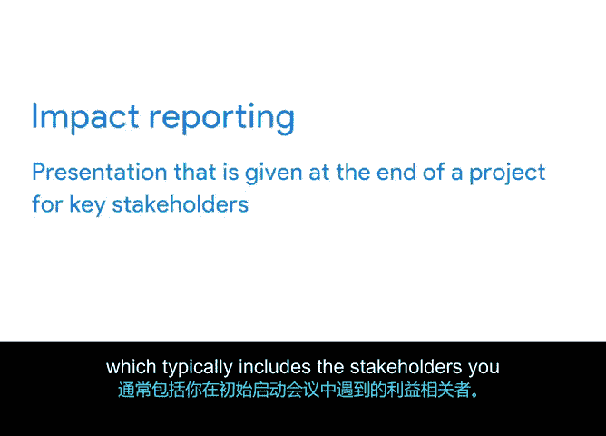

# 057：面向客户与利益相关者的收尾流程 🎯

## 概述
在本节课程中，我们将学习项目收尾流程对于客户与利益相关者的重要性。我们将探讨如何通过正式的收尾来确保他们的需求得到满足，并维护团队的信誉。课程将详细介绍在里程碑节点和项目最终阶段分别应执行的收尾步骤，并解释“影响报告”的作用。

---

上一节我们介绍了收尾流程的总体重要性。本节中，我们将具体讨论为什么收尾对客户和利益相关者至关重要。

正式的收尾流程之所以重要，不仅因为不恰当的收尾可能使您对不完整的合同或范围负责，还因为您希望利益相关者感到他们的需求得到了满足。正如之前提到的，项目团队与客户、用户、供应商等的关系可能因未完成的事项而受到影响。如果关系受到负面影响，您团队的信誉也可能受损。通常，利益相关者与项目经理共同设定项目的目标和范围。因此，一位优秀的项目经理总是希望确保这些利益相关者对交付成果和最终产品的质量感到满意。

那么，如何确保客户和关键利益相关者对项目收尾感到满意呢？

首先，您需要决定您的项目是在每个里程碑结束时进行一个小型收尾流程，还是在项目最终阶段进行一个正式且更全面的收尾阶段。您甚至可以决定在每个里程碑结束时进行小型收尾，并在项目最终阶段进行更正式的收尾。

您可以通过问自己一个特定里程碑是否是最终的来决定，即该里程碑在项目后期不需要重新处理。如果是这样，进行一次简短的形式收尾将确保每个人都清楚该特定里程碑的成果。

例如，让我们将其置于“植物伙伴”网站发布项目的背景下。发布网站是一个正式的里程碑，因此对网站发布进行正式收尾是合理的。是的，网站仍将进行持续的更新和维护，但它不会再次发布，因此发布是一次性事件。所以您需要确保移交交付成果、整理适当的文档，并通知所有利益相关者您已达到该里程碑，并且项目的该部分现已结束。

如果您决定在每个阶段或里程碑之后执行收尾流程，以下将是您的团队需要做的事情。

以下是您团队需要执行的步骤清单：
1.  **确保项目满足其旨在达成的战略目标。** 首先，您需要参考先前的文档，例如您的工作说明书、提案请求、风险登记册和RACI矩阵。您会记得这些文档在之前的章节中讨论过，可以随时回顾以作复习。在此过程中，问自己：该阶段所有必需的工作都完成了吗？所有已识别的问题都解决了吗？每个团队成员都完成了分配的任务吗？
2.  **整理收尾文档。** 然后，您将整理收尾文档，例如创建收尾报告（我们将在后面深入介绍）。您将与团队成员一起构建和审查该文档，以确保项目的每个方面都已讨论。
3.  **回顾回顾会议记录。** 您还将回顾您和团队参与的任何回顾会议的记录。这样，您的团队成员将有机会谈论他们喜欢或不喜欢的方面，并带着一种完结感离开。
4.  **进行采购流程的行政收尾。** 接下来，您将进行采购流程的行政收尾，关闭任何必要的合同，向供应商支付款项，并从合同工那里取回所有最终交付成果。这非常重要，以便外部利益相关者和合同工能够理解该阶段或项目正式结束。
5.  **正式确认阶段完成。** 然后，如果需要，您将希望正式确认该阶段的完成。确保所有利益相关者都知道一个阶段或项目正在结束。这可能像发送一封电子邮件通知他们您已达到此里程碑一样简单，也可能需要召开一次更大的会议。
6.  **完成任何必要的后续工作。** 最后，您将完成任何必要的后续工作。这包括收集最终反馈和进行收尾调查等事项。这样，您将通过跟进和提供支持，主动帮助利益相关者应对未来的问题。

如果您不是在特定阶段或里程碑之后收尾，而是决定在项目最终阶段收尾，您的流程可能会略有不同。

以下是项目最终收尾可能包含的步骤：
1.  **提供必要的培训、工具、文档和能力。** 首先，提供使用您的产品所需的培训、工具、文档和能力。这包括手册和操作指南等，这些能让您的客户和用户在项目结束后了解如何使用您的产品或服务。
2.  **确保项目满足其目标和期望成果。** 审查项目以确保所有任务和交付成果均已完成，没有任何遗漏。您是否完成了您计划要做的事情？工作范围是否全部完成？
3.  **记录所有利益相关者的验收。** 您还需要记录来自所有利益相关者（如客户和发起人）的验收。确保您有书面证据证明利益相关者对交付成果和结果感到满意，这一点非常重要。这可以体现在回顾会议、项目完成文件或任何其他正式签核中。
4.  **与项目团队审查所有合同和文档。** 然后，与您的项目团队审查所有合同和文档。这包括您的工作说明书、提案请求、RACI矩阵、风险登记册以及我们之前讨论过的采购文件。让整个团队参与此审查过程将帮助您确保没有遗漏任何事项。
5.  **记录经验教训。** 始终通过进行正式的回顾会议来记录您的经验教训。在此会议中包括您的团队、任何其他相关团队、您的利益相关者和外部供应商。我们将在下一个视频中更详细地讨论这一点。
6.  **解散并感谢项目团队。** 最后，您可以解散并感谢项目团队。

面向利益相关者进行项目收尾的另一个重要步骤是影响报告。

影响报告是在项目结束时向关键利益相关者进行的演示，通常包括在初始启动会议中出现的利益相关者。影响报告的目的是展示项目的进展过程，并讨论您的产品或服务的影响。这对项目经理很重要，因为您将能够按照自己的方式展示项目的成功，并展示您为业务增值所做的工作。

在此演示中，您将涵盖项目在时间、范围和预算方面的落地情况，说明新服务或产品何时启动，并讨论来自用户的任何可用反馈。您还将解释如何实现了期望的成果。

---

## 总结
本节课中，我们一起学习了如何让利益相关者和客户清楚地理解项目已结束。我们讨论了这样做的必要性，以及如果您不做大量工作来完全结束项目，您的声誉和信誉将如何受到影响。在下一个视频中，我们将讨论适当的和不适当的项目收尾会如何影响您的团队。