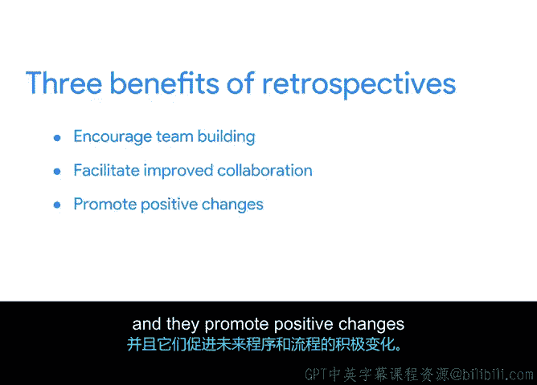

**谷歌项目管理专业证书：第4课：项目执行推动项目 - P58：面向团队的收尾流程**

在本节中，我们将学习如何与你的项目团队一起完成项目收尾。我们将重点讨论使用回顾会议来正式结束项目，并庆祝团队取得的成就。

---

### **回顾会议的重要性** 🧐

上一节我们介绍了如何为客户和利益相关者收尾项目。本节中，我们来看看面向项目团队的最佳收尾实践。

回顾会议在本课程中被多次提及，因为它确实是用于反思和改进的最佳工具。回顾会议是项目收尾的关键环节，无论你的团队选择在每个阶段后收尾，还是在项目最终结束时全面收尾，都需要将其作为流程的一部分来执行。

### **回顾会议的三大核心益处**

以下是举行回顾会议能为你的团队带来的三个主要好处：

*   **促进团队建设**：回顾会议让团队成员有机会理解彼此不同的观点。
*   **改善未来协作**：它们有助于在未来项目中实现更高效的协作。
*   **推动积极变革**：它们能促进未来流程和程序的积极改进。

你的项目团队可能会倾向于跳过反思，直接进入下一阶段。但如果不花时间反思，就无法成长和改进。反思是学习哪些做法应该保持、哪些可以改进的好方法。

### **营造持续改进的文化** 📈

作为项目经理，你需要在团队和公司内建立一种追求持续改进的文化。这意味着你需要征求反馈，以帮助你在下一个项目中做得更好。

这些反馈可能涉及项目的任何方面，例如：
*   规划
*   排期
*   执行
*   沟通
*   团队动态

你可能也会收到关于你所主导的流程的反馈，这很正常。处理反馈对于你作为项目经理的成长至关重要。重要的是要创造一个安全的反馈空间，让团队成员能够真诚分享想法，从而实现共同成长。这是改善未来项目协作的关键一环。

### **庆祝成就与团队建设** 🎉

鼓励持续成长的一部分，是认可并庆祝工作圆满完成。庆祝的方式会根据项目阶段和团队感受而有所不同。

花点时间用一份谢意奖励自己，可以将庆祝活动转变为团队建设练习。表达感激能确保你的工作让人感到振奋和有回报，而不是单调和疲惫。这也能推动积极的改变。

因此，在结束项目时，不要忘记有趣的元素。确保一起玩个游戏、吃点蛋糕、共度一段美好时光，因为这是你们应得的。

---

### **总结**

本节课中，我们一起学习了如何面向团队进行项目收尾。我们了解到，**回顾会议**是收尾过程的核心工具，它能带来三大益处：**促进团队建设**、**改善未来协作**和**推动积极变革**。我们还探讨了通过征求反馈来营造持续改进的文化，以及通过庆祝成就来进行团队建设的重要性。

现在你已经知道如何为团队收尾，接下来我们将讨论如何为项目经理自己完成所有收尾工作。