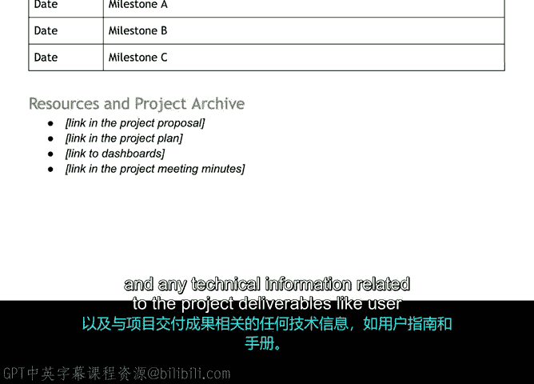

# 060：面向项目经理的收尾流程 🏁

在本节课中，我们将要学习项目收尾流程对项目经理的具体意义，并详细介绍如何通过创建项目收尾报告来正式结束一个项目。

## 项目经理的收尾流程

欢迎回来，我们来讨论一下项目收尾流程对您，即项目经理，意味着什么。

对于项目经理而言，妥善地结束项目至关重要，原因有很多。收尾工作提供了一个反思您和团队表现的机会。它能确保每项任务都已完成，并防止未来对项目产生混淆。

接下来，我将详细阐述这些收尾实践的重要性，以及成功结束项目所需的必要文档。

## 项目收尾报告的重要性

彻底结束项目最重要的一个方面是项目收尾报告。

项目收尾报告是由项目经理为项目经理创建的一份文档。一份项目收尾报告主要有三个目的。首先，它是一份蓝图，用于记录团队做了什么、如何做的以及交付了什么。其次，它提供了对工作质量的评估。第三，它评估了项目在预算和进度方面的表现。

与回顾会议类似，项目收尾报告可用于确定未来项目的最佳实践。可以将其视为您向未来项目经理的知识传递。例如，一个项目结束后，组织内可能会出现类似的项目或该项目的延续，而您可能去负责其他事情，由另一位项目经理接手这个新项目。

如果您创建了一份详尽的收尾报告，它将极大地帮助新上任的项目经理了解先前类似项目的情况。您的收尾报告可以包括进展顺利的事项和不太顺利的事项。创建收尾报告还将减少您回答新项目经理问题所花费的时间，帮助他们快速上手。

可以合理地假设，未来阅读您报告的人可能对该项目不熟悉。因此，请尽可能详细。这样，新的项目团队仅凭您的报告就能了解项目的目标、执行过程和成果。

## 收尾报告应包含的内容

以下是您的项目收尾报告中需要包含的内容。

**执行摘要**
这意味着对流程的描述以及项目的目的。这部分应简短精炼，最多几句话到一个段落。如果一位高管没有时间阅读整个文档，只读了这份执行摘要，他/她是否能理解项目的亮点？

**关键成就列表**
将此视为突出团队成就以及项目整体影响的一种方式。

**经验教训**
例如，哪些方面做得好及其原因，哪些方面出了问题及其原因。关键问题领域（如范围蔓延和进度延误）的主要影响是什么。

**未完成事项**
这可能包括您尚未完全完成的事情，或者如果您有时间会做出的变更想法。

**后续步骤**
例如，是否有预期的后续项目，是否需要持续的维护。

**进度与重要截止日期信息**
您还需要包含关于进度和重要截止日期的信息。例如，您的里程碑是什么以及您如何选择它们？项目持续了多长时间？项目是否按计划进行？以及任何关于重大挫折的信息。

**资源与团队成员**
务必列出资源和团队成员。解释谁参与其中以及他们的角色是什么。这也是表彰为项目完成做出贡献的人员的关键方式。

**资源与项目档案部分**
最后，包含一个资源和项目档案部分。这将包括指向以下内容的链接：您的原始项目计划、任何记录在案的利益相关者沟通和反馈（如会议记录）、用于跟踪、监控和报告的任何文档，以及与项目可交付成果相关的任何技术信息（如用户指南和手册）。

## 总结与展望

希望现在您能理解项目收尾报告不仅对组织有益，对项目经理也同样有益。项目收尾报告能促进团队成员之间的可见性，并创建更高效的未来项目。

好的，我们已经涵盖了大量信息。坚持学习，做得很好。在下一个视频中，我们将回顾本模块，重温您学到的概念。😊