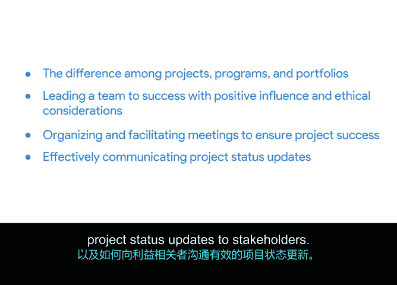

# 061：课程总结

在本节课中，我们共同学习了项目执行阶段的核心知识与技能，特别是如何正式结束一个项目。现在，让我们对全部课程内容进行回顾与总结。

## 课程回顾

恭喜你完成本课程。在项目中坚持至此，本身就是一项了不起的成就。你应该为自己的进步感到高兴。距离掌握成为一名项目经理所需的知识与技能，你又近了一大步。

在最后的系列视频中，我讲解了如何正式结束一个项目，并解释了项目收尾的重要性。

## 项目收尾详解

我定义了项目完成的含义，详述了收尾阶段的步骤，并演示了如何创建项目收尾文档。

我们了解到，恰当的项目收尾是以下三者的结合：
*   **工作完成保证**：确保所有工作均已完成。
*   **流程执行确认**：确认所有约定的项目管理流程均已执行。
*   **需求满足的正式认可**：正式确认项目需求已得到满足，且所有相关方一致同意项目确实已完成。

我们讨论了收尾过程的不同方面，包括：
*   为你的团队进行回顾总结。
*   影响报告的重要性。
*   项目收尾报告的目的。

## 全课程核心内容梳理

以上仅仅是课程的结尾。在整个课程中，你学习了如何运行一个项目。这绝非易事。

以下是我们在整个课程中涵盖的核心主题：

**项目跟踪与沟通**
我们讨论了项目跟踪有助于在团队内部建立并维持信心，确保项目能按时、按预算且在范围内交付。

**应对外部因素**
我们学习了影响项目的不同外部因素，例如**依赖关系**、**风险**和**变更**。我们讨论了如何将这些因素传达给你的团队成员。

**数据的运用**
我们涵盖了数据相关的内容：如何收集数据，如何利用数据为决策过程提供信息，以及如何运用有效的演示技巧来辨别和解释项目数据。

**项目、项目集与项目组合**
我们讨论了项目、项目集和项目组合三者之间的关系及其关键区别。

**团队领导力**
我们还学习了团队合作的要素，以及成功的项目经理如何通过积极的影响力和道德考量来带领团队走向成功。

至此，你应该已经很好地理解了如何组织和主持会议以确保项目成功，以及如何向相关方有效沟通项目状态更新。

## 展望下一阶段

下一门课程将全面介绍**敏捷项目管理**。

感谢你允许我与你分享我的知识。

在本节课中，我们一起学习了项目执行的全过程，从跟踪、沟通、处理变更到最终的项目收尾。你已掌握了推动项目走向成功的关键执行技能，为接下来的敏捷项目管理学习奠定了坚实的基础。