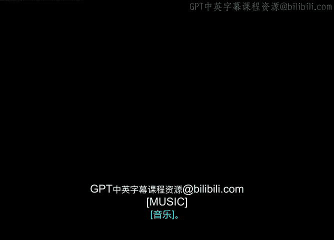
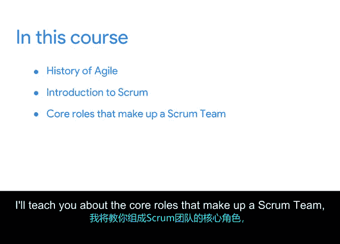

# 001：敏捷项目管理简介 🚀

在本课程中，我们将学习敏捷项目管理。这是一种流行的项目交付方法，旨在为客户提供价值。我们将探讨敏捷的历史、核心概念以及一个名为Scrum的具体框架。课程结束时，你将了解如何在现实世界中使用敏捷方法成功领导项目。

---

大家好，欢迎来到敏捷项目管理课程。

截至目前，本系列课程已涵盖项目管理的基础知识以及成为项目经理所需的条件。

我们探讨了项目生命周期的各个阶段：启动、规划、执行和收尾。

我们还回顾了许多用于管理和沟通计划的不同工具与技术。

此外，我们讨论了如何处理项目过程中出现的各种挑战、风险和问题。

如果你已完成所有先前的课程，恭喜你。如果你是刚刚加入，同样欢迎你。

无论如何，你正朝着项目管理领域的新职业或提升现有职业的方向前进。

既然你已经掌握了管理项目的坚实基础，我将与你分享最受欢迎的项目交付方法之一：敏捷。

在我看来，敏捷也是项目管理中最有趣、最灵活的方法。

敏捷本身并非一种项目管理方法论，而更像是一种为客户交付价值的总体方法和理念，这也是大多数项目的目标。

尽管敏捷不是一种具体的方法论，但在其范畴下有许多框架和方法。在本课程中，我将帮助你为敏捷项目管理的职业生涯做好准备。

我将为你介绍敏捷的历史，并向你介绍一个名为Scrum的特定敏捷交付框架。

我将教你构成Scrum团队的核心角色。

最后，我将介绍一些最佳实践和现实场景，在这些场景中，你可以使用敏捷方法引领项目走向成功。

哦，我可能应该自我介绍一下。我叫Sue，是Google支持平台的高级技术项目经理。😊

我们构建的产品，用于为几乎所有Google产品的用户提供支持。

我于2014年加入Google，从事产品可靠性工作，确保Google的产品始终为全球数十亿依赖它们的人正常运行。

在加入Google之前，我在许多不同类型和规模的公司工作过，在那里我使用瀑布式、敏捷式以及介于两者之间的各种方法运行和参与项目。

我的职业生涯始于软件工程师，从事手机技术工作，但我并没有计算机科学学位。自那时起，我担任过许多不同的角色，但项目管理是我的热情所在，因为它汇集了所有学科，为客户提供惊人的成果，同时也为企业带来同样惊人的效益。

😊，我仍然记得当我发现敏捷时那种顿悟的时刻，我很高兴能与你分享。我希望你已准备好发现敏捷并体验你自己的顿悟时刻。

在下一个视频中，我们将开始学习敏捷的基础知识，到时见。

---

在本节课中，我们一起学习了敏捷项目管理的课程简介，了解了课程目标、讲师背景以及敏捷方法的核心定位。接下来，我们将深入探讨敏捷的基础知识。