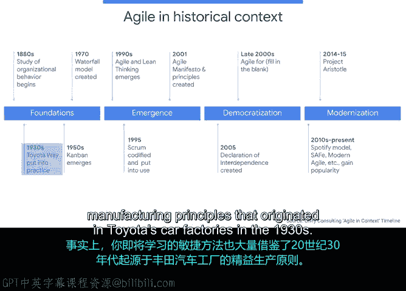

# 002：敏捷简史 🚀

在本节课中，我们将深入了解敏捷项目管理的历史背景、核心概念及其应用范围。我们将回顾瀑布式与敏捷方法的区别，并探讨敏捷价值观和原则的起源。

## 概述

本节将介绍敏捷项目管理的基本概念，追溯其历史发展，并说明其在不同行业中的应用。我们将从瀑布式方法的简要回顾开始，逐步过渡到敏捷方法的核心理念。

## 瀑布式方法回顾

瀑布式是一种流行的项目管理方法，它指的是阶段按顺序或线性排列。你一次只完成一个阶段，在该阶段完成之前不会进入下一个阶段。整个过程就像瀑布一样，从山顶开始，一路流向山底。

## 什么是“敏捷”？

“敏捷”一词指的是能够快速、轻松地移动。它也指灵活性以及改变和适应的意愿与能力。采用敏捷项目管理的项目采用迭代方法，这意味着在项目生命周期中，项目流程会经常重复多次。

在这种情况下，团队在多个较短的时间块内运作，这些时间块称为迭代。根据收到的反馈，单个迭代可能会重复进行。在每个迭代中，团队会选取项目所有活动的一个子集，并完成该子集活动所需的所有工作。你可以将其视为每个活动都有许多小型瀑布。

这种迭代方法使项目能够快速推进，同时也使其更能适应变化。因此，“敏捷”一词意味着灵活性、重复性和对变化的开放性。但敏捷项目管理具体指什么呢？

## 敏捷项目管理的定义

敏捷项目管理是一种基于《敏捷宣言》的项目和团队管理方法。该宣言包含四个价值观和十二项原则，定义了所有敏捷团队应努力追求的心态。

用非常基本的术语来说，瀑布式是线性和顺序的，一旦启动就不鼓励改变流程。而敏捷则是迭代的、灵活的，并在整个过程中纳入必要的变化。

## 敏捷简史 📜

现在，让我们上一节简短的历史课，以便你能更好地理解敏捷如何以及为何成为如此流行的项目管理方法。

敏捷方法论在20世纪90年代随着软件行业的蓬勃发展而有机地出现。像谷歌这样的软件初创公司正开辟一条道路，以在更短的时间内构建更多的软件产品。与此同时，当时的科技巨头正在尝试以更快的方式构建更好的软件并保持竞争力。

顺便说一下，软件不仅仅是我们每天使用的应用程序和网站。软件还包括农业、医疗设备、制造业等领域创新背后的代码。因此，在这个竞争激烈、不断发展的环境中，公司不仅需要创造新的创新产品，还需要创新他们用来开发这些新产品的流程本身。

2001年，这些新流程（也称为方法论）的思想领袖和创造者们聚集在一起，在他们的方法之间寻找共同点，并解决一个问题。他们一致认为的问题是：公司过于专注于规划和记录他们的项目，以至于忽视了真正重要的事情——取悦客户。因此，这些领导者制定了《敏捷宣言》，以指导他人在开发软件时什么才是真正重要的，即保持流程的灵活性，并关注人（包括团队和用户），而不是最终的产品或交付物。

## 敏捷的广泛应用 🌍

现在，敏捷变得更加有趣。即使你不打算从事软件项目，你仍然可以使用敏捷。敏捷在软件行业取得了巨大成功，以至于其价值观、原则和框架已被应用于几乎每个行业。事实上，你将学习的敏捷方法也大量借鉴了起源于20世纪30年代丰田汽车工厂的精益制造原则。

你还会发现敏捷方法在航空、医疗保健、教育、金融等行业中被采用，甚至更多。很酷，对吧？敏捷无处不在。

## 总结

本节课我们一起学习了敏捷项目管理的历史、核心定义及其广泛的行业应用。我们了解到，敏捷源于软件行业对更快、更灵活开发流程的需求，并通过《敏捷宣言》固化了其以人为本、拥抱变化的价值观。下一节，我们将更详细地比较瀑布式与敏捷的差异，以帮助你更深入地熟悉这些项目管理风格。