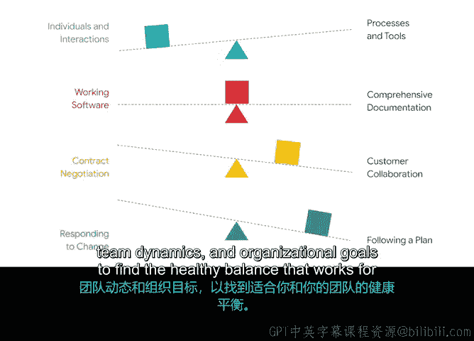

# 004：敏捷宣言的四大价值观 🎯

在本节课中，我们将要学习敏捷宣言的四大价值观。这些价值观是敏捷项目管理的基石，理解它们将帮助你掌握敏捷的核心思想，并将其应用到实际项目中。

---

## 敏捷宣言的起源与意义

上一节我们介绍了敏捷的历史及其在项目管理中的应用。本节中，我们来看看激发这场敏捷运动的灵感来源——敏捷宣言。

敏捷宣言于2001年撰写，它汇集了科技行业思想领袖们基于丰富经验总结出的集体智慧。宣言的核心是四大价值观，它们为敏捷项目管理提供了指导原则。

你可以通过访问 `agilemanifesto.org` 轻松找到完整的宣言内容。

---

## 四大价值观详解

以下是敏捷宣言中提出的四大价值观。每个价值观都强调在项目执行过程中，团队需要思考陈述的两端，但应确保更重视左侧的内容。

### 1. 个体与互动高于流程与工具

这一价值观的核心是强调人与人之间的沟通，而非依赖大量流程和工具来强制事情按特定方式发生。

例如，你是否曾通过邮件询问问题，却因简单的后续问题或澄清而陷入冗长的来回沟通？很可能，一次简短的对话就能在更短时间内获得相同信息。

敏捷旨在确保团队能够协作、互相帮助，以实现最佳成果。它同样重视个体的观点和创造力。这并不意味着每个团队都是混乱的。此价值观意在说明，流程和工具应用于促进和推动良好的项目管理及团队内部协作，而不应成为团队良好合作的障碍。

### 2. 可工作的软件高于详尽的文档

这一价值观意味着团队应优先将时间花在真正创造价值的事情上，避免在辩论、撰写和评审文档上花费超出必要的时间。

这个价值观看似只适用于软件项目，但其实不然。只需将“可工作的软件”替换为你的项目试图交付的任何成果即可。无论是撰写法律简报、设计办公室布局还是准备销售演示，**项目试图交付的成果才是创造价值的东西**。

换句话说，交付客户想要的产品，比详尽地记录你所使用的过程更为重要。

### 3. 客户合作高于合同谈判

在敏捷项目中，客户满意度被视为构建高质量、高价值产品的最高优先级。毕竟，如果对客户没有价值，那么花时间在上面就意义不大。

宣言中提到的“合同”，指的是需要客户签字和正式同意的官方文件，例如那些庞大的需求文档或正式的变更请求。敏捷重视的是能够尽早、经常地与客户自由协作。这样，团队可以快速响应并适应客户的需求，而不是等待漫长的合同条款谈判过程来做出一些更改或请求资源。

敏捷项目管理中仍然会有合同，但重点在于识别真正的需求，并为以客户为中心的协作工作留出空间。鼓励敏捷团队在项目执行过程中寻找一切机会让客户或利益相关者参与进来，例如展示早期原型、提出问题或邀请他们进行初步产品测试。

### 4. 响应变化高于遵循计划

最后一个价值观对敏捷项目至关重要。正如在历史部分所解释的，敏捷诞生于一个变化如此之快的世界，以至于组织难以适应并挣扎求存。

因此，这一价值观强调，每个敏捷团队都需要承认变化是不可避免的。你的项目规模越大、时间越长、越复杂，不确定性就越多。对于许多项目而言，在项目初期就敲定一个完善的计划，或许能带来按时、按预算的交付，但可能面临无法满足客户需求或未能实现最大价值的风险。

作为项目经理，这里的关键要点是：**最成功的项目是那些能够平稳整合变化的项目**。敏捷项目经理仍然会制定并重视计划，但他们能够应对并在项目任何阶段需要修订计划时进行适应。

---

## 总结与平衡之道

本节课中，我们一起学习了敏捷的四大价值观：
1.  **个体与互动**高于流程与工具。
2.  **可工作的软件**高于详尽的文档。
3.  **客户合作**高于合同谈判。
4.  **响应变化**高于遵循计划。

敏捷的伟大之处在于，它不仅提供了这些价值观，还让我们能够在两端之间找到正确的平衡。你可能需要根据行业需求、团队动态和组织目标来微调你的项目风格，以找到适合你和团队的健康平衡点。

通过熟悉不同的项目管理方法、价值观和原则，你将更有能力管理各行各业的各种类型的项目。