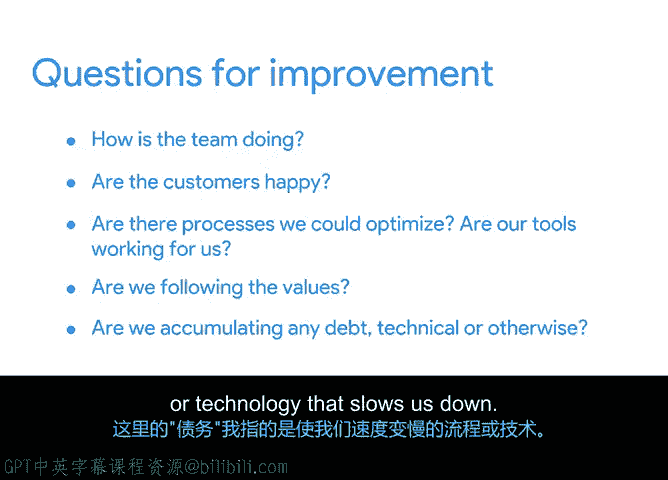

# 005：敏捷宣言的12项原则 🧩

在本节课中，我们将要学习敏捷宣言的12项原则。这些原则是对上一节介绍的四大价值观的强化和具体说明，为敏捷实践提供了更清晰的指导。

上一节我们介绍了敏捷的四大价值观，本节中我们来看看支撑这些价值观的12项具体原则。为了便于学习和记忆，我们将这12项原则归纳为四个主题：**价值交付**、**业务协作**、**团队文化**以及**回顾与持续学习**。

## 价值交付 💎

价值交付主题关注如何快速向客户交付高价值的产品。以下是该主题包含的五项原则：

*   我们的最高目标是，通过尽早和持续地交付有价值的**软件**（或**解决方案**）来满足客户。
*   欢迎对需求提出变更，即使在开发后期。敏捷过程善于利用变更，帮助客户获得竞争优势。
*   频繁地交付可工作的**软件**（或**解决方案**），交付周期可以从几周到几个月，且倾向于更短的周期。
*   可工作的**软件**（或**解决方案**）是衡量进度的首要标准。
*   简约——最大化不必要工作量的艺术——是至关重要的。

该主题的核心是尽快交付工作成果，以便获取反馈，降低花费大量时间却构建了错误产品的风险。同时，在交付之前，任何人都无法从你的工作中获得价值。交付周期越长，获得收益的时间就越晚，竞争对手也可能借此超越你。

这些原则看似以软件开发为中心，但若将“软件”一词替换为“可交付成果”或“解决方案”，它们几乎适用于任何项目。例如，“频繁交付可工作的解决方案”。

价值主题也强调**简约**。团队应专注于最重要的事务。一个实践案例是优先获取产品原型的反馈，从而明确哪些功能真正重要。另一个例子是确保团队只处理已批准的功能，避免在不必要的事务上浪费时间。还可以预留团队10%的时间用于修复缺陷或优化流程，这有助于在未来迭代中提高速度。

## 业务协作 🤝

在了解了如何高效交付价值后，我们来看看团队如何与业务伙伴及利益相关者协作，共同创造价值。业务协作主题包含两项原则：

*   在整个项目过程中，业务人员和开发人员必须每天一起工作。
*   项目过程中，业务人员和开发人员必须密切合作。

需要说明的是，这里的“业务人员”指参与销售、市场、客户支持和客户管理等事务的人员；“开发人员”则指参与产品制造和创造的人员。

我们曾在价值观部分讨论过客户协作，这里再次强调。与客户协作能帮助团队即时获取关键业务信息，使他们能够根据新信息立即进行调整和适应。无论信息在项目早期还是晚期出现，客户最终都能获得实现其业务目标所需的东西。

实现协作的方法可以包括：确保业务人员与开发团队就近办公（最好在同一办公室或虚拟空间）；如果无法实现，则可以每周安排一天集中办公、鼓励使用即时通讯工具，或在团队日历中每天或每周预留固定的协作时间。目标是让业务人员和开发人员能够便捷地沟通。

另一个例子是关于如何处理反馈和优先级变更。与其因担心范围蔓延而试图让客户远离开发人员，不如创建一个每周例会，让客户和业务人员可以与团队一起探讨反馈和新想法。这可能是发现某个极具价值的功能其实很容易构建，而用户认为简单的功能实际上很难实现的好方法。

## 团队文化与动力 🧑‍🤝‍🧑

团队的成功不仅依赖于流程，更依赖于人。接下来，我们探讨如何创建和维护良好的人际关系与团队动力。团队文化与动力主题包含四项原则：

*   激发个体的斗志，以他们为核心搭建项目。提供所需的环境和支援，辅以信任，从而达成目标。
*   最好的架构、需求和设计出自自组织团队。
*   团队定期反思如何能提高成效，并依此调整自身的举止表现。
*   构建项目时，要围绕积极主动的个体。给予他们所需的环境和支持，并且信任他们能够完成工作。

请注意，敏捷的第一条价值观强调“个体和互动高于流程和工具”，本主题的原则正体现了这一价值观。它强调创建一个包容、支持且赋能的有效团队文化，这对项目成功至关重要。

这些原则归根结底是：确保团队有动力做正确的事，被信任去做正确的事，拥有为实现目标而紧密协作所需的资源和空间，并能以可持续的节奏工作。一个体现有效团队文化的例子是：询问团队需要什么工具来完成工作，然后提供给他们。另一个表现是：让团队编写自己的流程和模板，而不是强迫他们使用总部制定的东西。

当团队感到自己的意见受到重视时，他们才能发挥最佳水平。因此，作为项目经理，你应该为团队创造空间，让他们参与并积极贡献于团队文化的建设。你将由此建立信任，并赋能他们以最适合自己的方式开展工作，从而提高工作效率。

## 回顾与持续学习 🔄

最后，我们来到第四个主题：回顾与持续学习。最后一项原则独立构成此主题：

*   团队定期反思如何能提高成效，并依此调整自身的举止表现。

我将其单独列为一个主题，是为了强调持续学习和适应对敏捷团队的重要性。团队应始终寻找更好的工作方式，在每次迭代后专门留出时间进行回顾，专注于如何改进，这是非常有价值的。

在这些回顾会议中，团队可以退一步思考诸如以下问题：团队表现如何？客户满意吗？有哪些流程可以优化？我们的工具好用吗？我们是否遵循了价值观？我们是否积累了任何“债务”（这里指拖慢我们速度的流程或技术）？

## 总结

本节课中，我们一起学习了敏捷宣言的12项原则，并将它们归纳为**价值交付**、**业务协作**、**团队文化**和**回顾与持续学习**四个主题进行理解。这些原则与四大价值观共同构成了敏捷项目管理的基石，推动了项目管理领域的诸多进步。在接下来的课程中，我们将继续看到这些价值观和原则如何与敏捷项目的日常活动紧密相连。

在下一个视频中，我们将探讨哪些类型的行业最能从敏捷方法中受益。