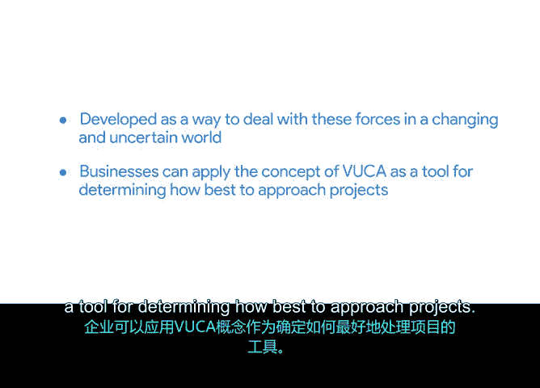

# 006：采用敏捷思维 🧠

在本节课中，我们将要学习敏捷思维的应用场景，并引入一个名为VUCA的概念框架，以帮助你根据项目所处的环境选择最合适的管理方法。

每个项目都存在于具有不同文化、业务目标和行业动态的组织与环境中。本节中，我们将讨论一些需要采用敏捷思维的不同场景。

## 敏捷思维的应用场景

敏捷方法的核心是在高度不确定、高风险和高竞争的环境中交付价值。它使团队能够尽可能快地对新信息、新市场机会甚至新技术做出反应。

敏捷在那些容易或鼓励变化与不确定性的行业或项目中效果最佳。除了软件行业，还有哪些行业需要应对大量变化呢？

以下是几个例子：
*   **生物技术行业**：涉及新兴疫苗、疗法和技术。
*   **媒体行业**：拥有分享内容的新方式。
*   **食品行业**：受名厨和最新饮食潮流影响。
*   **时尚行业**：建立在紧跟不断变化的趋势之上。

另一方面，一些看似稳定的行业，如农业、航空航天、制造业和矿业，也因新的法律法规、自然灾害和其他不可预见的问题而必须适应变化。2020年教会我们，没有哪个行业能真正免受变化和不确定性的影响。

## 理解VUCA框架

为了分类和思考这些塑造我们世界的力量，我们将探索一个概念，无论我们身处哪个行业，它都适用。这个概念就是**VUCA**，它能帮助你决定哪种项目管理方法最适合你。

VUCA是美国军事学院提出的一个概念，它是一个首字母缩写词，定义了在不断变化和复杂的世界中影响组织的条件。它旨在帮助我们在项目和业务中考虑变化和不确定性的力量。

VUCA代表：
*   **易变性**：指业务或情境中变化和动荡的速率。在易变的项目中，你会感觉下一次对运营的干扰即将来临，或者事情似乎永远没有时间进入正常节奏。
*   **不确定性**：指缺乏可预测性或存在高度意外可能性。在不确定的环境中，很难制定不基于大量可能被证明是错误的假设的未来计划。
*   **复杂性**：指影响项目的相互关联的力量、问题、组织或因素数量众多。例如，如果一个正在开发的产品依赖于多样化的全球供应商，就会增加项目的复杂性。
*   **模糊性**：指误解事件或情况的状况和根本原因的可能性。一个受模糊性困扰的项目将难以确定项目延误的原因，从而难以设计降低风险的缓解计划。

让我们回顾一下：VUCA代表易变性、不确定性、复杂性和模糊性。它是一个为应对变化和不确定世界中的这些力量而开发的概念。

## 应用VUCA与敏捷

企业可以将VUCA概念作为工具，来确定如何最好地处理项目。理解这些概念将有助于在各种项目中进行决策。尽管存在不确定性，采用敏捷方法仍能增加你成功的几率。这些概念不仅适用于项目，也适用于整个商业世界。

本节课中，我们一起学习了敏捷思维适用的行业环境，并深入了解了VUCA框架——一个帮助我们评估项目环境易变性、不确定性、复杂性和模糊性的有力工具。掌握这些概念，能让你在面对变化时，更明智地选择敏捷或其他项目管理方法，从而提升项目成功的可能性。