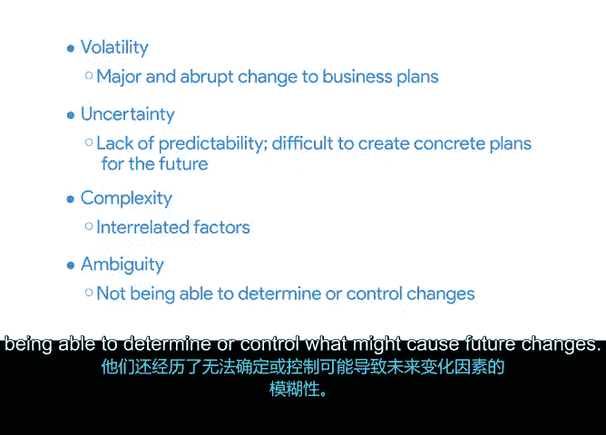

# 007：在VUCA环境中应用敏捷 🚀

在本节课中，我们将学习如何识别项目环境中的VUCA特征，并了解为何敏捷方法是应对此类挑战的有效策略。我们将通过Office Green公司的具体案例，来观察一个团队如何运用敏捷原则来应对高度不稳定、不确定、复杂和模糊的项目环境。

上一节我们介绍了VUCA的概念，本节中我们来看看一个面临高VUCA参数的实际项目场景，以及Office Green团队是如何应用敏捷方法的。

## 理解VUCA对项目管理的重要性

当我们启动一个新项目时，在决定采用最佳方法之前，先审视项目所处的环境和条件是有帮助的。如果你的项目环境具有高度的**波动性**、**不确定性**、**复杂性**和**模糊性**，那么这就是你应该考虑采用敏捷方法的一个明确信号。

虽然敏捷方法并非能完全消除VUCA的完美解决方案，但它能为你和你的团队提供工具和系统来**减轻VUCA带来的风险**，从而导向更好的结果。当你思考敏捷的价值观和原则时，可以清楚地看到，敏捷是应对VUCA给项目带来挑战的、经过验证且有据可查的解决方案。

## Office Green项目场景回顾

现在，让我们重温在本课程计划早期介绍的Office Green场景。我们将在整个课程中使用这个场景来说明敏捷项目管理方法的强大之处。

如果你刚刚加入我们，这里有一个快速回顾：在之前的课程中，学员扮演了Office Green LLC的首席项目经理，这是一家专注于为办公室、餐厅和酒店提供室内植物设计的商业园艺公司。在这门敏捷课程中，我们将回到Office Green，观察他们如何追求一个新的商业机会。

Office Green的市场调研团队注意到一个重大转变：越来越多的员工开始在家中设立办公室并远程工作。他们希望快速应对这个潜在的巨大市场机会，避免因企业对原有办公室服务需求减少而损失收入。

Office Green不再为企业提供室内园艺设计，而是希望找到一种方法来占领这个充满家庭办公室的新市场。

这种向居家办公的转变发生得很突然，因此Office Green没有任何现成的项目计划可以借鉴。他们没有时间做大量的准备工作，但又希望在这个机会消失之前最大限度地把握它。

为此，Office Green指派你担任一个新组建的敏捷团队的项目经理。你的目标是交付他们的新服务——**Virtual Verde**。

## Office Green面临的VUCA环境分析

Office Green面临的环境具备VUCA的所有特征：
*   **波动性**：他们的商业计划遭遇了重大的颠覆性变化。
*   **不确定性**：缺乏可预测性，使得为未来制定具体计划变得困难。
*   **复杂性**：存在供应商、经济状况等相互关联的因素，导致高度复杂。
*   **模糊性**：无法确定或控制可能导致未来变化的原因。

通过对其项目采用敏捷方法，Office Green得以应对影响其业务的高VUCA因素。他们没有让业务因市场力量而缓慢或快速地被侵蚀，而是**拥抱不断变化的市场**，并在处理下一个项目时保持灵活性。

在本课程中，我们将跟随Office Green以及你作为Virtual Verde项目经理的工作，一同探索你将如何应对这些挑战。

---

本节课中我们一起学习了VUCA环境的特点，并通过Office Green的案例，理解了为何在高度VUCA的项目中采用敏捷方法是明智的选择。敏捷方法通过其灵活性和适应性，为团队提供了在复杂多变的环境中稳步前进的框架。