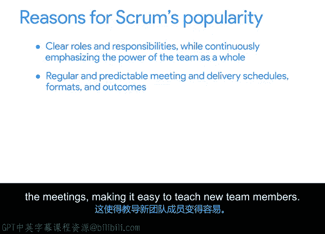

# 008：Scrum简介 🏉

在本节课中，我们将学习敏捷项目管理框架下的一个核心方法论——Scrum。我们将了解Scrum的起源、基本运作方式、核心角色与概念，以及它适用的项目类型。

到目前为止，我们已经探讨了敏捷的历史、敏捷宣言，以及哪些类型的项目适合采用敏捷方法。接下来，我将介绍敏捷框架下的一些具体方法论。其中，最流行的一个无疑是Scrum。本节视频将简要回顾Scrum的起源，并讨论Scrum方法论的基础知识。

## Scrum是什么？

首先，Scrum不是一个缩写词。如果你曾观看或参与过英式橄榄球运动，可能会对这个术语感到熟悉。对于不熟悉英式橄榄球的人来说，它类似于美式橄榄球，是一种在球场上进行的、使用相似形状橄榄球的全面接触性运动。

在英式橄榄球中，“Scrum”指的是一种阵型：全队球员俯身向前，头部紧锁在一起，作为一个整体协同工作，以争取宝贵的码数，向得分线推进。Scrum方法论的创始人将他们的团队视为一个紧密协作、埋头苦干的集体，就像橄榄球比赛中的Scrum一样，共同推动项目前进。

## Scrum方法论如何运作？

那么，Scrum方法论作为项目管理方法是如何运作的呢？这里我将给出一个简要概述，我们将在本课程中深入探讨。

如果你从事敏捷项目管理，你很可能会使用Scrum或基于Scrum的方法。根据2019年敏捷状态报告，72%使用敏捷方法的团队都在使用Scrum或混合方法。

当你使用Scrum进行项目管理时，需要组建一个团队，共同快速开发和测试可交付成果。工作以短周期完成，团队每天开会讨论当前任务，并清除任何阻碍进展的问题。

## Scrum核心概念

以下是Scrum中一些特定的术语和概念。

**产品待办列表** 是Scrum中的核心工件，所有可能的想法、可交付成果、功能或任务都被记录在此，供团队处理。它在项目的整个生命周期中由团队持续进行优先级排序和主动管理。

**冲刺** 是Scrum中完成工作的时间盒周期名称。冲刺周期通常在一到四周之间，但大多数冲刺约为两周。这也常被称为“迭代”。

**每日站会** 是一种实践，团队在冲刺的每一天会面15分钟或更短时间，以检查他们朝着目标的进展。

## Scrum核心角色

接下来是角色。第一个是 **Scrum主管**。这个角色负责确保团队遵循敏捷价值观和原则，遵守团队商定的流程和实践，向更大的项目团队分享信息，并帮助团队专注于做出最好的工作。

Scrum中另一个重要的角色是 **产品负责人**，他负责最大化产品的价值和团队工作的价值。产品负责人拥有工作清单，并对如何确定工作优先级拥有最终决定权。

**开发团队** 则负责团队将如何交付该产品。

## Scrum为何流行？

Scrum流行的原因有很多。首先，它为团队成员设定了明确的角色和职责，同时持续强调团队作为一个整体的力量。

Scrum拥有非常规律和可预测的会议及交付时间表，会议有预定义的议程和预期成果，这使得培训新团队成员变得容易。

它支持和强化敏捷价值观与原则，同时增加了一些结构和基础，帮助新的敏捷团队起步，并让经验丰富的团队做得更好。并且，它是完全免费和开放的，可供所有人使用。由于它是最常用的敏捷交付框架，网上也有大量的指导和支持资源，以及Scrum特定的培训和认证。

## Scrum适用的项目与团队

Scrum最适合以下类型的项目和团队。理想情况下，一个Scrum团队应该是跨职能的，由大约三到九名成员组成。有些人称之为“披萨大小团队”，因为其人数与可以分享一个大披萨的人数相当。

如果团队太小，可能没有足够的技能多样性来完成工作。如果团队太大，信息分发就会变得困难。

最后，Scrum最适合那些团队和管理层思想开放、适应性强、并重视持续学习如何成为更好团队的项目。试图强迫一个团队采用Scrum几乎总是会失败。

请注意，在上述所有例子中，我从未提及“软件”一词。尽管Scrum起源于软件项目，但人们已经调整Scrum以适应各种类型的项目，从婚礼策划到搬家，再到建造火箭。

## 总结

很好，你现在已经了解了Scrum的一些关键特征，以及哪些类型的项目能真正从中受益。这是一个令人兴奋的方法。虽然在我们能够完全实施Scrum之前还有更多内容需要讨论，但我们将首先讨论其他几种流行的敏捷方法论。

学习这些方法将帮助你成为任何项目团队中全面、多才多艺的成员。我们下个视频再见。😊